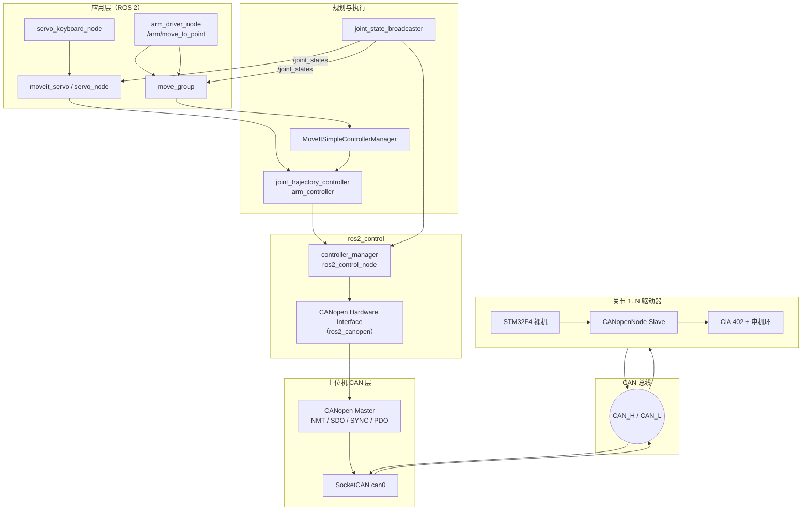
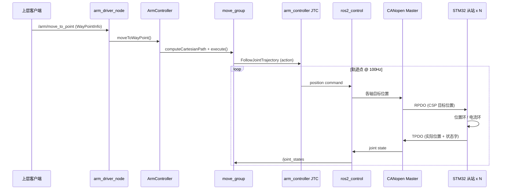
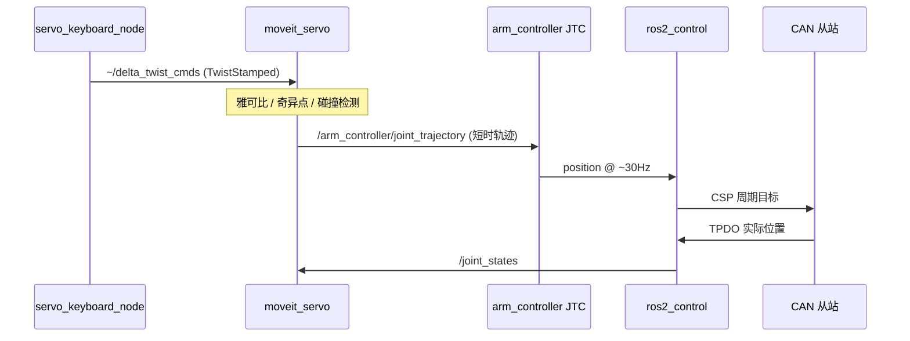
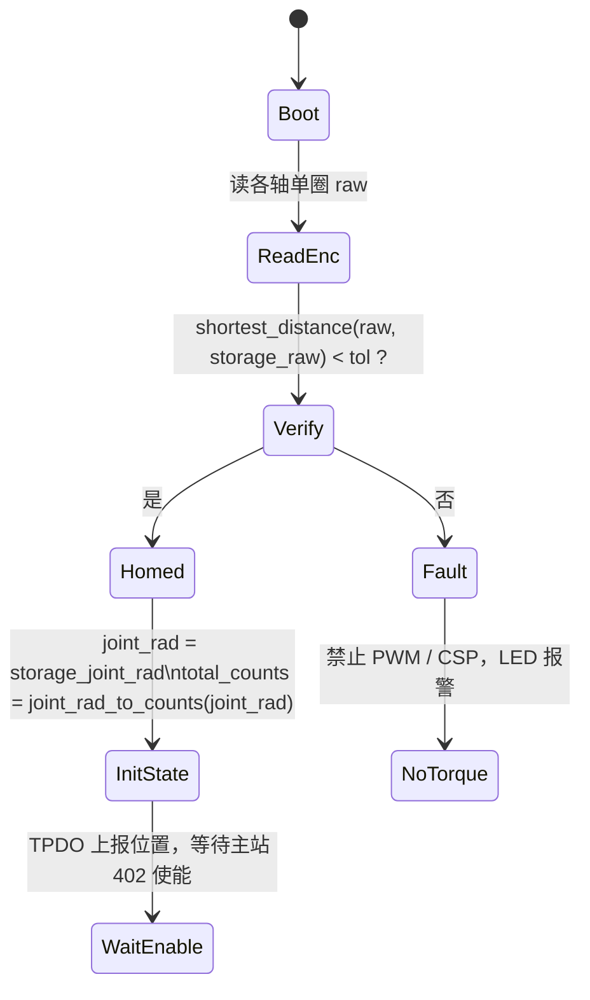

# 自研机械臂 CANopen 技术方案（STM32F4 + CANopenNode + ROS 2 / MoveIt）

> 本文档描述在关节驱动器 **STM32F4 裸机部署 CANopenNode 从站**，并与上位机 **ROS 2 Humble、ros2_control、MoveIt、`arm_control`** 对接的可行技术方案。
>
> 适用场景：6 轴（或可扩展）机械臂，关节间 **CAN 总线**，驱动器实现 **CiA 402** 伺服从站，上位机运行现有 **Arm-ZayV2** 软件栈。

---

## 1. 目标与范围

### 1.1 目标

| 层级  | 目标                                                                                             |
| --- | ---------------------------------------------------------------------------------------------- |
| 下位机 | 每关节一块 STM32F4 驱动板，运行 **CANopenNode 从站** + **CiA 402**，完成 FOC/位置环与总线通信                          |
| 上位机 | Linux + **SocketCAN** + **CANopen 主站** + **ros2_control**，替换当前 `mock_components/GenericSystem` |
| 应用  | 保留 **MoveIt `move_group`**、**`arm_control` 服务**、**MoveIt Servo** 数据通路，仅更换硬件抽象与机器人模型            |
| 标定  | **单圈编码器** + **收纳位上电标定**（不写 Flash 存多圈）；关节侧 **rad / rad/s** 与 MoveIt 统一（见第 8 节）              |

### 1.2 不在本文范围

- 电机 FOC、硬件原理图、EMC 与安规认证细节
- MoveIt 运动学算法本身（沿用现有 `moveit2`）
- 示教器、无线手柄等产品化 HMI

### 1.3 与当前 Arm-ZayV2 的关系

当前仿真栈（`aubo_i5_moveit_config`）使用 **Mock 硬件**：

```xml
<!-- aubo_i5.ros2_control.xacro -->
<plugin>mock_components/GenericSystem</plugin>
```

本方案将 Mock 替换为 **CANopen 真机硬件接口**，上层 `arm_control.launch.py` 的节点组合**基本不变**，需新增/替换：

- 自研臂 **URDF / SRDF / MoveIt Config**
- **CANopen 主站与 ros2_control 配置**（EDS、Node ID、PDO）
- **真机 launch**（`use_mock_hardware` 参数或独立 launch 文件）

---

## 2. 系统总体架构

### 2.1 逻辑分层



### 2.2 物理拓扑

```text
[工控机 / NUC]
    USB-CAN 或 PCIe-CAN 或板载 CAN
        |
    can0 (SocketCAN, 500k 或 1M)
        |
    ----+----+----+----+----+----+----  (总线型，两端 120Ω)
        |    |    |    |    |    |
      Node1 Node2 Node3 Node4 Node5 Node6
      STM32 STM32 STM32 STM32 STM32 STM32
```

**规则：**

- 全网 **同一波特率**（建议柜内短线 **500 kbps 或 1 Mbps**，与驱动器 Flash 配置一致）
- **仅总线物理两端**各 1 个 120 Ω 终端电阻
- 每关节 **唯一 Node ID**（1–127，建议机械臂固定为 1–6）

---

## 3. 端到端数据链路

### 3.1 链路 A：命名位姿 / 笛卡尔点动（`arm_control`）

用于 `arm_control.launch.py` + `arm_driver_node` 服务调用。



| 步骤 | 话题 / 接口 | 消息类型 | 说明 |
|------|-------------|----------|------|
| 1 | `/arm/move_to_point` | `robot_interfaces/srv/ArmMoveToPoint` | 应用入口，位姿 `[x,y,z,r,p,y]` |
| 2 | MoveGroupInterface 内部 | action / service | 规划笛卡尔或关节路径 |
| 3 | `move_group` → 控制器 | `control_msgs/action/FollowJointTrajectory` | `moveit_controllers.yaml` 中 `arm_controller` |
| 4 | JTC 命令 | `trajectory_msgs/JointTrajectory` | 话题名由 ros2_control 生成，如 `/arm_controller/joint_trajectory` |
| 5 | 硬件读写 | state/command interfaces | `position`（与现 `ros2_controllers.yaml` 一致） |
| 6 | CAN | CAN 2.0 标准帧 | RPDO/TPDO，见第 6 节 |
| 7 | 反馈 | `/joint_states` | `sensor_msgs/JointState`，供 MoveIt 与 TF |

### 3.2 链路 B：MoveIt Servo 实时遥操作

用于 `servo_demo.launch.py` + `servo_keyboard_node`。



| 配置项 | 当前工程位置 | 真机注意点 |
|--------|--------------|------------|
| 输出话题 | `aubo_i5_moveit_config/config/servo.yaml` → `command_out_topic` | 保持指向 JTC 的 `joint_trajectory` |
| 输入关节状态 | `joint_topic: /joint_states` | 必须来自真机反馈，禁止再用 Mock 假状态 |
| 控制周期 | `publish_period: 0.034` (~30Hz) | 真机可先降到 20Hz，CAN + 驱动器稳定后再提高 |
| JTC | `allow_nonzero_velocity_at_trajectory_end: true` | Servo 必需；真机需观察是否引起抖动 |

### 3.3 链路 C：仅状态监视（无运动）

```text
STM32 TPDO → SocketCAN → CANopen Master → ros2_control read()
    → joint_state_broadcaster → /joint_states
    → robot_state_publisher → /tf
    → RViz / move_group PlanningSceneMonitor
```

用于上电验证、手扳关节（若允许）、示教核对零位。

### 3.4 单位与坐标系约定

| 量 | ROS / MoveIt | 建议 CANopen 从站内部 | 转换位置 |
|----|--------------|----------------------|----------|
| 关节角 | rad | 编码器 counts 或 0.001° 整数 | **ros2_control 硬件接口** 或主站驱动配置 |
| 角速度 | rad/s | rpm 或 counts/s | 同上 |
| 时间 | s | — | JTC 时间戳；CSP 以主站 SYNC 周期为基准 |
| 末端位姿 | m, rad | — | MoveIt 运动学，不下发到 CAN |

**强制约定：** URDF 关节名、ros2_control 关节名、`JointState.name`、CANopen 轴序号四者一致（见第 6 节命名表）。  
**位置与速度换算、收纳位上电标定**见第 8 节。

---

## 4. 下位机方案（STM32F4 + CANopenNode 裸机）

### 4.1 软件模块划分

```text
┌─────────────────────────────────────────┐
│ 应用层 App                               │
│  - CiA 402 状态机与用户回调               │
│  - 模式：Cyclic Synchronous Position     │
│  - 目标位置 ← RPDO，实际位置 → TPDO       │
├─────────────────────────────────────────┤
│ CANopenNode                              │
│  - CO_NMT, CO_SDOserver, CO_PDO, CO_SYNC │
│  - 对象字典 OD（OD.c / OD.h）             │
├─────────────────────────────────────────┤
│ CAN 驱动 CO_driver_target.h              │
│  - CAN_Send / CAN_Receive / 定时 tick     │
│  - 对接 STM32 HAL CAN 或寄存器            │
├─────────────────────────────────────────┤
│ 电机控制（已有或并行开发）                 │
│  - FOC、编码器、限位、过流、抱闸           │
└─────────────────────────────────────────┘
```

### 4.2 CANopenNode 裸机集成要点

1. **时钟滴答 `CO_TMR_TICK`**  
   - 用 TIM 产生 1 ms（或栈要求的）tick，调用 `CO_process()` / `CO_NMT_process()` 等（按 CANopenNode 版本 API 为准）。

2. **CAN 接收**  
   - RX FIFO 中断中只做：**拷贝帧 → 入队**；在 main loop 或 1 ms tick 中调用栈处理，**禁止在 ISR 内跑 FOC**。

3. **主循环结构（示例）**

```c
while (1)
{
    // 1 ms：CANopen 协议栈
    if (flag_1ms)
    {
        flag_1ms = 0;
        CO_process(&CO, false);
    }

    // 高频：电流环（例如 20 kHz，独立 TIM 中断）
    // motor_foc_isr();

    // 低频：应用层把 OD 中目标位置送入位置环
    app_cia402_sync_position();
}
```

4. **对象字典**  
   - 使用 CANopenNode 配套 **OD 编辑器** 或手写 `OD.c`，导出 **EDS** 供上位机主站导入。

5. **只读配置参数**  
   - Node ID、波特率、`gear_ratio`、`counts_per_rev`、收纳位标定常量等可编译进 Flash **常量区**或出厂一次性烧录；**不在运行中反复写入 Flash 保存多圈位置**（见第 8.3 节收纳位方案）。STM32F4 **无片上 EEPROM**，若需可改写参数可考虑外置 I2C EEPROM，与本方案无硬性要求。

### 4.3 CiA 402 推荐配置（机械臂关节）

| 项目 | 推荐 |
|------|------|
| 运行模式 `0x6060` | **8 — Cyclic Synchronous Position (CSP)** |
| 主站周期 | 与 JTC `update_rate` 对齐，建议 **2–10 ms**；可用 SYNC 同步多轴 |
| RPDO | 控制字 `0x6040` + 目标位置 `0x607A`（可拆两帧或压缩映射） |
| TPDO | 状态字 `0x6041` + 实际位置 `0x6064` + 可选实际力矩 `0x6077` |
| 使能 | 严格按 402 状态机；Fault 时关 PWM，并置 `0x6041` 故障位 |
| 心跳 `0x1017` | 建议 200–1000 ms，主站监控掉线 |

**为何选 CSP：** MoveIt / JTC / Servo 在上位机产生**时间Parameterized 关节轨迹**，主站每周期下发**下一时刻目标位置**，与当前 Arm-ZayV2 的 `position` 命令接口一致。

### 4.4 安全行为（下位机必须实现）

| 事件                            | 行为                      |
| ----------------------------- | ----------------------- |
| NMT Stopped / Pre-operational | 禁止驱动输出，抱闸按需             |
| 402 未 Operation enabled       | 忽略或软跟踪 RPDO，不输出力矩       |
| 过流、过温、欠压                      | 本地 Fault + EMCY + 关 PWM |
| 心跳超时（若配置消费者心跳）                | 安全停车                    |
| CAN Bus-off                   | 恢复策略 + 禁止运动直至恢复         |

### 4.5 固件工程建议目录

```text
firmware/joint_canopen_drive/        # 可独立 Git 仓库
├── Core/                            # STM32CubeMX 生成
├── CANopenNode/                     # 子模块
├── od/                              # OD.c / OD.h / EDS
├── app/
│   ├── cia402_app.c                 # 402 与电机环衔接
│   ├── motor_foc.c
│   ├── joint_calib.c                # 收纳位标定、位置/速度换算
│   └── config.c                     # Node ID、减速比等只读配置
├── port/
│   ├── CO_driver.c                  # CANopenNode 硬件接口
│   └── CO_timer.c
└── docs/eds/joint_drive.eds
```

---

## 5. 上位机方案（Linux + ROS 2 Humble）

### 5.1 推荐软件栈

| 组件 | 推荐选型 | 作用 |
|------|----------|------|
| CAN 设备驱动 | `gs_usb` / `peak_usb` / `socketcan_fd` 等内核模块 | 创建 `can0` |
| 调试 | `can-utils`（`candump` / `cansend`） | 总线排障 |
| CANopen 主站 | **[ros2_canopen](https://github.com/ros-industrial/ros2_canopen)**（Humble 分支） | NMT、SDO、PDO、402 驱动 |
| 机器人控制 | `ros2_control` + `controller_manager` | 与现工程一致 |
| 402 集成 | `canopen_402_driver` + `canopen_ros2_control` | 将各从站映射为 ros2_control 关节 |
| 运动规划 | MoveIt 2 + 自研 `*_moveit_config` | 替换 `aubo_i5_moveit_config` |
| 应用 | 现有 `arm_control` 包 | **无需改协议**，仍走 MoveGroup |

**备选（不推荐首选）：** 自写 `hardware_interface::SystemInterface`，内部调用 Lely CANopen 或简易主站——工作量大、与标准工具链脱节。

### 5.2 ROS 2 工作空间包规划

在 `Arm-ZayV2` 或并行工作空间中新增：

```text
src/
├── robot_ros_description/           # 已有：改为自研臂 URDF 或新增 zay_arm.urdf
├── zay_arm_moveit_config/           # 新建：SRDF、joint_limits、controllers
├── zay_arm_bringup/                 # 新建：真机 / 仿真 launch、can0 启动脚本
├── arm_control/                     # 已有：改 launch 默认 moveit_config 包名
└── robot_interfaces/                # 已有：服务定义不变
```

`package.xml` 增加对 `ros2_canopen`、`canopen_ros2_control` 等的 `exec_depend`（版本以 Humble 实际 apt/git 为准）。

### 5.3 SocketCAN 启动示例

```bash
# 1 Mbps，需与从站一致
sudo ip link set can0 down
sudo ip link set can0 up type can bitrate 1000000
ip -details link show can0
```

可写入 `zay_arm_bringup/scripts/can_up.sh`，由 launch 在 `ros2_control` 之前执行。

### 5.4 ros2_control 配置（对齐现有工程）

保持与 `aubo_i5_moveit_config/config/ros2_controllers.yaml` 相同结构：

```yaml
controller_manager:
  ros__parameters:
    update_rate: 100

    arm_controller:
      type: joint_trajectory_controller/JointTrajectoryController
    joint_state_broadcaster:
      type: joint_state_broadcaster/JointStateBroadcaster

arm_controller:
  ros__parameters:
    joints: [joint1, joint2, joint3, joint4, joint5, joint6]
    command_interfaces: [position]
    state_interfaces: [position, velocity]
    open_loop_control: false          # 真机有编码器反馈时建议 false
    allow_nonzero_velocity_at_trajectory_end: true  # Servo 需要
```

**`moveit_controllers.yaml`** 保持 `FollowJointTrajectory` → `arm_controller`。

### 5.5 CANopen + ros2_control 配置思路

为每个从站准备：

1. **EDS 文件**（从下位机导出）
2. **bus.yml / master.dcf**（ros2_canopen 设备描述，具体文件名以所用版本文档为准）
3. **Node ID 与关节名映射**

概念示例（非完整语法，实施时对照 ros2_canopen 官方示例修改）：

```yaml
# 概念：zay_arm_bringup/config/bus.yml
master:
  node_id: 1
  driver: "ros2_canopen::MasterDriver"
  package: "canopen_core"

nodes:
  joint1:
    node_id: 11
    driver: "ros2_canopen::Cia402Driver"
    package: "canopen_402_driver"
    eds: "package://zay_arm_bringup/eds/joint_drive.eds"
    # 映射到 ros2_control 的 joint1
```

`*.ros2_control.xacro` 中将插件由 Mock 改为 CANopen 硬件插件（插件名以 `canopen_ros2_control` 文档为准），并传入 bus 配置路径。

### 5.6 Launch 分工

| Launch | 用途 |
|--------|------|
| `zay_arm_mock.launch.py` | 保留 `GenericSystem`，无 CAN 硬件开发 MoveIt / arm_control |
| `zay_arm_canopen.launch.py` | 拉起 can0、CANopen 主站、ros2_control、move_group |
| `arm_control.launch.py` | 改为 include `zay_arm_canopen` + `arm_driver_node` |
| `servo_demo.launch.py` | 同上，真机降低 Servo 速度 scale |

---

## 6. PDO 与对象字典设计（建议默认值）

### 6.1 轴编号与 Node ID

| 机械臂关节 | URDF joint 名（示例） | Node ID | 备注 |
|------------|----------------------|---------|------|
| J1 | `joint1` | 11 | 远离基座侧编号规则写入手册 |
| J2 | `joint2` | 12 | |
| J3 | `joint3` | 13 | |
| J4 | `joint4` | 14 | |
| J5 | `joint5` | 15 | |
| J6 | `joint6` | 16 | |

> 当前 `aubo_i5` 使用 `shoulder_joint` 等命名；自研臂建议统一为 `joint1`–`joint6` 或自有命名，**全程一致**即可。

### 6.2 TPDO1（从站 → 主站，周期发送）

| OD 对象 | 索引 | 长度 | 说明 |
|---------|------|------|------|
| Statusword | `0x6041` | 16 bit | CiA 402 状态 |
| Position actual | `0x6064` | 32 bit | 编码器位置 |

### 6.3 RPDO1（主站 → 从站，SYNC 或事件触发）

| OD 对象 | 索引 | 长度 | 说明 |
|---------|------|------|------|
| Controlword | `0x6040` | 16 bit | 使能 / 清故障 |
| Target position | `0x607A` | 32 bit | CSP 目标 |

### 6.4 SDO（调试与配置）

| 用途 | 典型索引 |
|------|----------|
| 运行模式 | `0x6060` |
| 心跳生产者时间 | `0x1017` |
| 位置因子 / 齿轮比 | `0x6091`, `0x608F` 等 |
| 软件位置限位 | 厂商自定义或 `0x607D` 区域 |

上电配置阶段用 SDO；运行阶段**仅 PDO**，避免 SDO 占用总线带宽。

---

## 7. 时序与带宽

### 7.1 频率建议

| 环节                 | 频率                    | 说明                                    |
| ------------------ | --------------------- | ------------------------------------- |
| 电流环                | 10–20 kHz             | STM32 本地，不走 CAN                       |
| 位置环                | 1–4 kHz               | 本地；CSP 目标来自 PDO                       |
| SYNC / RPDO        | 500 Hz–1 kHz 或 100 Hz | 与 `controller_manager.update_rate` 匹配 |
| JTC / ros2_control | 100 Hz                | 与现配置一致                                |
| MoveIt Servo 输出    | ~30 Hz                | `servo.yaml` `publish_period`         |
| `/joint_states` 发布 | 100 Hz                | `joint_state_broadcaster`             |
| Heartbeat          | 10 Hz                 | 每从站                                   |

### 7.2 CAN 负载粗算

假设每轴 TPDO+RPDO 各 8 字节，6 轴，1 kHz：

```text
6 * 2 * (8 + 协议开销) ≈ 数百帧/秒
```

1 Mbps 总线通常足够；若加多路 TPDO 或长网络，用 `candump` 统计负载率。

---

## 8. 关节编码器、位置换算与速度统一

本章约定：**各关节电机硬件参数、减速比不同**；**仅用单圈编码器**；**不将多圈计数写入 Flash**，采用 **收纳位上电标定** 恢复绝对关节角；在 **关节侧（连杆侧）** 用 rad / rad/s 与 MoveIt 对齐，在驱动器内按每轴参数换算到电机侧。

### 8.1 电机侧 vs 关节侧

| 名称 | 含义 | MoveIt / ROS 使用 |
|------|------|-------------------|
| **电机侧** | 电机轴上的单圈编码器计数 + 软件累加的多圈量 | 不直接暴露给 MoveIt |
| **关节侧** | 减速器输出轴（URDF 关节轴）角度与角速度 | `joint_states`、规划、Servo、限位 |

各轴独立参数（可不同）：

| 符号 | 含义 |
|------|------|
| `gear_ratio` | 电机转 `gear_ratio` 圈 → 关节转 1 圈（按机械定义写入手册，全程一致） |
| `counts_per_rev` | 单圈编码器每电机圈的计数分辨率（如 4096、16384） |
| `sign` | 关节正方向与编码器正方向是否一致，取 `+1` 或 `-1` |

### 8.2 位置换算

**关节角 → 电机总计数：**

```text
counts_motor = sign × joint_rad / (2π) × gear_ratio × counts_per_rev
```

**电机总计数 → 关节角：**

```text
joint_rad = sign × counts_motor / (counts_per_rev × gear_ratio) × 2π
```

**实现位置（推荐）：** 在 **各关节 STM32 固件**内完成换算；TPDO `0x6064` / RPDO `0x607A` 使用 **关节侧用户单位**（或统一为「关节侧 counts」并在 EDS 注明）。主站与 `ros2_control` 只处理 **rad**，避免每块板子减速比不同时主站写死一套比例。

### 8.3 单圈编码器与运行中多圈累加

单圈编码器仅提供一圈内的读数 `single_turn_counts ∈ [0, counts_per_rev)`。运行中由固件维护 **电机侧总计数** `total_counts`（建议 `int64`）：

```c
// 周期性调用（如 1 kHz），在收纳位标定完成（Homed）之后
int32_t delta = (int32_t)single_turn_counts - (int32_t)last_single_turn_counts;
if (delta >  counts_per_rev / 2) delta -= counts_per_rev;
if (delta < -counts_per_rev / 2) delta += counts_per_rev;
total_counts += delta;
last_single_turn_counts = single_turn_counts;
joint_rad = counts_motor_to_joint_rad(total_counts);
```

跨圈修正使用「半圈阈值」法，避免在 0/2π 边界跳变。

### 8.4 收纳位上电标定（不写入 Flash 保存圈数）

**策略：** 每次 **上电前** 将机械臂摆到 **唯一、可重复的收纳位（Storage Pose）**；上电后读单圈编码器，与出厂标定值比对，通过则认定关节绝对角为已知的 `storage_joint_rad`，并反推 `total_counts`。**多圈信息来自「当前就是收纳位」这一假设，而非掉电存储。**

#### 8.4.1 前提条件

| 条件 | 说明 |
|------|------|
| 姿态唯一 | 收纳位在各关节工作空间内对应 **唯一** 的一组电机圈数；多圈关节不能存在两种不同圈数却外观相近的姿势 |
| 可重复 | 建议 **机械挡块 / 销钉 / 折叠止挡**，不仅靠目视 |
| 先摆后上电 | 上电瞬间已在收纳位；上电后再挪动会导致标定错误 |
| 行程限制 | 若某关节连杆侧行程 **超过 360°** 且收纳位不能唯一确定圈数，必须加机械限位或改用多圈绝对值编码器 |

#### 8.4.2 出厂标定（每轴做一次，写入固件常量）

在最终收纳位（建议带治具）上电，记录：

```text
storage_raw_counts[i]      // 收纳位单圈编码器读数（可多次采样平均）
storage_joint_rad[i]       // 该姿态在 URDF 下的关节角，与 MoveIt 一致
verify_tolerance_counts[i] // 校验容差，如 ±0.5° 对应 counts
gear_ratio[i], counts_per_rev[i], sign[i]
```

MoveIt SRDF 中增加同名组态，例如 `storage_pose`，关节角与 `storage_joint_rad` 一致。

#### 8.4.3 每次上电流程



**校验逻辑（每轴）：**

```c
int32_t delta = shortest_counts_distance(raw, storage_raw_counts, counts_per_rev);
if (abs(delta) > verify_tolerance_counts)
    homed = false;
else {
    joint_rad = storage_joint_rad;
    total_counts = joint_rad_to_counts_motor(joint_rad);
    homed = true;
}
```

**全部关节 `homed == true`** 后，才允许 CiA 402 进入 Operation enabled 并跟踪 CSP。

#### 8.4.4 掉电与异常

| 场景 | 处理 |
|------|------|
| 正常关机前臂在任意姿态 | 下次必须先摆回收纳位再 **重新上电** 或 **软复位重新校验** |
| 校验失败 | 禁止运动；主站不加载 `arm_controller` 或仅监视 `joint_states` |
| 可选人工确认 | 主站服务 `/arm/confirm_storage_pose` 或 SDO 清「未标定」标志（机械挡块可靠时可全自动） |

#### 8.4.5 与 CANopen / ROS 的衔接

- 状态字 `0x6041` 或厂商对象（如 `0x2000`）增加 **`Homed` / `PoseVerified`** 位。
- **未 Homed**：不输出力矩；主站轮询全部为真后再 `spawn` `arm_controller`。
- `joint_state_broadcaster` 发布的 `position` 必须为 **关节侧 rad**，与 URDF 一致。

### 8.5 角速度换算与「统一运行速度」

**统一运行速度**指：规划与限幅在 **关节侧角速度 rad/s** 上一致，**不是**各电机相同 RPM。减速比大的关节，达到相同关节角速度需要更高的电机转速，属正常现象。

#### 8.5.1 基本换算

```text
ω_joint = d(joint_rad) / dt                    // 关节侧，rad/s
ω_motor = ω_joint × gear_ratio               // 电机侧，rad/s（或再换 rpm）
rpm_motor = ω_motor × 60 / (2π)
```

**counts/s（电机侧）：**

```text
counts_per_sec = sign × ω_joint / (2π) × gear_ratio × counts_per_rev
```

#### 8.5.2 各层限速职责

| 层级 | 配置 | 单位 | 作用 |
|------|------|------|------|
| MoveIt | `joint_limits.yaml` 每轴 `max_velocity` / `max_acceleration` | rad, rad/s | 规划轨迹上限；各轴可不同 |
| `arm_control` | `max_velocity_scaling_factor` 等 | 0~1 缩放 | 全局再降速 |
| JTC | 轨迹点时间戳 | s | 隐含各轴 `ω_joint` |
| CSP 从站固件 | `joint_max_velocity_rad_s`、`joint_max_accel_rad_s2` | rad/s | 对 RPDO 目标做差分限幅，防止主站过快 |
| 电机驱动器 | `motor_max_rpm` | rpm | 硬限制，防止超速 |

**CSP 周期内从站限速示例：**

```c
ω_cmd = (joint_target_rad - joint_prev_rad) / dt_csp;
ω_cmd = clamp(ω_cmd, -joint_max_velocity_rad_s, +joint_max_velocity_rad_s);
joint_target_rad = joint_prev_rad + ω_cmd * dt_csp;
// 可选：再检查 ω_cmd * gear_ratio 是否超过 motor_max_rpm
```

#### 8.5.3 MoveIt Servo

Servo 将笛卡尔速度通过雅可比映射为各轴 `ω_joint`；各轴是否饱和由该轴 `joint_limits.max_velocity` 决定。真机可减小 `servo.yaml` 中 `scale.linear` / `scale.joint`，与第 3.2 节一致。

#### 8.5.4 `/joint_states` 中的 velocity

`joint_state_broadcaster` 需要 `velocity` 接口时，推荐：

- **优先**：固件对 `joint_rad` 微分 + 低通滤波后，经 TPDO 或主站从位置差分得到；
- **单位**：必须为 **关节侧 rad/s**，与 `position` 一致。

### 8.6 每轴参数存放建议

| 参数 | 存放位置 | 说明 |
|------|----------|------|
| `gear_ratio`, `counts_per_rev`, `sign` | 各关节驱动器固件常量 | 与机械绑定 |
| `storage_raw`, `storage_joint_rad`, `tolerance` | 各关节驱动器固件常量 | 收纳位标定结果 |
| `max_velocity`, `max_acceleration` | `joint_limits.yaml` | 规划用，关节侧 |
| `joint_max_velocity_rad_s` | 固件常量或与 yaml 一致 | 从站安全限速 |
| rad ↔ counts 运行时换算 | **固件** | 主站保持单位统一 |

### 8.7 对象字典扩展建议（厂商区域）

| 对象 | 类型 | 说明 |
|------|------|------|
| `0x2000` | UINT16 | 驱动状态位：`bit0=Homed`，`bit1=PoseError`，… |
| `0x2001` | INT32 | 只读：校验失败时 `raw - storage_raw` 差值，便于调试 |
| `0x2100` | INT32 | 只读：`gear_ratio × 1000` 或分子项 |
| `0x2101` | UINT32 | 只读：`counts_per_rev` |

上电标定与使能前，主站可通过 SDO 读 `0x2000` 确认整机就绪。

### 8.8 实施检查清单

- [ ] 各轴 `gear_ratio` / `sign` 单轴小角度验证方向正确
- [ ] 收纳位机械止挡重复精度满足 `verify_tolerance_counts`
- [ ] 上电未摆放到位时 **无法使能**
- [ ] RViz 模型与收纳位真机姿态一致
- [ ] `joint_limits.yaml` 中各轴 `max_velocity` 已按真实机械能力区分设置
- [ ] Servo 与 MoveIt 规划均在关节侧 rad/s 理解下测试，而非对比电机 RPM

### 8.9 常见错误

| 现象 | 原因 |
|------|------|
| MoveIt 规划与真机姿态偏差大 | 将电机 raw counts 直接当作 `joint_states`；或收纳位 `storage_joint_rad` 与 URDF 不一致 |
| 某轴特别容易超速饱和 | 该轴 `gear_ratio` 填反或 `joint_limits` 未单独限制 |
| 掉电后上电乱动 | 未摆回收纳位仍使能；应强制 `Homed` 门控 |
| 跨圈跳变 | 未做 8.3 节半圈阈值累加；或校验容差过大 |

---

## 9. 安全与运维

### 9.1 分层安全

```text
应用：arm_control 限速、工作空间检查（MoveIt）
规划：joint_limits.yaml、碰撞几何（保守包络）
伺服：Servo 奇异点 / 碰撞检测
主站：心跳丢失 → 全部从站 Disable
从站：硬件过流、急停硬线、抱闸
```

### 9.2 急停

- **硬急停**：切断驱动器主电或 STO，不依赖 CAN
- **软急停**：主站 NMT Stop + 各轴 Quick Stop（402 控制字位）

### 9.3 日志与诊断

| 层级 | 手段 |
|------|------|
| CAN | `candump -l` 录包 |
| 从站 | SWO/RTT 打印 Fault 码 |
| ROS | `ros2 topic echo /joint_states`、`controller_manager` 列表 |
| MoveIt | `move_group` 日志、规划失败原因 |

---

## 10. 实施阶段（推荐顺序）

### 阶段 0：单轴 CANopen 从站

- [ ] STM32 裸机跑通 CANopenNode，Heartbeat + SDO 读版本
- [ ] 导出 EDS，`candump` 能看到 TPDO
- [ ] 402 使能 + CSP，单轴小角度摆动
- [ ] 收纳位标定逻辑：校验通过置 `Homed`，失败禁止使能

### 阶段 1：单轴接上 PC 主站

- [ ] `ip link` 配置 can0
- [ ] ros2_canopen 识别从站，SDO 配置 PDO
- [ ] ros2_control 单关节 `position` 读写，`joint_state_publisher` 与手扳一致

### 阶段 2：6 轴总线 + JTC

- [ ] 6 从站并联，SYNC 同步
- [ ] 加载 `arm_controller`，`ros2 action send_goal` 小幅度轨迹
- [ ] `open_loop_control: false` 验证跟踪误差

### 阶段 3：MoveIt

- [ ] 自研 URDF/SRDF，`move_group` 规划 + 执行
- [ ] RViz 模型与真机一致（收纳位上电标定 + `storage_pose` 核对）

### 阶段 4：arm_control 服务

- [ ] `arm_control.launch.py` 切到真机 config
- [ ] 调用 `/arm/move_to_point`、`/arm/set_preset_pose`

### 阶段 5：Servo

- [ ] `servo_demo.launch.py`，极低 `linear_speed` / `scale`
- [ ] 确认 `allow_nonzero_velocity_at_trajectory_end` 下无危险振荡

---

## 11. 与现有代码的修改清单

| 文件 / 包 | 修改内容 |
|-----------|----------|
| `robot_ros_description` | 自研臂 URDF、关节限位、碰撞体 |
| `*_moveit_config` | 新建；复制 `aubo_i5` 结构，换 xacro 与关节名 |
| `*.ros2_control.xacro` | `GenericSystem` → CANopen 硬件插件 |
| `ros2_controllers.yaml` | 关节名列表、`open_loop_control` |
| `arm_control/launch/*.py` | `MoveItConfigsBuilder` 包名、真机 launch 参数 |
| `arm_control` C++ | **通常不改**；可选增加急停服务、连接状态 |
| `firmware/` | 新建 CANopenNode 工程；`joint_calib.c` 实现收纳位与换算 |

---

## 12. 风险与对策

| 风险                          | 对策                                   |
| --------------------------- | ------------------------------------ |
| 关节名不一致导致 MoveIt 拒动          | 统一 URDF / yaml / EDS 命名，启动时检查        |
| CSP 周期抖动                    | 主站固定周期线程；必要时 SYNC；下位机插值              |
| Servo 真机振荡                  | 降 scale、加大滤波、先关碰撞再逐步开启               |
| Bus-off / 接线错误              | 示波器 / `candump`；终端电阻与拓扑检查            |
| 零位 / 圈数错误导致笛卡尔偏差 | 严格执行收纳位上电 SOP；`Homed` 门控；SRDF `storage_pose` 与固件常量一致（见第 8 节） |
| 各轴减速比不同导致速度理解混乱 | 统一在关节侧 rad/s 限幅；固件内按 `gear_ratio` 换算（见第 8.5 节） |
| ros2_canopen 版本与 Humble 不匹配 | 锁定 git tag，写入 `docs/requirements.md` |

---

## 13. 参考资源

| 资源 | 链接 / 说明 |
|------|-------------|
| CANopenNode | https://github.com/CANopenNode/CANopenNode |
| CiA 402 概要 | CAN in Automation DS402 |
| ros2_canopen | https://github.com/ros-industrial/ros2_canopen |
| 本项目 MoveIt 栈 | `docs/moveit2-overview.md` |
| 本项目 Servo | `docs/moveit-servo.md` |
| 当前仿真 launch | `src/arm_control/launch/arm_control.launch.py` |
| SocketCAN | Linux Kernel Documentation — CAN |

---

## 14. 附录：话题 / 服务速查（真机运行时）

| 名称 | 类型 | 方向 |
|------|------|------|
| `/joint_states` | `sensor_msgs/JointState` | 发布 |
| `/arm_controller/follow_joint_trajectory` | `control_msgs/action/FollowJointTrajectory` | action 服务器 |
| `/arm_controller/joint_trajectory` | `trajectory_msgs/JointTrajectory` | Servo 常作为命令输入 |
| `/arm/move_to_point` | `robot_interfaces/srv/ArmMoveToPoint` | 服务 |
| `/arm/set_preset_pose` | `robot_interfaces/srv/SetPresetPose` | 服务；收纳位可定义为 SRDF 命名位姿 |
| `/delta_twist_cmds` 或 servo 命名空间内 | `geometry_msgs/TwistStamped` | Servo 笛卡尔输入 |

---

*文档版本：v1.1 | 与 Arm-ZayV2 仓库同步维护*
