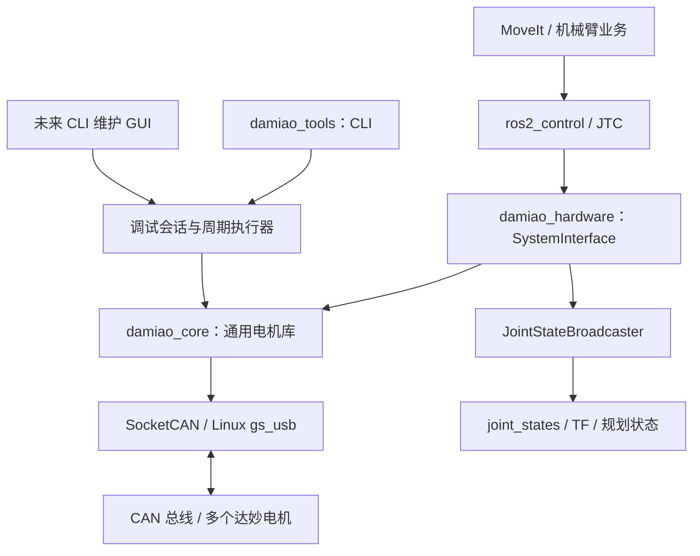
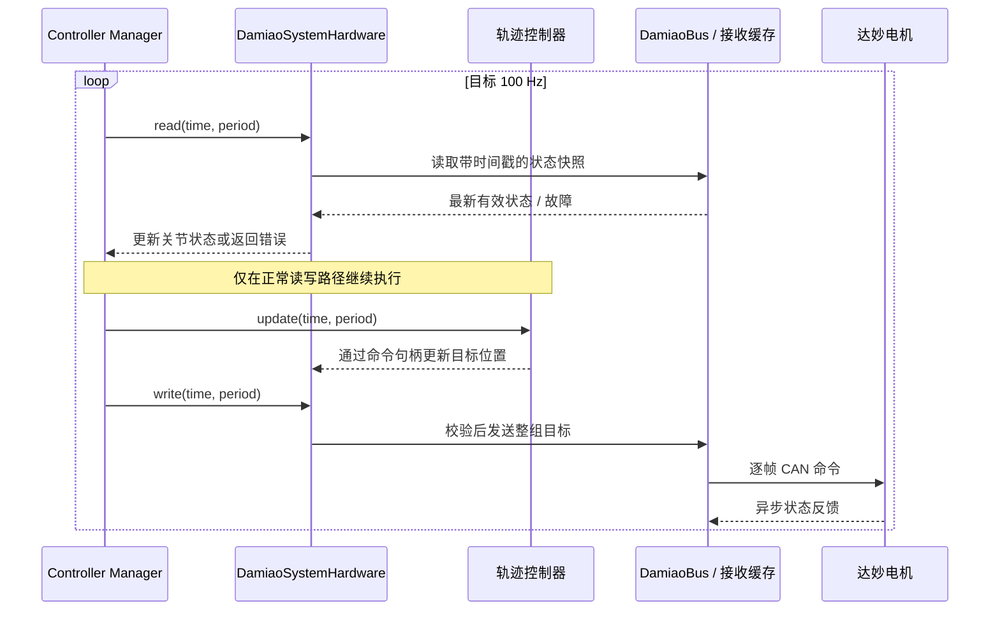
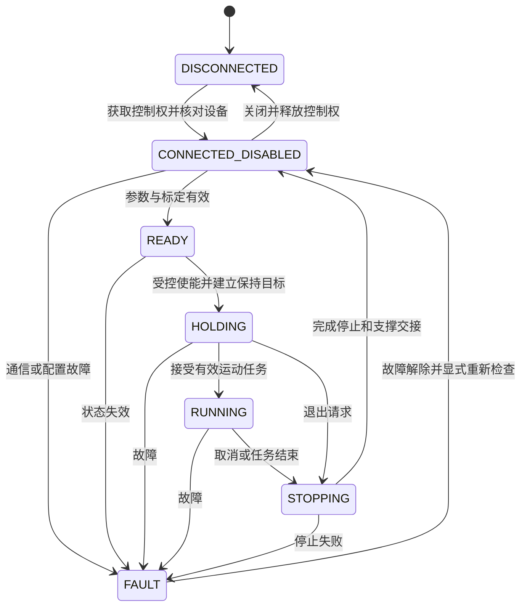

# Arm-ZayV2 达妙电机接入与多电机调试工具开发文档

版本：0.4（硬件插件与零点工具进度同步）<br>
更新日期：2026-09-25<br>
适用项目：`Arm-ZayV2`<br>
适用环境：Linux / ROS 2 Humble / 达妙 J4310P-2EC 与 J4340-2EC 系列

本文整合实体机械臂缺口分析、ros2_control 硬件插件设计，以及可独立运行的多电机调试工具方案，供后续编码、联调和验收使用。本文中的“应”“必须”为拟定的开发要求，不表示相应功能已经实现。

**实现进展（2026-09-25）：**项目已有 MoveIt、轨迹控制器和 Mock 演示链路；`damiao_core` 已实现协议、SocketCAN 和最多六轴总线管理。`damiao_tools` 已实现多电机 CLI，并新增菜单 11：确认全轴失能与输入 `YES` 后，对选中电机保存零点，成功时刷新状态。`damiao_hardware` 已实现 1～6 轴 `SystemInterface`，单轴和六轴真机 bringup、JTC、状态广播器、六轴硬件状态监视器及独立六轴滑块 GUI 均已接入。CLI 目标有效期、配置导入导出、完整运行记录和整机控制权管理仍未交付。代码和软件测试不能替代实体固件、停止行为、机械标定及轨迹性能验收。当前操作边界分别见 [核心库](../src/damiao_core/README.md)、[调试工具](../src/damiao_tools/README.md)、[硬件插件](../src/damiao_hardware/README.md) 与 [真机 bringup](../src/zayv2_bringup/README.md)。

**URDF/MoveIt 进展（2026-09-23）：**旧 Aubo i5 MoveIt 包及包含 Aubo、LS65、elite 资源的旧描述包已移除；`arm_control` 主启动和 Servo 演示已切换至 `zayv2_description` / `zayv2_moveit_config`。ZayV2 六轴 URDF、STL 网格、SRDF 规划组和 Mock ros2_control 配置均已接入。模型展开和文件引用已通过软件检查，实体尺寸、惯量、限位、负载、TCP 与运动安全仍未完成实机核验。

文中各模块的“当前实现”以对应段落标注的源码核对日期为准；标为“拟新增”或“模板”的内容仍是后续设计。模板配置不能直接用于真机运动，硬件参数必须由实际设备读取、机械设计和实测结果补全。

## 1. 目标、范围与设计决策

### 1.1 最终目标

1. 建立不依赖 ROS 的达妙电机 C++ 库，统一完成协议、通信、多电机管理和参数访问。
2. 基于同一库实现独立 CLI，支持多电机配置、状态监测、受限运动和数据记录；随后增加 GUI。
3. 实现 ros2_control `SystemInterface` 插件，将电机库接入现有关节轨迹控制和状态反馈链路。
4. 完成真实机械模型、关节标定、运行许可、故障处理和控制权交接，逐步接入 MoveIt 与 Servo。

### 1.2 第一版范围


| 项目     | 第一版决定                                     | 后续扩展条件                    |
| ------ | ----------------------------------------- | ------------------------- |
| 总线     | 一个 SocketCAN 接口，经典 CAN，按实际确认的 1 Mbps 参数接入 | 多总线或 CAN FD 需重新核对固件、链路和预算 |
| 电机数量   | 配置驱动，支持 1～6 个；先验证单轴                       | 更多电机需重算总线负载和标识分配          |
| 控制模式   | 先实现位置速度模式的完整运动会话                          | MIT、速度、力位混控逐项完成测试后开放      |
| 核心库    | C++17，标准 CMake，无 ROS 必需依赖                 | 可增加其他传输后端或语言绑定            |
| ROS 插件 | Humble，position 命令，position/velocity 状态   | effort 状态在单位和反馈语义验证后导出    |
| 控制周期   | 初始目标 100 Hz                               | 根据反馈延迟、跟踪误差、CPU 和总线测试决定   |
| 调试工具   | 先 CLI，再 GUI                               | GUI 复用调试会话，不重复实现 CAN 控制   |
| 控制权    | 同一总线只有一个主动控制所有者                           | 在线管理服务在确有多客户端需求时增加        |
| 自动行为   | 加载、连接不自动使能；重连不自动恢复运动                      | 所有恢复动作受状态机约束              |


STM32 中间控制器、CANopen/CiA 402、自研电流环、固件升级、视觉和复杂力控均不作为首版依赖。达妙电机当前采用私有应用协议；SocketCAN 是主机通信接口，两者不能与 CANopen 混为一谈。

### 1.3 文档与实现状态标记

- **已核对**：来自当前源码、配置、本机已安装头文件或前序核对的说明书。
- **设计要求**：本文提出的行为约束，待实现和测试。
- **待实测**：仅靠文档或源码无法确定，必须记录验证结果后才能开放相关功能。
- **示例**：用于表达结构，不表示具体电机选型、限位或控制增益已确定。

## 2. 当前工程基线与缺口

### 2.1 可复用部分


| 现有组件                                | 当前作用                  | 真机接入动作                |
| ----------------------------------- | --------------------- | --------------------- |
| `arm_driver_node` / `ArmController` | 提供位姿、预设姿态接口，调用 MoveIt | 保留上层功能，补齐状态检查、取消和结果语义 |
| `move_group`                        | 已加载 ZayV2 Mock 模型并提供规划管理 | 真机使用前核对实体模型参数 |
| `JointTrajectoryController`（JTC）    | 执行关节轨迹                | 保留，修订开环、容差和停止配置       |
| `joint_state_broadcaster`           | 发布关节状态                | 状态来源替换为真实电机反馈         |
| `robot_state_publisher`             | 根据关节状态与模型计算 TF        | 保留，核对真实坐标系            |
| Servo / 键盘节点                        | ZayV2 Mock 演示已接入 | 真机开放前增加与规划模式的控制权互斥 |
| `GenericSystem`                     | Mock 硬件               | 保留测试入口；真机由 `zayv2_bringup` 加载达妙插件 |


已核对的主要文件：

- [硬件 xacro](../src/zayv2_moveit_config/config/zayv2_description.ros2_control.xacro)：当前插件为 `mock_components/GenericSystem`。
- [控制器配置](../src/zayv2_moveit_config/config/ros2_controllers.yaml)：100 Hz、position 命令、position/velocity 状态、未显式设置 `open_loop_control`。
- [主启动文件](../src/arm_control/launch/arm_control.launch.py)：启动控制框架和 MoveIt，并通过固定延时启动业务节点。
- [机器人模型](../src/zayv2_description/urdf/zayv2_description.urdf)：七个连杆、六个旋转关节及 CAD 导出的质量、惯量和 STL 网格已接入；参数仍需实机核对。
- [规划限位](../src/zayv2_moveit_config/config/joint_limits.yaml)：各轴 `has_acceleration_limits: false`。
- [Servo 配置](../src/zayv2_moveit_config/config/servo.yaml)：输出到同一个 `arm_controller`，不能与规划执行无管理地同时发轨迹。

本机已安装 `hardware_interface` 2.54.0、`joint_trajectory_controller` 2.53.1。后续实现应固定并记录实际依赖版本，不能默认其他发行版示例可直接编译或具有相同故障行为。

### 2.2 ZayV2 URDF 与 MoveIt 配置进度（2026-09-23）

- **模型已接入：**[ZayV2 URDF](../src/zayv2_description/urdf/zayv2_description.urdf) 定义 `base_link`、`link1`～`link6` 和 `joint1`～`joint6`；七个连杆均有惯性数据、可视与碰撞 STL 网格。当前碰撞几何使用相同的 STL 网格，尚未针对规划性能和实体间隙优化。
- **规划与控制配置已接入：**[MoveIt xacro](../src/zayv2_moveit_config/config/zayv2_description.urdf.xacro) 引入上述 URDF 和六关节 `GenericSystem`；[SRDF](../src/zayv2_moveit_config/config/zayv2_description.srdf) 定义从 `base_link` 到 `link6` 的 `arm` 规划组及 `home`、`package` 预设姿态。主启动和 Servo 演示均使用 ZayV2 配置，Servo 末端链节为 `link6`。
- **最近的仿真参数变更：**URDF 中 `joint5` 当前范围为 `-1.88495`～`1.88495` rad；[Servo 演示初始姿态](../src/arm_control/config/servo_initial_positions.yaml) 将该关节设为 `1.5707` rad。普通 Mock 初始姿态仍为全零；这些数值不是实测机械限位或真机标定值。
- **软件核对已通过：**当前 URDF/SRDF 可解析，七个连杆、六个关节及网格路径一致；MoveIt xacro 可展开为含六个 ros2_control 关节的 ZayV2 模型。这证明文件与软件配置可加载，不构成运动或动力学验收。
- **真机验证未完成：**需实测关节轴方向、零位、机械行程、TCP、尺寸、质量和惯量，核算负载与持续/峰值力矩，确定碰撞简化模型和加速度限制。[规划限位](../src/zayv2_moveit_config/config/joint_limits.yaml) 仍关闭六轴加速度限制；Mock 与真机插件使用不同启动入口。

### 2.3 关键缺口


| 编号  | 缺口或成果                  | 当前状态（2026-09-25）              | 下一验收证据                  |
| --- | ----------------------- | ----------------------------- | ----------------------- |
| G01 | 真实机械参数、负载和停止方式未确定       | CAD 导出六轴 URDF 已接入；实物参数未核验 | 六轴参数表、负载核算、失能支撑方案       |
| G02 | 电机与主机通信尚未形成可验收链路        | 软件模拟完成，vcan 与实机未完成            | 单电机参数读取、原始帧和反馈记录        |
| G03 | 项目级通用电机库               | `damiao_core` 0.1.0 已实现并通过软件测试 | vcan 与实体协议验证             |
| G04 | 独立多电机调试工具              | `damiao_tools` 0.1.0 CLI 已实现      | M4 停止、断连和实机受限运动报告       |
| G05 | 真实 ros2_control 插件    | 1～6 轴插件及单/六轴 bringup 已实现；实机轨迹未验收 | 单轴 JTC 与六轴故障注入报告 |
| G06 | 关节名、电机 ID、零偏、方向映射     | YAML 映射与坐标转换已实现；实物标定未验收 | 逐轴标定、掉电/重启一致性记录 |
| G07 | 整机运行许可与故障联动           | 插件运行门控和六轴状态监视器已实现；机械停止策略未验收 | 故障注入、承重轴停止与恢复报告 |
| G08 | 规划与 Servo 控制权未统一管理      | 未完成                           | 单一真机 bringup 和模式切换流程    |
| G09 | 电机零点维护命令 | `damiao_tools` 菜单 11 已实现；与 bringup 回零轨迹独立 | 电机零点写入前后读回及掉电验证 |


相关工具的验收以本项目当前源码和运行记录为准；相邻仓库中的示例不计入本项目已交付能力。

## 3. 总体架构与复用边界

### 3.1 应用依赖关系




图中表示代码依赖，不表示 CLI 和机械臂可以同时拥有同一总线的控制权。

### 3.2 模块职责


| 模块                     | 负责                          | 不承担的职责               |
| ---------------------- | --------------------------- | -------------------- |
| `DamiaoProtocol`       | 定长帧编解码、寄存器类型、模式编码           | 不打开设备、不启线程、不调用 ROS   |
| `SocketCanTransport`   | Socket 收发、帧元信息、错误检测         | 不解释关节或运动意图           |
| `DamiaoBus`            | 电机清单、反馈索引、状态缓存、管理事务         | 不执行 MoveIt 轨迹插值      |
| `DamiaoSystemHardware` | 生命周期、关节转换、接口导出、读写门控         | 不独立启动重复的周期发送循环       |
| `MotorManager`         | 扫描结果、菜单电机编号和 `MotorBusSession` 编排 | 不直接实现协议编解码           |
| `MotorBusSession`      | 全轴使能/失能、目标保持、100 Hz 周期发送和维护操作 | 当前尚不实现目标有效期和停止轨迹     |
| `scan_motors`          | ESC_ID 范围探测、基础寄存器与状态读取          | 不负责控制会话和周期运动          |
| CLI / GUI              | 输入、配置展示、记录、结果反馈             | GUI 线程不直接承担周期 CAN 调度 |
| 整机管理层                  | 规划/Servo 模式、启停许可、故障恢复和控制权交接 | 不绕过核心库重复发送底层帧        |


核心库使用电机输出轴量；机械臂插件使用关节量。所有公开数据类型应明确单位与坐标含义。

### 3.3 共享库与共享设备的区别

`libdamiao_core.so` 被两个程序链接，只表示两者复用了代码。进程中的对象、缓存、线程和 Socket 各自独立，不会自动共享电机连接或互斥锁。

SocketCAN 允许多个 Socket 收发同一 CAN 接口的帧，因此必须由应用定义控制权策略，见第 11 节。[Linux SocketCAN 官方文档](https://docs.kernel.org/networking/can.html)

## 4. 机械、电气与设备准备

### 4.1 机械模型与电机分配

J4310P-2EC 的额定/峰值力矩为 3.5/12.5 N·m，J4340-2EC 为 12/40 N·m。实际选型必须核算连杆自重、下游电机、末端工具、负载和动态惯性，不能用峰值力矩代替持续承载能力。

准静态核算应逐关节考虑最不利姿态下的重力矩；动态核算还需考虑加减速、摩擦、传动效率和使用占空比。当前 ZayV2 模型的参数仍需与实体机械臂核对。

每个关节需交付：轴方向、机械上下限、额外传动比、安装零位、允许速度/加速度、负载工况、温升约束和失能后的支撑方式。承重关节的抱闸、配重或支撑方式应在自由承重测试前完成验证。

### 4.2 电气与通信

- 电源按实际 24 V/48 V 型号、同时工作电流和再生制动情况设计；评估供电保护、回灌处理、接地和布线。
- CAN 总线两端使用正确终端配置，检查转接器自带终端，不能给每个节点都增加终端。
- Linux SocketCAN 路线需要适配器固件与主机驱动配套；`gs_usb` 主机驱动和转接器固件是两个不同组件。
- 首次设备检查只确认接口和通信参数；不在连接动作里自动改波特率、模式、零位或 Flash。
- 若多个新电机 ID 相同，先逐台或隔离分配 ID，软件扫描不能可靠区分完全相同的地址。

适配器接入和刷机细节引用 [通信链路文档](./damiao-x86-usb2canfd-link.md)。其中历史主机检查结果不能当作今天设备已连接或已完成刷写的证据。

## 5. 达妙协议实现要求

### 5.1 统一协议，逐电机配置

两型号所涉及的控制帧和主要寄存器结构可以共用协议实现；保留型号、电压版本、固件版本和能力信息，不能假定所有固件行为完全一致。

第一版采用标准 11-bit ID、经典 CAN、已确认的 1 Mbps。CAN FD 和更高速率留到能力验证后支持，禁止因为转接器名称带 FD 就自动使用 FD 帧。


| 模式   | ID 偏移   | 数据语义                        | 开放顺序        |
| ---- | ------- | --------------------------- | ----------- |
| MIT  | `0x000` | p、v、kp、kd、前馈力矩              | 位置速度验证后按需开放 |
| 位置速度 | `0x100` | 位置 float LE、最大绝对速度 float LE | 第一版运动模式     |
| 速度   | `0x200` | 速度 float LE                 | 完成停止和有效期测试后 |
| 力位混控 | `0x300` | 位置、速度上限、电流标幺上限              | 电流与力矩语义验证后  |


位置速度模式的 `v_des` 不是 JTC 轨迹中的带符号速度。力位混控的电流标幺值也不能直接当作 N·m。MIT 中的 `kp/kd` 是电机控制参数，不能直接沿用示例数值用于带载机械臂。

### 5.2 地址与反馈路由

建议首组六轴使用 ESC_ID `1～6`、独立 MST_ID `0x11～0x16`；这只是无冲突配置方案，仍需逐机读回确认。数字配置统一解析十进制整数，界面可同时显示十六进制。

初始化校验至少包括：

1. ESC_ID、MST_ID 在支持范围内；第一版限制 ESC_ID 为 `1～15`。
2. ESC_ID 唯一，MST_ID 唯一；各控制 ID、反馈 ID、管理 ID 不冲突。
3. 核对文档中的低 8 位匹配规则，避免反馈 ID 的低 8 位被另一电机当成目标地址。
4. 电机列表只保存一份对象；分别建立 ESC_ID 和 MST_ID 索引，不能把两个索引混成需要遍历使能的电机列表。

普通反馈先按完整帧头 MST_ID 定位电机，再核对数据中低位 ID 和状态。手册中关于反馈 ID 位宽的文字与打包结构存在需要谨慎解释的地方；首版低 ID 约束和逐机抓包验证应保留，不向高 ID 范围推断兼容性。

### 5.3 编解码规则

- 明确区分经典 CAN 的有效长度与 Socket 读取字节数；检查标准/扩展帧、RTR、错误帧标志。
- 接收系统调用返回值用 `ssize_t`，分别处理 `EINTR`、`EAGAIN`、关闭和实际错误。
- 检查实际报文布局所需长度；错误帧不交给电机状态解析器。
- float 小端编解码使用明确的字节处理或 `memcpy`，避免未对齐指针强转和严格别名问题。
- 浮点到整数前检查有限性、范围及溢出。协议编码层拒绝非法值；应用如进行限幅，需明确报告限幅事件。
- PMAX、VMAX、TMAX 必须为有限正数；按每台电机独立保存，不通过共享型号表修改其他同型号电机的映射。
- 编码范围不是机械限位，也不表示电机长期允许输出的速度或力矩。

线性映射采用 `u = (x - xmin) / (xmax - xmin) * (2^bits - 1)`，反向映射为 `x = xmin + u * (xmax - xmin) / (2^bits - 1)`。舍入方式需要在实现和测试中固定，允许误差以量化步长说明。

### 5.4 关键寄存器与管理操作


| 寄存器/命令          | 用途              | 开发要求                        |
| --------------- | --------------- | --------------------------- |
| `0x07` / `0x08` | MST_ID / ESC_ID | 修改后更新索引并重新确认；失联时不继续盲发       |
| `0x09`          | TIMEOUT         | 50 μs/计数；零值语义由固件验证，不默认其保护有效 |
| `0x0A`          | 控制模式            | 切换会清零相关目标；运动中不直接修改          |
| `0x15～0x17`     | PMAX/VMAX/TMAX  | 查询同步，修改后刷新映射并使旧反馈缓存失效       |
| `0x23`          | CAN 波特率         | 第一版不提供多电机在线批量修改             |
| `0x50` / `0x51` | p_m / xout      | 用于位置来源核对、标定和启动一致性检查         |
| `0x3C`          | 母线电压            | 低频管理查询，不在 read() 中阻塞读取      |
| `0xFC` / `0xFD` | 使能 / 失能         | 显式会话动作，检查反馈结果               |
| `0xFB`          | 清错              | 与重新使能分开，禁止故障后无限清错重试         |
| `0xFE`          | 保存零点            | 改变坐标基准，执行后使相关标定失效           |
| `0xAA, 0x01`    | 存参数             | 失能时执行；与普通写寄存器分开；禁止周期调用      |


普通反馈中 ERR=0 表示失能，ERR=1 表示使能。已知过压、欠压、过流、温度、通信丢失和过载需要有可读说明；手册另述的校准/传感器异常也需纳入故障字典。未知状态码保留原始值并报告，不能映射成正常。

Flash 保存一次涉及全部相关参数，手册提示最多约 30 ms、约一万次擦写寿命。开发时需设置明确期限和完成确认；这些说明书量级不是连续控制循环可用的时间预算。

### 5.5 参数事务与报文歧义

第一版每条总线只允许一个未完成的管理事务，记录预期 MST_ID、ESC_ID、操作码、RID、数据类型和截止时间。不能仅凭 `data[2]` 恰好为 `0x33/0x55/0xAA` 就认定为参数回应，普通状态数据也可能碰巧相同。

寄存器协议没有通用事务序号；即使核对多个字段，也不能宣称可以消除所有迟到回应和数据重合的歧义。第一版将配置事务集中在已停止的维护会话内，避免与连续运动帧交错；启动查询和超时重试要隔离旧事务，设置受限重试和读回确认。对尚无法消歧的回应标为不确定，不更新可信配置。

写参数流程为：读取原值 → 验证条件和类型 → 写入 → 读回比较 → 更新本地版本。超时后先判定实际是否生效，再决定重试；不要把通信超时等同于设备未执行。

多电机应用配置是逐台事务，不是原子事务。结果应逐台区分成功、失败、未执行和结果未知。自动回滚也可能失败，不承诺“失败就全部恢复原状”。

## 6. damiao_core 公共接口与数据模型

### 6.1 构建与依赖

采用普通 CMake 项目，导出 `damiao_core::damiao_core` target，可由 ROS 包或独立程序链接。核心库只依赖 C++ 标准库、线程库和 Linux SocketCAN 所需系统接口。

安装内容包括头文件、动态库、CMake package config/version 和导出 target。设置版本与 SOVERSION；对外 C++ ABI 在发布时固定编译器/标准库组合，不能把动态库形式理解为跨所有平台和编译器的 ABI 保证。

当前已提供构建类型为 `cmake` 的 `package.xml`，可由 colcon 发现和构建；核心源码和独立构建流程不依赖 ament。GUI 和 YAML 解析依赖放在工具或配置适配层。

### 6.2 当前公共数据类型

以下 C++17 代码摘自当前公共头文件的数据契约；完整定义以
[`types.hpp`](../src/damiao_core/include/damiao_core/types.hpp) 为准。

```cpp
#include <chrono>
#include <cstdint>
#include <optional>
#include <string>
#include <variant>

namespace damiao
{

using SteadyClock = std::chrono::steady_clock;
using Deadline = SteadyClock::time_point;

// 模式枚举使用寄存器编码，协议层另行计算 CAN ID 偏移。
enum class ControlMode : std::uint32_t
{
    Mit = 1,
    PositionVelocity = 2,
    Velocity = 3,
    PositionCurrentLimit = 4
};

struct MotorAddress
{
    std::uint16_t esc_id = 0;
    std::uint16_t mst_id = 0;
};

// 三个量是编解码映射范围，不代表机械关节限位。
struct MappingLimits
{
    double position_rad = 0.0;
    double velocity_rad_s = 0.0;
    double torque_nm = 0.0;
};

// 状态无效时由 valid 表达，不用数值零代替“未收到反馈”。
struct MotorState
{
    double output_position_rad = 0.0;
    double output_velocity_rad_s = 0.0;
    double reported_torque_nm = 0.0;
    std::uint8_t raw_status = 0;
    std::uint8_t mos_temperature_c = 0;
    std::uint8_t rotor_temperature_c = 0;
    SteadyClock::time_point received_at{};
    std::uint64_t sequence = 0;
    std::uint64_t mapping_revision = 0;
    bool valid = false;
};

// 位置速度模式中的速度字段是绝对速度上限。
struct PositionVelocityCommand
{
    double output_position_rad = 0.0;
    double max_output_speed_rad_s = 0.0;
};

enum class ErrorCode
{
    Ok,
    InvalidConfiguration,
    InvalidCommand,
    Timeout,
    Disconnected,
    BusError,
    StaleFeedback,
    MotorFault,
    OwnershipConflict,
    AmbiguousReply,
    PartialFailure,
    Unsupported,
    InvalidFrame,
    WouldBlock,
    NotExecuted
};

// 文本供低频诊断使用；周期路径只记录预分配的错误码与上下文。
struct Status
{
    ErrorCode code = ErrorCode::Ok;
    std::string message;
};

template<typename T>
struct Result
{
    Status status;
    std::optional<T> value;
};

using RegisterValue = std::variant<float, std::uint32_t>;

// 寄存器写入并非原子事务，报告保留原值、请求值、读回值和发送证据。
struct ParameterWriteReport
{
    Status status;
    std::optional<RegisterValue> previous;
    RegisterValue requested;
    std::optional<RegisterValue> readback;
    bool write_sent = false;
    bool verified = false;
    std::uint64_t configuration_revision = 0;
};

// PMAX/VMAX/TMAX 顺序写入的逐项证据。
struct MappingLimitsWriteReport
{
    Status status;
    ParameterWriteReport position;
    ParameterWriteReport velocity;
    ParameterWriteReport torque;
    bool verified = false;
};

}  // namespace damiao
```

`reported_torque_nm` 明确表示电机报告的估计量；没有校核前不能等同于经过标定的关节外力矩传感器值。寄存器参数类型由统一表决定，不通过数值大小猜测。

### 6.3 总线与会话接口契约


| 当前 `DamiaoBus` 操作 | 输入/输出 | 约束 |
| -------------------- | --------- | ---- |
| `register_motor` | `MotorConfig` / `Result<MotorIndex>` | 只允许在 `Closed` 状态注册，最多六轴 |
| `open` / `close` | `BusConfig` / `Status` | 打开不使能、不切模式、不保存参数；`Control` 状态拒绝关闭 |
| `state` / `diagnostics` / `motor_config` | 生命周期、诊断和可信配置快照 | 低频观察接口 |
| `snapshot` / `snapshot_into` | 电机索引或预分配数组 / 状态 | 检查有效性、新鲜度和映射版本；后者返回整体 `ErrorCode` |
| `read_parameter` / `write_parameter_verified` | 电机、RID、值、绝对 `Deadline` | 维护态类型化事务；写入返回 `ParameterWriteReport`，不自动存 Flash |
| `read_control_mode` / `set_control_mode` | 电机、模式、绝对 `Deadline` | `set_control_mode` 是当前工具使用的名称；`switch_mode` 为等价接口 |
| `read_mapping_limits` / `write_mapping_limits` | PMAX/VMAX/TMAX / 组合写报告 | 组合写入逐项执行，不具备设备侧原子性 |
| `read_communication_timeout` / `write_communication_timeout` | 毫秒 / 类型化结果或写报告 | 内部按 50 μs/计数换算并读回验证 |
| `synchronize_motor` / `query_state` | 电机、绝对 `Deadline` | 同步模式、映射和固件；状态使用独立查询帧 |
| `enable` / `disable` / `clear_error` | 电机、绝对 `Deadline` / `Status` | 与连接、模式和参数保存分离 |
| `save_zero` / `save_zero_position` | 电机、绝对 `Deadline` / `Status` | 两者当前为语义别名，都会改变坐标基准 |
| `save_parameters` | 电机、绝对 `Deadline` / `Status` | 失能维护态操作，不在周期路径执行 |
| `recover_maintenance` | 无 / `Status` | 只清除允许恢复的本地故障并作废缓存，不自动重连或使能 |
| `begin_control` / `end_control` | 无 / `Status` | 只改变发送许可，不负责使能、停车或失能 |
| `send_position_velocity_batch` | 预分配命令和逐轴结果数组 / `ErrorCode` | 先全量检查再发送；不承诺多帧原子性，失败不重试 |


这些名称是 `damiao_core` 0.1.0 的当前公共接口，但仍处于开发期，不承诺后续版本的 C++ ABI 不变。线程安全级别、允许状态、截止时间及失败语义以公共头文件注释为准；周期接口使用调用方预分配存储，避免构造诊断字符串或动态结果容器。

## 7. 线程、调度与控制频率

### 7.1 第一版执行模型


| 执行单元                  | 职责                               | 时序约束            |
| --------------------- | -------------------------------- | --------------- |
| CAN 接收线程              | 接收、检查、解码、更新时间戳和缓存                | 不能被 GUI 或磁盘日志阻塞 |
| controller_manager 循环 | read → controller update → write | ROS 模式的唯一周期命令来源 |
| `MotorBusSession` 工作线程 | 当前以 100 Hz 周期发送最新全轴目标；目标有效期待扩展 | 独立工具模式的唯一周期命令来源 |
| 管理路径                  | 参数事务、模式操作、配置文件处理                 | 首版仅在维护会话中执行     |
| GUI/记录线程              | 展示快照、绘图、异步写盘                     | 不决定电机周期是否按时发生   |


核心 `DamiaoBus` 维护一个接收线程，但不启动无限重发最后命令的周期线程。当前 CLI 的 `MotorBusSession::control_loop()` 以 100 Hz 复制并批量发送最新目标；ROS 插件不得复用或重复启动这一工具周期循环。

反馈缓存使用有界同步机制；首版可使用短临界区复制固定数组，但需测量锁等待。若改用双缓冲、无锁队列或序列锁，必须保证 C++ 内存模型下无数据竞争，不能通过“只有一个写线程”推断普通字段读写安全。

传输发送统一受调度和所有权约束。维护事务不能拿着发送锁等待回应；后台发送若采用队列，需有容量、截止时间、停止优先级和旧目标清除规则，禁止断连后积压命令在重连时补发。

### 7.2 总线预算

六轴每周期每轴一条 8 字节命令、一条 8 字节反馈，按含间隔和填充余量约 110～135 bit/帧估算：

`占用率 ≈ 电机数 × 2 × 刷新率 × 单帧位数 / 总线位率`


| 刷新率     | 经典 CAN 1 Mbps 估算占用 | 决策            |
| ------- | ------------------ | ------------- |
| 100 Hz  | 13.2%～16.2%        | 首版起点          |
| 250 Hz  | 33%～40.5%          | 实测后评估         |
| 500 Hz  | 66%～81%            | 对查询、重传和抖动余量有限 |
| 1000 Hz | 132%～162%          | 六轴此报文模型下不可行   |


该估算不包含管理查询、错误帧、USB 排队和主机调度。增加 STM32 不能自动突破同一 CAN 总线的位率限制。高频目标需结合更少报文、更多总线或经验证的 FD 方案重新设计。

100 Hz 代表目标周期 10 ms，不代表每次 read/write 都可各阻塞 10 ms。记录整个循环、收发和控制器更新的平均值、p99、最大值与超期计数；使用实际 period 检查命令变化率，并对异常大 period 进入故障策略，避免把延迟当作允许大跳变的理由。

## 8. ros2_control 硬件插件设计

**当前实现：**`damiao_hardware/DamiaoSystemHardware` 已注册为 pluginlib 硬件插件，支持一至六轴。以下生命周期说明保留设计约束；已实现行为与未验收边界以 [插件 README](../src/damiao_hardware/README.md) 为准。当前 `on_deactivate` 会撤销发送许可并逐台尝试失能，不能用于没有外部支撑的承重关节。`read()` 检查整组状态新鲜度，`write()` 对合法目标跳变做逐周期限幅，错误会锁存，不自动恢复旧轨迹。

### 8.1 加载方式和内存接口

`DamiaoSystemHardware` 继承 `hardware_interface::SystemInterface`，编译为动态库，由 ResourceManager/pluginlib 在 `ros2_control_node` 进程内创建。核心库同样可链接给独立工具，插件本身只负责 ROS 适配。

每关节导出 position 命令，以及 position/velocity 状态。命令和状态是插件拥有的数值内存；框架通过句柄访问，详见 [本机 Humble 句柄定义](/opt/ros/humble/include/hardware_interface/hardware_interface/handle.hpp)。接口导出后不得移动底层存储或扩容导致指针失效。

框架类型和接口注册依据 [Humble 硬件组件开发说明](https://control.ros.org/humble/doc/ros2_control/hardware_interface/doc/writing_new_hardware_component.html)，具体 API 以 [本机 SystemInterface 头文件](/opt/ros/humble/include/hardware_interface/hardware_interface/system_interface.hpp) 为准。

### 8.2 生命周期责任


| 回调                           | 要求                                        |
| ---------------------------- | ----------------------------------------- |
| `on_init`                    | 调用基类；解析并校验配置；固定关节数；初始状态无效，命令可用 NaN 表示未初始化 |
| `export_state_interfaces`    | 注册 position/velocity 的稳定内存；额外诊断接口明确名称和单位  |
| `export_command_interfaces`  | 注册 position 目标；不订阅额外直通 CAN 控制话题           |
| `on_configure`               | 获取控制权、连接总线、核对配置与映射、建立反馈来源；禁止运动            |
| `on_activate`                | 核验全轴反馈和标定，初始化保持目标，执行已验证的使能时序              |
| `read`                       | 取得快照、验证状态和新鲜度、更新关节状态；不逐轴阻塞等待              |
| `write`                      | 检查许可、模式、全部命令和变化率，转换后发送；处理部分发送失败           |
| `on_deactivate`              | 当前撤销整组发送许可并逐台失能；承重轴支撑和停止策略仍需实机验证          |
| `on_error`                   | 锁存故障、清除待执行目标、报告处理结果；不自动恢复活动轨迹             |
| `on_cleanup` / `on_shutdown` | 在既定退出流程后结束接收线程和连接；资源回收幂等且有界               |


Humble 的 `INACTIVE` 不能被当作自动禁止硬件发送的保证：本机头文件明确将是否使用命令留给实现决定。插件应检查自己的运行许可和故障状态。硬件 lifecycle 与控制器 lifecycle 也不同，必须分别管理。

### 8.3 启动和首次使能

1. 配置阶段确认全部电机在线、当前模式、映射和故障情况。
2. 利用已验证的无运动查询路径获取当前位置。禁止为“拿到反馈”随意发送零位置控制帧；编码全零也不等于浮点零。
3. 验证位置来源、单圈/多圈一致性、零偏和机械范围。
4. 将命令数组、上一周期目标和变化率检查基准初始化为实测关节位置。
5. 执行通过单轴验证的模式设置、目标保持和使能流程；模式切换清零目标后必须重新建立目标。
6. 确认各轴使能和状态有效后才开放控制器运动。部分轴失败时走整机中止策略。

失能期间是否接受/保留位置目标、使能时内部目标如何处理、管理帧是否刷新 TIMEOUT，均属于待实测行为。不能仅凭“先发送目标再使能”就保证无跳变。分批使能时还需防止最先使能的轴因后续查询耗时而触发超时。

### 8.4 读写流程




`read()` 使用的是此前已到达的反馈，不能给旧样本反复刷新接收时间。广播器发布时刻不等于电机采样时刻，插件必须独立检查原始反馈年龄，并向诊断层暴露该值。

`write()` 先全量校验六轴，再发送。非有限值、越界、无效映射或不可信位置应拒绝；普通限幅是否允许需明确策略，严重偏差进入故障。CAN 帧成功写入 Socket 只代表主机接受发送，不代表电机已经执行；执行成功最终依靠真实反馈和轨迹容差判断。

### 8.5 模式与控制器关系

首版插件固定使用位置速度模式。JTC 的 position 接口转发目标位置，关闭 `open_loop_control` 不会自动为它增加位置 PID。电机内部的位置速度运动过程可能造成轨迹滞后，应通过多轴跟踪测试判断是否适用。

后续 MIT 可先使用固定逐轴 kp/kd，再讨论速度与力矩前馈。动态 kp/kd 等自定义命令需要能够生成这些接口数据的控制器，不能只增加 URDF 接口名就期待标准 JTC 提供值。

若以后实现控制接口切换，`prepare_command_mode_switch` 用于验证，`perform_command_mode_switch` 处于周期路径，必须快速完成；不能在其中阻塞执行一串寄存器事务。

## 9. 关节映射、标定与配置管理

### 9.1 电机量和关节量转换

定义 `theta` 为已折算至电机减速器输出轴的角度，`theta_zero` 为机械关节零位对应的电机角，`direction` 取 +1/-1，`extra_reduction` 为电机输出轴到关节之间的额外传动比（正数）。直接连接时额外传动比为 1。

```text
joint_position = direction * (theta - theta_zero) / extra_reduction
joint_velocity = direction * motor_output_velocity / extra_reduction
motor_target = theta_zero + direction * extra_reduction * joint_target
motor_speed_limit = extra_reduction * joint_speed_limit
```

以上转换不重复计算电机内置 10:1 或 40:1 减速比。力矩转换还受额外传动效率和测量语义影响；未经验证不把电机报告力矩直接标为关节外力矩。

### 9.2 标定记录

当前六轴配置已直接提供 `joint_name`、`motor_name`、CAN ID、`direction`、`zero_offset_motor_output_rad`、`extra_reduction` 和关节限位，并由 launch 校验后注入硬件描述；它仍不是带版本和设备身份核对的标定记录。电机零点写入只在 `damiao_tools` 菜单 11 中执行，要求全轴失能与输入 `YES`；保存后电机坐标基准改变，必须重新测量或复核 YAML 零偏。`zayv2_bringup` 滑块 GUI 的“回零”只经 JTC 发送六轴 0 rad 运动目标，不调用零点写入，也不修改 YAML。

标定记录至少包含机械关节名、电机逻辑标识和当前地址、可获得的设备身份/型号/固件、位置源、方向、零偏、额外传动比、机械限位、标定方法、时间和版本。若协议无法读取唯一序列号，不能只靠相同 CAN ID 证明换电机后标定仍然有效。


| 场景            | 处理要求                            |
| ------------- | ------------------------------- |
| 初次安装          | 机械定位，核对旋转方向，记录关节零位与电机位置         |
| 普通重新上电        | 校验标定版本和位置一致性，不自动保存新零位           |
| 电机保存零点        | 明确坐标基准已改变，重新验证或重建机械标定           |
| 更换电机、编码器或传动部件 | 原标定失效，重新验收                      |
| 单圈边界经过        | 根据实际位置源及连续反馈验证展开逻辑              |
| 掉电后可能跨多圈      | 不凭单圈绝对编码器猜测圈数；使用回零、限位约束或其他可验证方案 |


`0x50 p_m`、`0x51 xout` 和普通反馈 POS 的关系、掉电保持行为及零点影响需要在台架上形成对照记录。电机出厂编码器校准通常无需重新执行，但它不能代替机械臂安装标定。

### 9.3 配置分层

当前 `damiao_tools::ToolConfig` 使用扁平 YAML，只保存接口、所有扫描到电机共用的受限运动范围、扫描参数和可选动作序列路径。ESC_ID、MST_ID、模式、PMAX、VMAX、TMAX 和固件版本由 `scan_motors()` 读取，不从当前 YAML 指定：

```yaml
# 当前 damiao_tools 0.1.0 配置；示例运动范围仍须用台架值替换。
can_interface: can0
min_output_position_rad: -12.5
max_output_position_rad: 12.5
max_output_speed_rad_s: 3
scan_esc_min: 1
scan_esc_max: 15
scan_timeout_ms: 200
action_sequence_file: demo_sequence.txt
```

`can_interface`、位置上下限和最大速度是必填字段；扫描范围、单地址扫描超时和动作序列路径可选。`load_config()` 严格拒绝未知字段、缺失字段、非有限数、无序限位和越界扫描范围。当前限位对全部已注册电机共用，尚未提供逐轴配置、标定配置或参数导出快照。

真机插件当前使用 [单轴](../src/zayv2_bringup/config/single_axis.example.yaml) 或 [六轴](../src/zayv2_bringup/config/six_axis.example.yaml) YAML，由 bringup 转为 ros2_control 参数。下表仅是未来统一配置工作流的设计，不表示当前 CLI 或插件已支持这些文件：


| 配置文件（拟新增）                | 使用者                      | 内容                    |
| ------------------------ | ------------------------ | --------------------- |
| `motors.yaml`            | 工具 / ROS 配置适配层           | 总线、电机清单、型号、电机侧限制、查询期限 |
| `joint_calibration.yaml` | ROS 插件适配层                | 关节与电机映射、零偏、方向、机械范围    |
| `stop_policy.yaml`       | 调试会话 / 整机管理层             | 不同故障下的停止和退出策略         |
| `controllers_real.yaml`  | controller_manager / JTC | 更新率、接口、容差、硬件初始状态      |
| 参数导出快照                   | CLI / GUI                | 电机实际读回值和版本；不直接覆盖已审核配置 |


核心库接受已解析的 C++ 配置对象。可设置一个供 CLI 和 ROS 共同使用的非实时配置解析模块；不要让实时 read/write 解析 YAML，也不要把 YAML 文件读取写进纯协议层。

以下是后续 `motors.yaml` 两电机配置模板，当前 `damiao_tools::load_config()` 不解析该结构。数值为 null 的项目必须补全后才能启动运动；型号与地址仅表示格式，不代表真实电机分配。

```yaml
# 设计模板；null 代表未确认，加载器必须据此禁止运动。
schema_version: 1
bus:
    interface: can0
    frame_format: classical_can
    bitrate: 1000000
    cycle_hz: 100
    management_timeout_ms: null
    feedback_timeout_ms: null
    motor_timeout_counts: null
motors:
    - name: motor_1
      model: J4340-2EC
      voltage_variant: null
      esc_id: 1
      mst_id: 17
      mode: position_velocity
      max_output_speed_rad_s: null
      max_output_acceleration_rad_s2: null
      mapping_source: device_registers
    - name: motor_2
      model: J4310P-2EC
      voltage_variant: null
      esc_id: 2
      mst_id: 18
      mode: position_velocity
      max_output_speed_rad_s: null
      max_output_acceleration_rad_s2: null
      mapping_source: device_registers
```

关节标定模板：

```yaml
# 设计模板；未标定关节不能激活到运动状态。
schema_version: 1
calibration_revision: null
joints:
    - name: shoulder_joint
      motor: motor_1
      calibrated: false
      position_source: null
      direction: null
      zero_offset_motor_output_rad: null
      extra_reduction: null
      min_position_rad: null
      max_position_rad: null
      max_velocity_rad_s: null
      max_acceleration_rad_s2: null
```

加载器检查必填项、有限性、方向取值、比例正值、上下限顺序、ID 冲突、关节唯一性和电机引用完整性。配置失配必须返回具体字段错误，不能静默回退到零位置或未知速度上限。

### 9.4 配置变更事务

GUI 或 CLI 应显示“当前读回值 → 拟写入值 → 写入结果 → 读回结果 → 是否持久化”。批量动作逐台记录，保存配置版本和审计事件。默认运行过程不写 Flash。

修改 ID、映射、模式和零点会影响缓存语义，必须更新配置版本并作废旧状态/旧命令。正在使用这些配置的控制会话不能继续执行原目标。

## 10. 状态机、超时与停止策略

### 10.1 应用会话状态机

以下是项目自定义状态，不是 ROS lifecycle 的同名替代物：




恢复只回到禁止运动的检查阶段；重新连接、清错和重新使能是不同动作。禁止恢复旧运动任务或发送断连前积压的目标。

### 10.2 超时分层


| 检查         | 观察对象                | 负责人               | 说明                        |
| ---------- | ------------------- | ----------------- | ------------------------- |
| 电机通信超时     | 电机多久未收到其认可的命令       | 电机固件 + 配置层        | TIMEOUT 按 50 μs/计数换算并读回确认 |
| 反馈超时       | 主机多久未收到某轴有效状态       | 核心缓存 + 插件/会话      | 按每轴接收时间判断，不能由其他轴反馈刷新      |
| 控制循环超期     | 主机周期是否停止或严重延迟       | 插件/会话             | 记录超期；不自动继续执行过时队列          |
| 调试目标过期     | 调试动作是否超过有效期或授权会话已结束 | 后续扩展 `MotorBusSession` | 当前尚未实现；恒定位置可以是有效保持目标，不能凭数值没变判过期 |
| Servo 输入超时 | 连续输入是否中断            | Servo + 整机管理      | 核对实际停止输出与硬件停止结果           |
| 规划任务状态     | 任务是否取消、执行失败或超过允许时长  | MoveIt/JTC + 业务层  | 长轨迹不能按“最近没有新消息”简单误判       |


`TIMEOUT秒 = 计数 × 50e-6`。若已验证允许的超时是 T 秒，配置时按支持类型换算、检查范围并读回。不要预设所有轴使用某个固定毫秒数；参数需同时满足最坏调度抖动、停止距离和硬件支撑要求。

反馈超时应留足正常总线排队与周期余量，同时不超过机械允许的故障检测时间。电机超时是主机失效时的后备，不替代主机对上层指令失效的判断。

### 10.3 故障处置矩阵


| 事件              | 软件动作                       | 物理侧要求 / 限制           |
| --------------- | -------------------------- | -------------------- |
| GUI 退出、正常取消     | 禁止新目标，按停止轨迹或既定模式停止，确认结果后退出 | 不能靠直接关闭窗口保证停止        |
| 目标 NaN、越界、变化率异常 | 拒绝整组新命令，锁存或报告相应故障          | 不让部分轴执行本周期非法任务       |
| 单轴反馈过期或电机故障     | 中止整机任务，处理健康轴与故障轴状态，记录各轴结果  | 不把最后位置当作当前真实位置       |
| USB 断开、bus-off  | 清空待执行目标，禁止重连后自动恢复          | 主机可能无法发出任何停止帧        |
| 过温、过流、欠压        | 记录电机状态，整机进入故障流程            | 电机可能已自行失能，软件无法保证保持力矩 |
| 进程崩溃或强制终止       | 依赖预先验证的电机通信保护与硬件措施         | 析构函数、信号处理都可能不执行      |
| 故障解除            | 重新连接/读取/校验并显式恢复许可          | 不自动继续故障前轨迹           |


承重机械臂应区分“有通信能力的受控停车”和“失去电源/通信的硬件处置”。抱闸、配重、机械支撑、急停及电源设计必须能处理软件无法保持的情况；不要统一规定所有异常都立即失能。

### 10.4 回调时序与退出保证

正常停止建议在硬件仍处于可控状态时，由管理层先请求停止并等待状态确认，再执行 deactivate/cleanup。不要在周期回调中长时间等待减速完成。

`read/write` 返回 ERROR 是向框架报告失败，不是物理停止的证明。错误返回后框架可能改变生命周期和后续更新行为，因此故障方案不能依赖“一定还会再调用几次 write()”。需要持续保持或制动交接的方案应有明确执行主体、期限和硬件后备。

`on_error` 中只做有界的故障锁存、队列清理、必要的尽力发送和状态记录；不能通过无限重试等待 USB 恢复。析构阶段提供资源回收和有限的兜底，不把析构当作唯一停车入口。

## 11. 总线控制权与多应用协作

### 11.1 第一版所有权规则

同一 CAN 接口的主动发送权只属于一个运行实例，包含运动帧和参数查询/写入。插件、CLI 和 GUI 后端使用相同的进程间锁约定，锁文件放在有权限的运行时目录，按接口身份规范化命名。

进程间锁是协作式机制：不能阻止不遵守约定的第三方工具或另一物理 CAN 主站。所有权冲突应返回具体实例信息；不得静默抢占或通过重复启停争夺。


| 模式        | 允许能力                            |
| --------- | ------------------------------- |
| 独立维护      | 工具拥有主动发送权，执行参数查询、配置、受限调试        |
| 机械臂运行     | 插件拥有主动发送权，业务通过 ROS 控制器和管理接口请求动作 |
| 被动监听      | 只接收，不发送查询或运动帧；没有主动流量时可能没有状态可看   |
| 在线 GUI 监视 | 优先读取已有状态/诊断发布，不再直接创建另一控制会话      |


### 11.2 控制权交接

机械臂到调试工具：取消规划/Servo → 确认停止与支撑状态 → 停用相关控制器 → 插件完成退出并关闭主动通信 → 释放锁 → 工具获得锁 → 重新读取实际参数与状态。

调试工具到机械臂：完成调试停止 → 记录配置变化并关闭会话 → 释放锁 → 插件重新连接和校验 → 更新/验证关节标定 → 重新激活。

JTC inactive 不等于插件已关闭 CAN；硬件 inactive 也不自动证明停止发送或已释放锁。交接必须确认实际通信所有者状态。

### 11.3 后续在线管理服务

如果需要机械臂运行时同时查看、记录或提交维护操作，可增加统一服务，由唯一所有者处理请求。界面通过 ROS 服务/动作或其他 IPC 获取状态和提交操作。

首版仅允许在线只读状态监测；可能改变坐标、模式、ID 或映射的操作必须转入维护状态。若未来把 CAN 所有权移动到独立守护进程，插件与其之间还需重新设计 IPC 延迟、队列、watchdog 和失联行为，不属于简单增加一个 GUI 按钮。

## 12. 多电机调试工具实现与后续设计

### 12.1 CLI 功能分组

当前可执行文件名为 `damiao_motor_tool`。程序通过 `--file <motor.yaml>` 加载严格 YAML，随后由 `scan_motors()` 扫描配置范围内的 ESC_ID，读取 MST_ID、控制模式、PMAX、VMAX、TMAX、固件版本和状态。`MotorManager::scan_and_initialize()` 最多选择六台可注册电机建立 `MotorBusSession`；非位置速度模式电机也可注册和维护，但不能参与当前运动控制。


| 菜单 | 当前实现调用与行为 |
| ---- | ------------------ |
| 1 选择电机 | `MotorManager::select_motor()`，选择后续单轴维护或驱动目标 |
| 2 查询全部状态 | `MotorManager::status_all()`；维护态主动查询，控制态读取缓存 |
| 3 使能全部电机 | `MotorBusSession::enable_all()`；要求全部已注册轴处于位置速度模式和失能状态，从实际位置初始化保持目标后逐轴使能并启动 100 Hz 发送 |
| 4 失能全部电机 | `MotorBusSession::disable_all()`；停止周期线程、撤销发送许可、逐轴失能并再次查询状态 |
| 5 驱动选中电机 | `MotorManager::drive_selected()`；更新选中轴绝对输出位置和最大绝对速度，其他轴继续保持最新目标 |
| 6 清错 | `MotorManager::clear_error_selected()`；要求控制停止且全部轴确认失能 |
| 7 重新扫描 | `MotorManager::rescan()`；要求全轴失能，关闭当前会话后重新扫描和注册 |
| 8 修改控制模式 | `MotorManager::set_control_mode_selected()` → `MotorBusSession::set_control_mode()` → `DamiaoBus::set_control_mode()`；读回确认，只修改 RAM |
| 9 保存参数到 Flash | `MotorManager::save_parameters_selected()`；要求全轴失能，保存后等待目标轴恢复并重新同步 |
| 10 执行动作序列 | `parse_action_sequence_file()` 和 `run_action_sequence()`；顺序更新指定 M 编号目标并执行显式延时 |
| 0 退出 | `MotorManager::shutdown()`；停止主机周期发送并关闭总线，不自动失能电机 |


启动、扫描、重扫和连接不会自动使能。使能后 `MotorBusSession::control_loop()` 每 10 ms 调用 `DamiaoBus::send_position_velocity_batch()` 发送全部已注册轴的最新目标；`WouldBlock` 且总线仍为 `Control` 时视为瞬时竞争，其他发送或反馈故障会停止周期发送并记录 `background_error()`。故障和普通退出均不会自动失能，用户须先执行菜单 4；Ctrl-C、SIGTERM、EOF 和菜单 0 只停止主机发送并关闭 SocketCAN，电机后续行为取决于 TIMEOUT、固件和机械保护。

当前交互方式：

```text
damiao_motor_tool --file src/damiao_tools/config/motor.example.yaml
[can0] 选中 M1 | 已使能 0/6 | 总线 MAINTENANCE
请选择操作> 3
全部电机已使能，后台保持目标已启动。
请选择操作> 5
输入目标位置(rad)> 0.2
输入最大速度(rad/s)> 0.5
```

动作序列支持 `M<n> pos=<rad> ve=<rad/s>` 与 `delay <ms>`。`delay` 只推进主机时间线，不等待上一轴到位；若同一轴尚在运动，后续目标会覆盖旧目标。解析器拒绝空序列、非法 M 编号语法、非有限数、非正延时以及大于 3,600,000 ms 的单次延时；执行前还会检查引用电机已注册且处于位置速度模式。当前没有到位判定、轨迹插值或多轴同步到达保证。

### 12.2 调试会话与限制

当前 CLI 已完成扫描、多轴保持、选中轴驱动、模式维护、Flash 保存和动作序列的软件实现，但以下 M4 能力仍未实现或未完成实机验收：

- 当前目标只有位置/速度限幅，没有目标有效期、会话期限、变化率/加速度限制或独立 `prepare-motion` 步骤。
- 所有已注册轴必须同时处于位置速度模式才能执行 `enable_all()`；使能后未选中轴保持使能前读取的位置。
- `enable_all()` 和 `disable_all()` 当前按注册顺序逐轴执行；中途失败不会自动回滚，调用方必须查询全部状态并显式处置可能已执行的轴。
- 动作序列的“执行完成”只表示所有目标更新和延时步骤已执行，不表示电机到位。
- `send_position_velocity_batch()` 内部具有逐轴错误数组，但当前 CLI 未将每周期逐轴结果持久化为运行报告。
- 模式切换和 Flash 保存已有读回/重新同步流程，但没有参数导入导出、配置备份、审计记录或批量非原子结果界面。
- 当前 100 ms 反馈期限、5 ms 管理静默期、2 s 管理操作期限和 100 Hz 周期为代码常量，尚未形成经实机批准的配置基线。
- 软件测试不证明首次使能无跳变、TIMEOUT 有效、断连可物理停车或承重轴失能安全。
- 错误退出不应报告运动成功；后续实机验收仍需记录逐电机结果、初始状态和恢复流程。
- 使用配置文件记录标定或持久化结果时，原文件先备份，再使用原子文件替换；设备参数的多步更新仍不具备原子性。

### 12.3 GUI 结构

直连 CAN 的维护 GUI 尚未实现。后续若复用 CLI 代码，应先将包内静态支持库中的 `MotorManager` / `MotorBusSession` 整理成明确的公共接口，再提供电机列表、状态卡片、参数表、曲线、操作记录和连接/控制权指示。现有六轴滑块 GUI 走 JTC，不执行参数维护或电机零点写入。

参数页显示单位、类型、只读/可写、实际值、拟写值、读回确认和是否已存储；区分主机配置与电机寄存器。状态页始终显示数据是否过期，不把冻结曲线当作正常实时数据。

表格支持按电机选择和分组，禁止默认将单轴修改应用于全部电机。窗口关闭请求交给会话停止流程；GUI 崩溃仍需底层有效期和设备保护兜底。

GUI 框架后续按项目需求选定；若使用 Python 界面，可为核心库增加绑定或独立后端接口，仍复用同一协议实现，不另写一份 Python CAN 协议。

现有 `damiao_slider_test_gui.py` 是经六轴 JTC 发送轨迹的独立测试界面，不是上述直连 CAN 的维护 GUI；它的“回零”按钮发送 0 rad 关节轨迹，不调用 `save_zero`。

## 13. 建议工程布局与构建接入

### 13.1 当前与拟新增模块

以下目录位于项目的 `src/`。这些包均已创建；树中未出现的文件仍按本节文字标识为拟新增：

```text
src/
├── zayv2_description/
│   ├── urdf/zayv2_description.urdf
│   ├── meshes/
│   └── launch/
├── zayv2_moveit_config/
│   ├── config/{zayv2_description.srdf,zayv2_description.urdf.xacro,joint_limits.yaml,ros2_controllers.yaml,servo.yaml}
│   └── launch/
├── arm_control/
│   ├── config/{arm_control.yaml,servo_initial_positions.yaml,servo_keyboard.yaml}
│   └── launch/
├── damiao_core/
│   ├── CMakeLists.txt
│   ├── cmake/damiao_coreConfig.cmake.in
│   ├── include/damiao_core/
│   │   ├── types.hpp
│   │   ├── registers.hpp
│   │   ├── protocol.hpp
│   │   ├── transport.hpp
│   │   └── bus.hpp
│   ├── src/{registers,protocol,socket_can_transport,bus}.cpp
│   └── test/{core_tests,vcan_tests}.cpp
├── damiao_tools/
│   ├── CMakeLists.txt
│   ├── package.xml
│   ├── src/
│   │   ├── config.{hpp,cpp}
│   │   ├── motor_scanner.{hpp,cpp}
│   │   ├── motor_bus_session.{hpp,cpp}
│   │   ├── motor_manager.{hpp,cpp}
│   │   ├── action_sequence.{hpp,cpp}
│   │   ├── console_output.{hpp,cpp}
│   │   └── main.cpp
│   ├── config/{motor.example.yaml,demo_sequence.txt}
│   └── test/tools_tests.cpp
├── damiao_hardware/
│   ├── CMakeLists.txt
│   ├── package.xml
│   ├── damiao_hardware_plugins.xml
│   ├── include/damiao_hardware/damiao_system_hardware.hpp
│   ├── src/damiao_system_hardware.cpp
│   └── test/
└── zayv2_bringup/
    ├── package.xml
    ├── CMakeLists.txt
    ├── config/
    └── launch/
```

`damiao_tools` 通过 `damiao_motor_tool_support` 包内静态目标组织配置、扫描、会话、管理器、动作序列和输出代码，只安装 `damiao_motor_tool` 可执行文件、示例配置和说明，不安装公共头文件。后续 GUI 若需要复用，应先把会话整理为明确的公共接口。机器人 description/MoveIt 配置已切换到 ZayV2 包；真机接入前仍需核对模型参数。

代码遵循项目约定：4 空格缩进，C++ 大括号换行，关键代码块添加简明注释。新增接口需注明单位、坐标系、有效性、线程约束和失败行为。复用第三方代码时保留许可证与来源，记录参考提交版本。

### 13.2 核心库构建片段

下列片段是当前 `damiao_core` 构建的缩略版本；共享库、安装导出、Config/Version 和软件/vcan 测试目标均已创建：

```cmake
cmake_minimum_required(VERSION 3.16)
project(damiao_core VERSION 0.1.0 LANGUAGES CXX)

include(GNUInstallDirs)
include(CMakePackageConfigHelpers)
find_package(Threads REQUIRED)

# 纯 C++ 共享库供独立工具与 ROS 插件共同链接。
add_library(damiao_core SHARED
    src/protocol.cpp
    src/socket_can_transport.cpp
    src/registers.cpp
    src/bus.cpp
)
add_library(damiao_core::damiao_core ALIAS damiao_core)
target_compile_features(damiao_core PUBLIC cxx_std_17)
target_link_libraries(damiao_core PRIVATE Threads::Threads)
target_include_directories(damiao_core PUBLIC
    $<BUILD_INTERFACE:${CMAKE_CURRENT_SOURCE_DIR}/include>
    $<INSTALL_INTERFACE:${CMAKE_INSTALL_INCLUDEDIR}>
)
set_target_properties(damiao_core PROPERTIES
    VERSION ${PROJECT_VERSION}
    SOVERSION 0
)

# 安装头文件和导出 target；源码还生成并安装 Config/Version 文件。
install(TARGETS damiao_core EXPORT damiao_coreTargets
    LIBRARY DESTINATION ${CMAKE_INSTALL_LIBDIR}
    ARCHIVE DESTINATION ${CMAKE_INSTALL_LIBDIR}
    RUNTIME DESTINATION ${CMAKE_INSTALL_BINDIR}
)
install(DIRECTORY include/ DESTINATION ${CMAKE_INSTALL_INCLUDEDIR})
install(EXPORT damiao_coreTargets
    NAMESPACE damiao_core::
    DESTINATION ${CMAKE_INSTALL_LIBDIR}/cmake/damiao_core
)
```

当前 package config 使用 `CMakePackageConfigHelpers` 生成可定位的 Config/Version 文件并安装到同一目录。消费者使用 `find_package(damiao_core CONFIG REQUIRED)`；`damiao_tools` 还依赖 `yaml-cpp` 和 `Threads`，但不依赖 ROS。不要让独立工具依赖整个 ROS 工作区才能找到核心库。

### 13.3 ROS 插件注册

插件实现文件导出宏片段：

```cpp
#include <pluginlib/class_list_macros.hpp>

// 类定义及方法实现完成后，注册到 SystemInterface 插件体系。
PLUGINLIB_EXPORT_CLASS(
    damiao_hardware::DamiaoSystemHardware,
    hardware_interface::SystemInterface)
```

插件 XML：

```xml
<!-- path 对应共享库 target，name 对应 URDF 中的插件名称。 -->
<library path="damiao_hardware">
    <class
        name="damiao_hardware/DamiaoSystemHardware"
        type="damiao_hardware::DamiaoSystemHardware"
        base_class_type="hardware_interface::SystemInterface">
        <description>Damiao multi-joint SocketCAN hardware.</description>
    </class>
</library>
```

ROS 包 CMake 关键片段：

```cmake
# 依赖查找之后，建立 ROS 适配库并复用核心库。
add_library(damiao_hardware SHARED src/damiao_system_hardware.cpp)
target_compile_features(damiao_hardware PUBLIC cxx_std_17)
target_link_libraries(damiao_hardware PRIVATE damiao_core::damiao_core)
ament_target_dependencies(damiao_hardware
    hardware_interface
    pluginlib
    rclcpp
    rclcpp_lifecycle
)
pluginlib_export_plugin_description_file(
    hardware_interface damiao_hardware_plugins.xml
)
```

完整 ROS 包还需要 `ament_cmake`、头文件路径、target 安装、导出信息和 `ament_package()`；`package.xml` 声明核心库及上述 ROS 依赖。插件 XML、C++ 类型、库名和 URDF 插件名必须一致，验收时从安装空间加载，避免只在源码目录偶然工作。

### 13.4 真机硬件描述

Mock 与真机入口已分开。真机 launch 读取 [单轴配置](../src/zayv2_bringup/config/single_axis.example.yaml) 或 [六轴配置](../src/zayv2_bringup/config/six_axis.example.yaml)，校验后把总线参数和逐轴参数注入机器人描述中的 `<ros2_control>`。实际插件名为 `damiao_hardware/DamiaoSystemHardware`，关节接口为 position 命令与 position/velocity 状态。当前插件不读取独立 `motor_config_file`、`calibration_file` 或 `stop_policy_file`；真机 YAML 是当前地址、零偏和限位的唯一配置来源。Mock 的 `initial_positions` 不能作为真机反馈兜底。

## 14. 真机 bringup 与现有业务调整

### 14.1 启动依赖

当前已有单轴和六轴两个独立真机入口；一次只运行一个控制同一 CAN 总线的 controller_manager。六轴 bringup 默认使硬件和 JTC 保持 inactive，并启动硬件状态监视器。以下是后续接入 MoveIt/Servo 的完整启动目标：

1. 解析并校验机器人模型、电机、标定和停止策略配置。
2. 启动 robot_state_publisher 与 controller_manager；硬件先配置为 inactive。
3. 核对硬件连接和状态读取，启动状态广播器；JTC 先加载为 inactive。
4. 校验逐轴反馈新鲜度、模式、标定与实体支撑状态。
5. 执行受控硬件激活，确认保持目标；再激活 JTC。
6. 启动或开放 MoveIt 业务接口，状态检查通过后才接受任务。
7. Servo 初始保持停止，只有模式切换成功后才接受连续控制输入。

Humble 可通过 `hardware_components_initial_state` 指定初始硬件状态。未显式指定的硬件可能被自动激活，因此真机配置需要明确声明。[Controller Manager 参数说明](https://control.ros.org/humble/doc/ros2_control/controller_manager/doc/userdoc.html#parameters)

```yaml
# 真机启动策略片段，DamiaoArm 对应 ros2_control 的 name。
controller_manager:
    ros__parameters:
        update_rate: 100
        hardware_components_initial_state:
            inactive:
                - DamiaoArm
```

固定等待 3 秒或 5 秒只能是启动便利手段，不能作为控制器、反馈和运动许可就绪的证明。失败时返回明确原因和可检查状态，不能靠不断自动重启掩盖问题。

### 14.2 控制器配置调整


| 当前项                                              | 真机要求                              |
| ------------------------------------------------ | --------------------------------- |
| 未显式设置 `open_loop_control`                        | 明确使用真实状态，并通过反馈扰动测试验证实际行为       |
| 没有逐关节 trajectory/goal 位置容差                       | 按机械精度和测试结果配置；缺省零值不提供所需的位置误差限制     |
| `goal_time: 0.0`                                 | 设置有限且合理的到达时间容差，避免无限等待             |
| 所有轴未启用加速度限制                                      | 补齐真实上限并验证规划与执行均遵守                 |
| `allow_nonzero_velocity_at_trajectory_end: true` | 与 Servo 需求配套；规划轨迹结束的停稳条件单独验证      |
| 基于 command 值初始化控制器                               | 激活前 command 与实测 state 对齐，避免使用历史目标 |


参数语义参见 [Humble JTC 参数文档](https://control.ros.org/humble/doc/ros2_controllers/joint_trajectory_controller/doc/parameters.html)。实际 installed 版本是否支持某个参数需核对，不复制其他版本新增参数而假设已生效。

Servo 使用 topic 流式轨迹，与规划使用的 action 共享同一控制器时，需要上层互斥。JTC 的接口资源互斥不会自动区分两个向同一 JTC 发送命令的上层应用。Servo 也不能只依赖规划 action 的执行结果进行监控，硬件反馈和故障检查必须独立有效。

### 14.3 ArmController 与接口整改


| 位置/问题                          | 要求                                           |
| ------------------------------ | -------------------------------------------- |
| `startStateMonitor` 失败仅告警      | 真机不得在状态不完整或不新鲜时开放运动服务                        |
| 获取当前状态失败时构造轨迹首点作为替代            | 真机执行路径删除该兜底；返回状态不可用错误                        |
| 当前允许 90% 笛卡尔路径即执行              | 先明确 API 合同；首版“到达目标”要求完整路径并校验终点，允许部分执行时返回部分结果 |
| `WayPointInfo` 注释是物理速度，代码当缩放系数 | 统一消息字段、单位与实现，考虑已有调用者兼容；不能静默改变语义              |
| `blend_radius` 未用于现有路径执行       | 明确未支持或实现其语义，不给调用者虚假承诺                        |
| 服务只返回 bool                     | 增加可区分规划失败、执行失败、取消、状态失效的结果；长任务优先考虑 action     |
| 预设姿态来自 ZayV2 SRDF               | 用实机验证姿态替换；非法名字需显式拒绝                          |
| 键盘空格仅清除速度输入                    | 保留操作停止功能，另实现任务取消和真实停止状态；不当作硬件急停              |


相关源码：[ArmController](../src/arm_control/src/arm_controller.cpp)、[业务消息](../src/robot_interfaces/msg/WayPointInfo.msg)、[键盘节点](../src/arm_control/src/servo_keyboard_node.cpp)。

## 15. 诊断、日志与可观察性

每电机诊断至少包含逻辑名、型号、当前地址、模式、状态码、温度、位置、速度、报告力矩、反馈年龄、接收频率、参数同步状态和配置版本。母线电压等额外量按已批准的管理查询计划获取。

总线诊断包括控制所有者、接口状态、发送失败计数、错误帧、bus-off、接收丢弃、队列长度/溢出、周期超期和最近故障。进程配置、依赖版本、固件版本和运行标识纳入每次记录。

ROS 侧使用状态接口配套 broadcaster 或低频诊断发布模块；不要在实时 read/write 中构造大量消息和写日志。若增加诊断节点，其数据来自唯一总线所有者的缓存，不另建电机控制连接。

日志采用有界队列，区分允许丢弃的高频曲线样本与关键故障/配置事件。记录原始单调时钟时间与可读时间映射，离线分析不得用 GUI 显示时刻替代反馈到达时刻。

验收曲线至少覆盖目标位置、实际位置、跟踪误差、速度、反馈年龄和温度。电机状态被冻结时曲线应明确显示过期，不能继续呈现为正常实时运行。

## 16. 开发里程碑与实现顺序

### 16.1 阶段依赖


协议、模拟器和模型制作可以并行开展；任何实机运动都必须先满足对应机械和停止前置条件。这里的并行指开发任务依赖关系，不要求额外创建代理或进程。

### 16.2 阶段交付与退出条件


| 阶段  | 交付物 | 当前状态（2026-09-25） | 完成条件 |
| --- | ------ | -------------------- | ------ |
| M0  | 设备清单、台架、供电、ID 计划、停止方案 | 未完成 | 型号/电压明确，受限台架测试条件具备；带载阶段另需负载与支撑验证 |
| M1  | 协议层、类型、寄存器表、配置校验 | 软件实现与测试已完成 | 已知帧向量、边界、非法值和类型测试通过 |
| M2  | SocketCAN 传输、总线、模拟电机、所有权 | 软件模拟已完成；vcan 未执行 | 路由、期限、断开、竞争、状态缓存和 vcan 测试通过 |
| M3  | CLI 扫描/状态查询、实机反馈报告 | 扫描和读取代码已完成；实机报告未完成 | 读回模式和映射，区分 p_m/xout/POS，单轴状态可靠 |
| M4  | 多电机会话、受限运动、维护和记录 | CLI 主功能和失能状态下保存零点已实现；目标有效期、导入导出、记录和实机验收未完成 | 单轴受限运动/停止/断连验证通过，零点写入与掉电复核可追溯 |
| M5  | 插件、pluginlib 注册、单轴描述与启动配置 | 软件已实现，单轴 JTC 实机验收待完成 | 安装空间能加载，生命周期正确，JTC 驱动单轴并发布真实状态 |
| M6  | 六轴配置与标定、整机故障联动 | 六轴 YAML、插件、JTC 和状态监视器已实现；标定记录和故障联动实机验收未完成 | 无串轴，周期与反馈满足预算，逐轴断连故障测试通过 |
| M7  | 真实 description/MoveIt 配置和业务整改 | ZayV2 模型与 Mock 配置已接入；真机验证和业务整改未开始 | 小幅关节轨迹、点到点、笛卡尔路径与取消均有实测结果 |
| M8  | Servo 管理、持续运行记录、性能整定 | ZayV2 Mock Servo 演示已接入；控制权管理和持续运行未开始 | 控制权切换、输入过期、温升和故障恢复达到项目指标 |


六轴滑块 GUI 已作为独立 ROS 测试节点实现，经 JTC 发送整组轨迹，并不复用 CLI 的 `MotorBusSession`。其真机测试和控制源互斥仍待验收。MIT、力矩前馈和重力补偿在 M6/M7 的位置反馈、机械参数与负载基础建立后另设里程碑。

### 16.3 建议任务拆分


| 工作项 | 范围 | 当前状态 | 依赖 | 首要测试 |
| ----- | ---- | -------- | ---- | -------- |
| DEV-01 | 核心类型、寄存器表和配置对象 | 已完成软件实现 | 无 | 字段/类型/范围校验 |
| DEV-02 | 经典 CAN 编解码 | 已完成软件实现 | DEV-01 | 已知报文与量化边界 |
| DEV-03 | 传输抽象、SocketCAN 与模拟后端 | 已完成软件实现，vcan 待执行 | DEV-02 | 错误返回和帧元信息 |
| DEV-04 | 多电机缓存、ID 索引、管理事务 | 已完成软件实现 | DEV-03 | 串轴、过期、迟到和歧义回应 |
| DEV-05 | 所有权、运行门控、调试会话 | 部分完成；目标有效期待实现 | DEV-04 | 多进程竞争和目标有效期 |
| DEV-06 | CLI 参数与配置工作流 | 菜单 CLI 已完成；导入导出和记录待实现 | DEV-04/05 | 逐台执行报告、读回与非原子失败 |
| DEV-07 | SystemInterface 与单轴 bringup | 软件已实现；实机验收待完成 | DEV-04/05 | 加载无动作、状态与命令接口，单轴 JTC 轨迹 |
| DEV-08 | 标定、真机配置、停止策略集成 | 六轴配置与零偏转换已实现；版本化标定和机械停止待完成 | M0、DEV-07 | 重启位置和故障联动 |
| DEV-09 | MoveIt 业务与真实模型接入 | ZayV2 模型已接入 Mock；真机业务未开始 | DEV-08 | 真实容差、取消和到达语义 |
| DEV-10 | Servo、GUI 与长期运行 | Mock Servo 和六轴滑块 GUI 已接入；真机互斥与长期运行未完成 | DEV-06/09，按功能分开 | UI 卡顿、控制权和温升 |


不按未知工作量承诺具体工期。开发前由实际参与人数、台架可用性和关键待测行为估算，里程碑按验收证据完成而不是按文件数量完成。

## 17. 测试方案与验收标准

### 17.1 软件测试矩阵


| 测试层       | 必测内容                               | 不覆盖的部分           |
| --------- | ---------------------------------- | ---------------- |
| 纯协议单元测试   | 四模式已支持部分、已知帧、LE、映射、NaN/Inf、边界、管理命令 | 物理电机是否按命令动作      |
| 配置/状态机测试  | 重复 ID、错误单位、缺少标定、越权操作、非法状态转换        | 实际负载和制动能力        |
| 模拟传输测试    | 丢帧、重复、乱序、晚到、写失败、队列满、线程退出           | USB 驱动和 CAN 电气特性 |
| vcan 集成测试 | 多节点 Socket、收发索引、管理事务、被动监听、控制权      | 真实仲裁带宽、电气错误、固件行为 |
| 插件加载测试    | 安装空间发现、接口名、稳定内存、生命周期、错误路径          | 实体运动性能           |
| 仿真控制集成    | JTC 状态、容差、取消、插件错误传播                | 减速器、摩擦、温升和真实碰撞   |


编解码测试必须含独立构造的已知帧，不能只有“自己编码再自己解码”的往返测试。普通反馈内容恰好含管理操作码、迟到旧回应、同型号不同映射等应作为专门用例。

首次 vcan 接口创建通常需要系统权限，只有在进入相应测试阶段时配置；本文编写不创建网络设备。模拟器只证明软件路径，不能据此宣称已验证实体电机保护和停止距离。

2026-09-21 当前工作区验证记录：`damiao_core_software` 通过，覆盖 12 组协议、原生帧、所有权、注册、维护/控制、类型化配置、被动路由、事务故障、并发管理、实际位置越界、写确认丢失和歧义/断连用例；`damiao_tools_software` 通过，覆盖 11 组配置、动作序列、扫描、多轴保持、模式切换、非位置速度轴和 Flash 前置条件用例。`damiao_core_vcan` 因未提供已启用的 vcan 接口而跳过。该记录仅代表当前构建目录的软件测试结果。

### 17.2 实机测试顺序

1. 单轴只读：读 ID/模式/映射/固件和位置来源，保存原始帧及读回值。
2. 单轴标定：在受限台架核对方向、机械零位、角度变化、跨边界和重新上电行为。
3. 单轴使能：在多个非零初始位置验证首次使能，检查目标初始化和模式切换影响。
4. 单轴运动：小幅位置变化、停止、取消、限位拒绝、反馈过期和进程退出。
5. 多轴维护：逐轴识别、同型号不同映射、批量参数中途失败和恢复确认。
6. 单轴 JTC：直接关节轨迹执行、真实反馈容差、不可达目标和取消结果。
7. 六轴联调：同周期命令、各轴反馈年龄、掉一轴和发送部分失败的整机反应。
8. 模型验证：实测姿态与 TF/末端位置对照，更新碰撞模型和 TCP。
9. MoveIt / Servo：任务执行、停止、模式交接、输入中断和持续运行。

通信断开、主机强制终止、电源和支撑相关测试必须在对应机械试验条件已具备时执行。每个用例记录初始状态、负载、命令、固件、预期、实测和恢复流程。

### 17.3 验收指标表

以下指标在对应实机阶段前填写目标值并批准为测试基线。空值意味着不能宣布该阶段通过，不应由程序擅自使用任意默认安全值。


| 指标           | 填写来源           | 验收方式               |
| ------------ | -------------- | ------------------ |
| 位置/速度/加速度上限  | 机械设计和台架验证      | 规划、插件和工具分别验证边界     |
| 位置跟踪误差和终点容差  | 精度需求、编码量化和实测   | 比较目标/真实状态并注入超差     |
| 控制周期 p99/最大值 | 总线预算与控制需求      | 空闲和 CPU/USB 负载下记录  |
| 各轴最大反馈年龄     | 正常排队和允许检测延迟    | 测量并注入单轴丢帧          |
| 上层失联检测与停止时间  | 运动速度、停止距离、机械支撑 | CLI/Servo/规划分别测试   |
| 温度、持续负载和试验时长 | 电机能力、散热和目标工况   | 分级增加负载并记录温升        |
| 重启/换模位置一致性   | 编码器与标定方案       | 多初始位置反复重启和切换       |
| 控制权交接        | 软件状态机          | 插件/工具竞争、异常退出、重新获得锁 |


### 17.4 完成定义

- 核心库可在不安装 ROS 的构建环境中编译并通过软件测试。
- 插件和独立工具链接同一核心实现，没有第二份协议逻辑。
- 连接、配置和加载操作不会隐式使能、清错、改零或存 Flash。
- 活动状态的退出、断连、部分轴故障和恢复路径有可复现测试。
- `/joint_states` 来源真实且经过新鲜度验证；没有 Mock 或历史目标冒充反馈。
- 命令成功、Socket 发送成功、电机参数确认和轨迹执行成功有明确区分。
- 配置/标定/依赖/固件版本与测试记录可追溯，待实测项目均有对应结果。

## 18. 参考代码复用与已知问题

相邻官方示例适合参考协议，但不能直接把 `test_motor_node` 当作最终硬件插件。源码基准目录为 `/home/wlzc/qihemu_ws/motor-control-routine/ROS2 例程/src/dmbot_serial/`。


| 本次静态核对项                                    | 集成要求                      |
| ------------------------------------------ | ------------------------- |
| `Motor_Control` 构造函数循环重试打开并调用 `enable_all` | 拆开创建、连接和使能；初始化有期限         |
| 析构函数直接调用 `disable_all`                     | 正常退出显式执行停机策略，析构不作为唯一保障    |
| ESC_ID 与 MST_ID 同时插入电机 map，遍历可能重复操作        | 电机列表与路由索引分离               |
| `changeMotorLimit` 修改按型号索引的映射表             | 按电机实例保存映射，避免同型号设备互相影响     |
| 管理回应判断依赖全局布尔量和部分字节                         | 使用受限事务上下文，处理晚到、歧义和读回校验    |
| Socket 接收用 `size_t` 保存 read 返回值并判断小于零      | 使用 `ssize_t`，检查返回值、帧尺寸和标志 |
| 参考节点默认 CAN FD 和 1000 Hz                    | 不复制为六轴经典 CAN 的默认参数        |


普通反馈路径已经使用帧头 ID 查表；不能将其概括为“完全没有使用 MST_ID”。需要改进的是索引组织、报文验证、管理事务和状态并发的一致性。更广泛的异常、锁和退出行为应在实现前继续审查，以上不是完整审计结论。

现有 [协议分析](./damiao-j4310p-j4340-can-protocol.md) 中的“500～1000 Hz”“退出时直接失能”和 `can-motor-tool` 描述不能直接作为六轴产品实现要求。本文采用总线预算、分层停止策略和实际源码状态作为开发基线。

## 19. 待确认问题与决策记录


| 编号  | 待确认内容                    | 阻塞的阶段     | 关闭证据       |
| --- | ------------------------ | --------- | ---------- |
| Q01 | 六轴电机型号、电压版本与固件分配         | M3/M6     | 逐台参数清单     |
| Q02 | CAD 导出尺寸/质量与实体一致性、负载、传动和承载能力 | M6/M7 | 实测参数与力矩核算 |
| Q03 | 承重轴断电/失能后的支撑与制动          | 带载 M4 及以后 | 机械试验记录     |
| Q04 | 适配器实际固件、接口、经典 CAN 配置     | M3        | 主机枚举与抓包记录  |
| Q05 | POS、p_m、xout 的来源及跨圈/掉电关系 | M4/M5     | 多姿态位置对照    |
| Q06 | 失能目标接收、使能目标、换模清零时序       | M4        | 非零初始位置使能测试 |
| Q07 | 参数回应匹配及超时后迟到帧处理          | M3/M4     | 原始报文与故障注入  |
| Q08 | 参数和管理帧对 TIMEOUT 的影响      | M4        | 固件实测记录     |
| Q09 | 位置速度模式对流式轨迹的跟踪能力         | M6/M7     | 六轴误差曲线     |
| Q10 | 实际 Humble 版本错误传播和停止行为    | M5/M6     | 插件错误注入报告   |
| Q11 | CLI/GUI 配置导入、身份核对和权限范围   | M4/GUI    | 功能验收记录     |


已选决策：共享无 ROS 核心库；CLI 先于 GUI；position 插件先于复杂 MIT；同一总线一个主动所有者；首版不在线修改 ID/映射/模式；所有关键限制和标定未完成时禁止运动。

若更改上述决策，应记录原因、影响模块、所需测试和回退方案，避免仅修改一个 launch 参数却改变整个系统的控制语义。

## 20. 参考资料与文档维护

### 20.1 项目资料

- [达妙协议分析](./damiao-j4310p-j4340-can-protocol.md)：模式、寄存器和编码参考；实现时遵守本文列出的待测边界。
- [达妙通信与转接器接入](./damiao-x86-usb2canfd-link.md)：适配器和主机链路。
- [官方例程概览](./motor-control-routine-overview.md)：参考仓库结构。
- [实体机械臂实现步骤分析](./zayv2-implementation-steps.md)：前序缺口分析。
- [硬件插件解释](./damiao-system-hardware.md)：SystemInterface 概念说明。
- [ros2_control 解释](./what-is-ros2-control.md)：框架职责说明。
- [J4310P 原始说明书](./DM-J4310P-2EC减速电机说明书V1.1  定稿(2).pdf)：前序已核对相关协议、位置和保护页。
- [J4340 原始说明书](./DM-J4340-2ECV1.1减速电机说明书 V1.2.pdf)：前序已核对相关规格、位置和保护页。

### 20.2 外部与本机接口依据

- [Humble 硬件插件开发](https://control.ros.org/humble/doc/ros2_control/hardware_interface/doc/writing_new_hardware_component.html)。
- [Humble Controller Manager](https://control.ros.org/humble/doc/ros2_control/controller_manager/doc/userdoc.html)。
- [Humble JTC 参数](https://control.ros.org/humble/doc/ros2_controllers/joint_trajectory_controller/doc/parameters.html)。
- [Linux SocketCAN](https://docs.kernel.org/networking/can.html)。
- [本机 SystemInterface](/opt/ros/humble/include/hardware_interface/hardware_interface/system_interface.hpp)。
- [本机 HardwareInfo](/opt/ros/humble/include/hardware_interface/hardware_interface/hardware_info.hpp)。

源码和依赖升级后需重新核对 API、参数和错误路径。每个里程碑完成时更新本文件状态、配置 schema、已知限制与待确认表，并附测试结果位置。文档示例不能被当作已经通过实机验收的程序。
