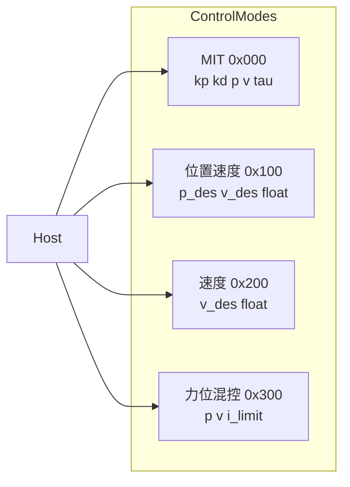
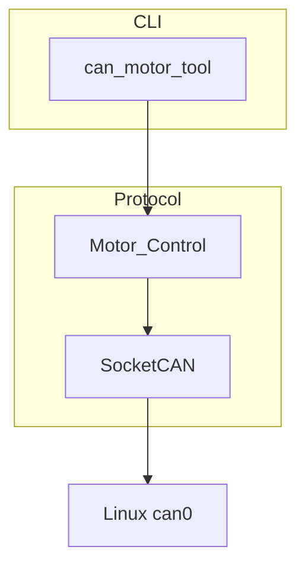

# 达妙 J4310P / J4340 减速电机 CAN 协议分析

> 本文档整理自官方说明书与 `can-motor-tool` 实现方案，用于 Arm-ZayV2 项目在电机选型、协议理解与底层驱动集成时的参考。
>
> 说明书来源：
>
> - [DM-J4310P-2EC减速电机说明书 V1.1](DM-J4310P-2EC减速电机说明书V1.1%20%20定稿(2).pdf)
> - [DM-J4340-2EC V1.1减速电机说明书 V1.2](DM-J4340-2ECV1.1减速电机说明书%20V1.2.pdf)
>
> 配套工具：`../can-motor-tool/`（SocketCAN C++ CLI）

---

## 1. 结论摘要

| 项目 | 结论 |
| --- | --- |
| CAN 协议 | **J4310P-2EC 与 J4340-2EC V1.1 完全相同** |
| 帧格式 | CAN 2.0B 标准帧，出厂默认 1Mbps |
| 控制模式 | MIT / 位置速度 / 速度 / 力位混控，四种模式 ID 偏移一致 |
| 主要差异 | 机械参数（减速比、扭矩、转速）及 PMAX/VMAX/TMAX 映射范围 |
| 实现建议 | 共用一套协议层；通过 `--motor-type` 选默认映射，连接后读寄存器同步 |

J4340 说明书亦注明：调试流程参考 43 系列中 4310 的同系列演示，可供同系列电机调试参考。

---

## 2. 电机硬件对比

### 2.1 共同特性

- 双磁编（16 bit），输出轴单圈绝对位置，掉电不丢
- 电机与驱动一体化
- 控制：CAN；调参：UART @ 921600
- 支持上位机调试、CAN 读写参数、CAN 固件升级
- 双温度保护、通讯丢失保护

### 2.2 型号参数对照

| 项目 | DM-J4310P-2EC | DM-J4340-2EC V1.1 |
| --- | --- | --- |
| 额定电压 | 24V / 48V | 24V / 48V |
| 工作电压（24V 版） | 20–28V | 20–28V |
| 工作电压（48V 版） | 20–58V（>36V 减少热插拔） | 20–58V（>36V 减少热插拔） |
| 额定扭矩 | 3.5 N·m | 12 N·m |
| 峰值扭矩 | 12.5 N·m | 40 N·m |
| 额定转速 | 120 rpm | 36 rpm |
| 空载最高转速（24V） | 200 rpm | 56 rpm |
| 空载最高转速（48V） | 450 rpm | 112 rpm |
| 减速比 | 10:1 | 40:1 |
| 极对数 | 14 | 14 |
| 外径 × 高度 | 57 × 49.3 mm | 57 × 53.3 mm |
| 重量 | 约 325 g | 约 362 g |
| 默认 CAN 波特率 | 1 Mbps | 1 Mbps |

### 2.3 SDK 默认 MIT 映射参数

用于 MIT 模式浮点 ↔ 定点编解码的初始值（可被寄存器覆盖）：

| 型号别名 | PMAX (rad) | VMAX (rad/s) | TMAX (N·m) |
| --- | --- | --- | --- |
| J4310P-2EC / DM4310 | 12.5 | 30 | 10 |
| J4310P-2EC-48V / DM4310_48V | 12.5 | 50 | 10 |
| J4340-2EC / DM4340 | 12.5 | 10 | 28 |
| J4340-2EC-48V / DM4340_48V | 12.5 | 20 | 28 |

实际映射以电机内寄存器 **0x15 PMAX / 0x16 VMAX / 0x17 TMAX** 为准（上位机可配置）。`can-motor-tool` 连接后会自动读取并同步。

---

## 3. 工作模式



### 3.1 MIT 模式

阻抗控制，电流环跟踪扭矩给定。

- `kp ∈ [0, 500]`，`kd ∈ [0, 5]`
- `kp=0, kd≠0`：给定 `v_des` 可匀速
- `kp=kd=0`：给定 `t_ff` 可纯力矩输出
- **位置控制时 kd 不能为 0**，否则震荡甚至失控

### 3.2 位置速度模式

三环串级：位置环 → 速度环 → 电流环。

- `p_des`：目标位置（rad，float）
- `v_des`：运动过程最大绝对速度（rad/s，float），梯形加减速
- 可通过寄存器 ACC/DEC 设置加/减速度（转子侧，单位 Krad/s²，减速度为负）

### 3.3 速度模式

单速度环控制。

- `v_des`：rad/s，float
- 阻尼因子建议 4.0（范围 2.0–10.0）

### 3.4 力位混控模式

在位置速度基础上限制电流/扭矩输出。

- `p_des`：rad，float
- `v_des`：限速，×100 后 uint16（0–10000 → 0–100 rad/s）
- `i_des`：电流标幺，×10000 后 uint16（0–1.0）

### 3.5 模式切换

| 方式 | 行为 |
| --- | --- |
| 串口写参数 | 电机复位，模式持久化到 flash |
| CAN 写寄存器 0x0A | 不复位，但清零位置/速度/扭矩/kp/kd 命令；掉电丢失，需 0xAA 0x01 存 flash |

模式编码：1=MIT，2=位置速度，3=速度，4=力位混控。

切换到位置类模式前，建议先读 0x50 当前位置，并在零速时切换。

---

## 4. CAN 通信协议

### 4.1 基本规则

- **帧类型**：CAN 2.0B 标准帧（11-bit ID）
- **默认波特率**：1 Mbps
- **ID 匹配**：仅比较 CAN ID **低 8 位**（高 3 位忽略）
- **反馈机制**：**问询式**——收到与 `ESC_ID + 模式偏移` 匹配的控制帧后，向 `MST_ID` 发送状态
- **发送 ID**：`ESC_ID + mode_offset`

| 模式 | offset | 示例（ESC_ID=0x01） |
| --- | --- | --- |
| MIT | 0x000 | 0x001 |
| 位置速度 | 0x100 | 0x101 |
| 速度 | 0x200 | 0x201 |
| 力位混控 | 0x300 | 0x301 |

> **CAN 2.0B vs CAN-FD**：波特率 >1 Mbps 时驱动器切 CAN-FD 发反馈，CAN 2.0B 主机收不到反馈且持续报错。两型号出厂均为 1 Mbps，工具应使用经典 CAN。

### 4.2 反馈帧（所有模式相同）

- **ID** = `MST_ID`（寄存器 0x07，默认 0）

| 字节 | 含义 |
| --- | --- |
| D[0] | `CAN_ID低4位 \| ERR<<4` |
| D[1–2] | POS，16 bit 定点 |
| D[3–4高4] | VEL，12 bit 定点 |
| D[4低4–5] | T，12 bit 定点 |
| D[6] | T_MOS（℃） |
| D[7] | T_Rotor（℃） |

**ERR 状态码**：

| 值 | 含义 |
| --- | --- |
| 0 | 失能 |
| 1 | 使能 |
| 8 | 超压 |
| 9 | 欠压 |
| A | 过电流 |
| B | MOS 过温 |
| C | 线圈过温 |
| D | 通讯丢失 |
| E | 过载 |

**定点线性映射**：

```
uint = (value - min) / (max - min) * (2^bits - 1)
value = uint / (2^bits - 1) * (max - min) + min
```

- POS：16 bit，范围 ±PMAX
- VEL：12 bit，范围 ±VMAX
- T：12 bit，范围 ±TMAX

### 4.3 控制帧

#### MIT（ID = ESC_ID）

| 字节 | 内容 |
| --- | --- |
| D[0–1] | p_des[15:0] |
| D[2] | v_des[11:4] |
| D[3] | v_des[3:0] \| kp[11:8] |
| D[4] | kp[7:0] |
| D[5] | kd[11:4] |
| D[6] | kd[3:0] \| t_ff[11:8] |
| D[7] | t_ff[7:0] |

#### 位置速度（ID = ESC_ID + 0x100）

D[0–3] = p_des float LE，D[4–7] = v_des float LE。

#### 速度（ID = ESC_ID + 0x200）

D[0–3] = v_des float LE。

#### 力位混控（ID = ESC_ID + 0x300）

D[0–3] = p_des float LE；D[4–5] = v×100 uint16 LE；D[6–7] = i×10000 uint16 LE。

### 4.4 通用管理帧

任意模式下，ID = `ESC_ID + 当前模式偏移`，D[0–6]=0xFF：

| D[7] | 功能 |
| --- | --- |
| 0xFC | 使能 |
| 0xFD | 失能 |
| 0xFE | 保存位置零点 |
| 0xFB | 清除错误 |

上电默认失能。官方例程使能/失能各连发 5 次，间隔 2 ms。

### 4.5 寄存器读写（广播 ID 0x7FF）

| 操作 | D[2] | 说明 |
| --- | --- | --- |
| 读 | 0x33 | D[3]=RID，回应在 MST_ID |
| 写 | 0x55 | D[3]=RID，D[4–7]=数据 LE，立即生效 |
| 存 flash | 0xAA | D[3]=0x01，须失能，≤30 ms，约 1 万次寿命 |

读/写帧格式：

```
发送: ID=0x7FF, D[0]=CANID_L, D[1]=CANID_H, D[2]=0x33/0x55, D[3]=RID, D[4-7]=数据
回应: ID=MST_ID,  同上
```

数据为 float 或 uint32，4 字节小端。

### 4.6 CAN 波特率修改

写寄存器 0x23（can_br）：

| 编码 | 波特率 |
| --- | --- |
| 0 | 125K |
| 1 | 200K |
| 2 | 250K |
| 3 | 500K |
| 4 | 1M |
| 5 | 2M |
| 6 | 2.5M |
| 7 | 3.2M |
| 8 | 4M |
| 9 | 5M |

修改成功后先以原波特率反馈，再切换新波特率。

### 4.7 寄存器列表（关键项）

| 地址 | 变量 | 描述 | 读写 |
| --- | --- | --- | --- |
| 0x07 | MST_ID | 反馈帧 ID | RW |
| 0x08 | ESC_ID | 接收帧 ID | RW |
| 0x09 | TIMEOUT | 通讯超时（50 µs/计数，使能时生效） | RW |
| 0x0A | CTRL_MODE | 控制模式 1–4 | RW |
| 0x15 | PMAX | 位置映射范围 | RW |
| 0x16 | VMAX | 速度映射范围 | RW |
| 0x17 | TMAX | 扭矩映射范围 | RW |
| 0x23 | can_br | CAN 波特率代码 | RW |
| 0x0E | sw_ver | 软件版本 | RO |
| 0x50 | p_m | 转子折算输出轴位置 (rad) | RO |
| 0x51 | xout | 输出轴编码器位置 (rad) | RO |
| 0x3C | VBus | 电源电压 | RO |
| 0x3D | Tpcb | 驱动板温度 | RO |
| 0x3E | Tmtr | 电机温度 | RO |

完整寄存器表见各型号说明书「寄存器列表及范围」章节，两型号地址与定义一致。

---

## 5. 指示灯与保护

| 状态 | 指示灯 | ERR |
| --- | --- | --- |
| 使能正常工作 | 绿灯常亮 | 1 |
| 失能 | 红灯常亮 | 0 |
| 故障 | 红灯闪烁 | 见 ERR 表 |

保护项：驱动过温 120℃、线圈过温（建议 ≤100℃）、过压/欠压、过流、通讯丢失、过载。触发后自动失能。

建议 ESC_ID 设为小于 16，避免与 ERR 高 nibble 混淆。

---

## 6. 调试流程概要

两型号流程相同，均需：

1. 连接串口、CAN、电源；串口确认 Control Mode
2. （可选）电机侧编码器校准、参数标定、输出轴编码器校准——出厂已完成
3. 串口读/写参数，核对 CAN_ID、Master ID、PMAX/VMAX/TMAX
4. CAN 调试：确认模式 → 使能 → 发控制帧（定时发送）→ 读反馈 → 停止 → 失能

### 6.1 MIT 调试示例

| 场景 | 参数 |
| --- | --- |
| 速度 5 rad/s | v_des=5, kd=1, 其余 0 |
| 位置 3.14 rad | pos=3.14, kp=2, kd=1 |
| 力矩 1 N·m | tau=1（空载会加速到最高转速，须固定电机） |

### 6.2 位置速度 / 速度 / 力位混控

- 位置速度：pos=10 rad, vel=5 rad/s
- 速度：vel=5 rad/s
- 力位混控：pos=10 rad, vel=5 rad/s, current=20%

退出前先发零速/停稳，再失能。

---

## 7. can-motor-tool 实现要点

工具路径：`../can-motor-tool/`

### 7.1 架构



协议层复用 `motor-control-routine/SocketCan控制例程/C++例程`，两型号共用，不做协议分叉。

### 7.2 子命令

| 命令 | 功能 |
| --- | --- |
| `scan` | 探测 ESC_ID 1–15 |
| `read-reg` / `read-state` | 读寄存器 / 反馈 |
| `enable` / `disable` | 使能 / 失能 |
| `clear-error` / `set-zero` | 清错 / 保存零点 |
| `switch-mode` | 写 0x0A |
| `mit` / `pos-vel` / `vel` / `pvt` | 四种控制 |
| `save-params` | 存 flash |

### 7.3 使用示例

```bash
# 配置经典 CAN 1M
sudo ./scripts/setup_can.sh can0

# J4310P
./build/can_motor_tool --iface can0 --esc-id 1 --motor-type J4310P-2EC read-reg 0x0E

# J4340
./build/can_motor_tool --iface can0 --esc-id 1 --motor-type J4340-2EC --mst-id 0x11 enable
./build/can_motor_tool --iface can0 --esc-id 1 --motor-type J4340-2EC --mode mit \
  mit --vel 5 --kd 1 --loop-hz 500 --duration 3 --force
```

### 7.4 实现注意

- 默认 `Can_control_Mode::can`（经典 CAN 1M）
- 连接后 `sync_mapping_limits()` 读 0x15/0x16/0x17
- 控制循环 500–1000 Hz，避免通讯超时（寄存器 0x09）
- SIGINT 时先 disable 再退出
- 模式与控制帧 ID 必须一致

---

## 8. 风险与注意事项

1. **勿误用 CAN-FD**：出厂 1 Mbps；除非确认 `can_br` 已改
2. **MIT 位置控制 kd≠0**
3. **空载力矩测试**：小力矩也会满速，须固定电机
4. **通讯丢失**：停止发帧过久自动失能
5. **存 flash**：仅失能时可写，勿频繁调用
6. **双编码器**：0x50 为转子折算位置，0x51 为输出轴编码器位置

---

## 9. 相关资源

| 资源 | 路径 |
| --- | --- |
| J4310P 说明书 | `docs/DM-J4310P-2EC减速电机说明书V1.1  定稿(2).pdf` |
| J4340 说明书 | `docs/DM-J4340-2ECV1.1减速电机说明书 V1.2.pdf` |
| motor-control-routine 分析 | `docs/motor-control-routine-overview.md` |
| USB2CANFD 连接 | `docs/damiao-x86-usb2canfd-link.md` |
| 测试 CLI | `../can-motor-tool/` |
| 官方 SocketCAN 例程 | `../motor-control-routine/SocketCan控制例程/` |
