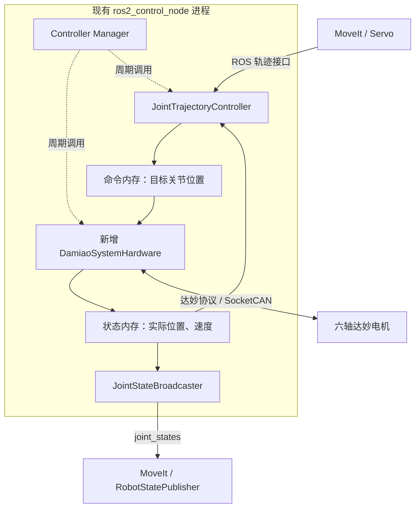

注释 1 **这里的硬件插件，本质上是一个 C++ 动态库：向上提供 ros2_control 认识的“关节命令、关节状态”，向下把这些数据转换成达妙电机的 CAN 通信。**

对 ZayV2，可以实现一个 `DamiaoSystemHardware` 类，统一管理六个电机。它运行在现有 `ros2_control_node` 进程中，由框架加载并定期调用，因此不需要单独写 `main()`、单独启动节点，或通过 ROS 话题转发每一条电机命令。[官方硬件插件说明](https://control.ros.org/humble/doc/ros2_control/hardware_interface/doc/writing_new_hardware_component.html)

下面的类名、目录和配置是建议方案，代码片段用于解释结构，尚未写入项目。

**它在现有框架中的位置，可以具体到一个控制周期。**

你现在已经启动了 `controller_manager`，配置了 `JointTrajectoryController`。需要新增的是图中的达妙硬件插件和通信实现：




当前 [控制器配置](/home/wlzc/qihemu_ws/Arm-ZayV2/src/aubo_i5_moveit_config/config/ros2_controllers.yaml:4) 的更新率为 100 Hz，因此正常情况下每隔约 10 ms 执行：

1. `hardware.read()`：将已经收到的电机反馈更新到关节状态内存。
2. `controller.update()`：轨迹控制器计算当前时刻的目标，写入关节命令内存；状态广播器读取状态。
3. `hardware.write()`：读取目标关节位置，转换并发送 CAN 命令。

这是框架已有的执行循环，硬件插件不需要再建立一个重复的 ROS 定时器来执行相同流程。[Controller Manager 文档](https://control.ros.org/humble/doc/ros2_control/controller_manager/doc/userdoc.html)

**为什么一个插件可以管理六个电机？因为插件代表的是一个硬件系统。**

ros2_control 提供三种主要硬件抽象：


| 类型                  | 适用对象             | 对 ZayV2 的用途          |
| ------------------- | ---------------- | -------------------- |
| `ActuatorInterface` | 单个执行器            | 可以用于独立电机，但这里没有必要逐轴拆分 |
| `SensorInterface`   | 只提供测量数据的设备       | 例如独立传感器              |
| `SystemInterface`   | 多关节、共享通信或存在耦合的设备 | 适合六轴共用 CAN 的机械臂      |


你的六个关节共享一个 CAN 接口，统一管理更方便完成发送调度、反馈路由、启动检查和故障联动。**这个插件内部仍然有六份独立的电机配置和状态。**

同时，几层软件各有职责：


| 层                           | 负责什么                       |
| --------------------------- | -------------------------- |
| Linux `gs_usb` 驱动           | 让 USB 转接器成为 Linux CAN 网络接口 |
| SocketCAN 通信层               | 收发 CAN 帧                   |
| 达妙协议层                       | 编解码位置、速度、力矩、寄存器和管理命令       |
| `DamiaoSystemHardware`      | 将达妙电机映射到 ROS 关节，管理生命周期和读写  |
| `JointTrajectoryController` | 按时间执行关节轨迹                  |


**实现时，最先要理解的是“导出接口”：它是在注册内存中的数值。**

对于当前 ZayV2 的 position 控制方式，每个关节至少提供：


| 接口                 | 含义              | 谁更新   |
| ------------------ | --------------- | ----- |
| command：`position` | 目标关节角，单位 rad    | 轨迹控制器 |
| state：`position`   | 实际关节角，单位 rad    | 硬件插件  |
| state：`velocity`   | 实际关节速度，单位 rad/s | 硬件插件  |


例如插件保存三个数组：

```cpp
// 每个下标对应一条已校验的“关节名—电机 ID”映射。
std::vector<double> position_commands_;
std::vector<double> position_states_;
std::vector<double> velocity_states_;
```

Humble 中可以这样注册接口，以下是类成员函数的实现片段：

```cpp
std::vector<hardware_interface::StateInterface>
DamiaoSystemHardware::export_state_interfaces()
{
    std::vector<hardware_interface::StateInterface> interfaces;
    interfaces.reserve(info_.joints.size() * 2);

    // 将各关节的实测状态内存注册给 ros2_control。
    for (std::size_t i = 0; i < info_.joints.size(); ++i)
    {
        const auto& name = info_.joints[i].name;

        interfaces.emplace_back(
            name, hardware_interface::HW_IF_POSITION,
            &position_states_[i]);

        interfaces.emplace_back(
            name, hardware_interface::HW_IF_VELOCITY,
            &velocity_states_[i]);
    }

    return interfaces;
}

std::vector<hardware_interface::CommandInterface>
DamiaoSystemHardware::export_command_interfaces()
{
    std::vector<hardware_interface::CommandInterface> interfaces;
    interfaces.reserve(info_.joints.size());

    // 控制器通过这些接口写入目标位置，write() 再读取并发送。
    for (std::size_t i = 0; i < info_.joints.size(); ++i)
    {
        interfaces.emplace_back(
            info_.joints[i].name,
            hardware_interface::HW_IF_POSITION,
            &position_commands_[i]);
    }

    return interfaces;
}
```

注册后，框架可以按名字找到 `shoulder_joint/position` 等接口。控制器按名字申请接口，不需要知道对应的电机是 J4310P 还是 J4340。

这里有两个实现约束：

- 三个数组应在 `on_init()` 中一次性确定大小，**导出接口后不能再进行导致地址变化的扩容操作**。
- CAN 接收线程应写入独立的反馈缓存，由 `read()` 更新上述状态数组，避免线程并发读写同一份 `double`。

本机 Humble 的接口句柄确实保存数值指针，见 [handle.hpp](/opt/ros/humble/include/hardware_interface/hardware_interface/handle.hpp:30)。

**插件需要实现的主要方法，以及达妙场景下各自做什么。**

类继承自 `hardware_interface::SystemInterface`。本机安装的接口版本为 2.54.0，应以 [本机头文件](/opt/ros/humble/include/hardware_interface/hardware_interface/system_interface.hpp:84) 为实现依据，避免直接套用其他 ROS 发行版示例。


| 方法                             | 建议职责                                    |
| ------------------------------ | --------------------------------------- |
| `on_init(info)`                | 调用基类初始化；解析配置；检查关节、型号、ID、接口和限位；分配固定大小的内存 |
| `export_state_interfaces()`    | 注册实际位置、速度，必要时增加力矩状态                     |
| `export_command_interfaces()`  | 第一版只注册目标位置                              |
| `on_configure()`               | 打开 CAN、启动接收线程、核对电机参数，保持运动禁止             |
| `on_activate()`                | 验证反馈与标定，初始化保持目标，执行受控使能流程                |
| `read(time, period)`           | 获取反馈快照，检查有效性，转换为关节状态                    |
| `write(time, period)`          | 检查运行许可和命令，转换、编码、发送                      |
| `on_deactivate()`              | 禁止新运动，完成既定停止和失能/抱闸交接                    |
| `on_error()`                   | 锁存故障，执行适用于当前故障的处理，阻止自动恢复运动              |
| `on_cleanup()`、`on_shutdown()` | 在停止流程完成后关闭通信、结束线程、释放资源                  |


三个阶段尤其需要区分：

- **初始化完成**：知道配置，但还没有连接电机。
- **通信就绪**：能读到真实状态，但没有获得运动许可。
- **激活完成**：所有前置条件成立，可以执行命令。

Humble 明确允许硬件实现自行决定 `INACTIVE` 时是否使用命令，因此插件应维护明确的运动许可标志，不能认为框架进入 `INACTIVE` 就一定不再调用运动相关读写。[硬件生命周期说明](https://control.ros.org/humble/doc/ros2_control/hardware_interface/doc/hardware_components_userdoc.html)

达妙参考代码的 [Motor_Control 构造函数](/home/wlzc/qihemu_ws/motor-control-routine/ROS2%20例程/src/dmbot_serial/src/protocol/damiao.cpp:112) 会调用 `enable_all()`。这个行为需要拆开：**创建通信对象不能同时意味着使能六个关节。**

`read()` **和** `write()` **的实现，是这个插件真正连接实体机械臂的部分。**

建议第一版采用“一个接收线程 + 框架控制线程”的结构：


| 执行位置      | 工作                                |
| --------- | --------------------------------- |
| CAN 接收线程  | 接收帧、检查帧类型和长度、识别电机、解析反馈、记录单调时钟时间戳  |
| `read()`  | 获取一致的反馈快照，判断是否过期，将电机量转换为关节量       |
| `write()` | 检查六轴命令，准备完整一周期报文，再以非阻塞或有严格时限的方式发送 |
| 配置阶段      | 执行寄存器查询、参数核对等允许等待的操作              |


不要让 `read()` 按顺序阻塞等待六台电机逐一应答。达妙正常反馈通常由控制帧触发，因此周期运行时，`read()` 使用的是前面已到达的最新反馈，`write()` 发出的命令又会促成后续反馈。

反馈缓存至少需要保存：

- 位置、速度、力矩、错误码与温度。
- 本次反馈的接收时间、序号和有效标志。
- 接收异常、发送失败和总线错误信息。

`write()` 应先检查**整组命令**，再开始发送，避免前几轴已经收到命令，才发现后面某个关节是 NaN 或越界。即便如此，CAN 上的多帧发送也不具备六轴原子性，中途发送失败仍要进入整机故障处理。

高频路径应避免无期限等待、动态扩容、大量日志、同步服务调用和长时间锁占用。第一版保持 100 Hz，依据实测延迟和总线占用再提高频率。

**电机角度与关节角度的转换，应当集中在插件内部。**

假设：

- `θ`：已经折算到电机减速器输出轴的角度。
- `θ₀`：机械关节处于零位时，对应的电机输出轴角度。
- `s`：安装方向，取 `+1` 或 `-1`。
- `R`：电机输出轴到机械关节之间的**额外传动比**；直接连接时为 1。

则：


q=s\frac{\theta-\theta_0}{R},
\qquad
\dot q=s\frac{\dot\theta}{R}


发送时使用逆变换：


\theta_{\mathrm{cmd}}=\theta_0+sRq_{\mathrm{cmd}}


单圈展开、零位可信性和异常跳变检查，需要在这一步周围完成。不能把达妙内部减速比再次计算进去。

对于第一版位置速度模式：

- `position_commands_[i]` 转换成电机的 `p_des`。
- 电机 `v_des` 来自经过验证的速度上限配置。
- 不应把轨迹中的带符号目标速度直接当成这个速度上限。
- `PMAX/VMAX/TMAX` 应按每台电机查询、保存和校验；这些是协议映射范围，机械限位需要单独配置。

以后改用 MIT 时，可以保留上层位置接口，在硬件层使用经过整定的固定 `kp/kd`。如果要逐周期控制增益和力矩前馈，则需要重新设计命令接口及相应控制器；仅在 URDF 中增加 `kp`、`kd` 名称，现有 JTC 不会自动生成这些命令。

**使能流程需要解决“第一条命令是什么”。**

真机不能沿用 Mock 的初始零位置。建议流程为：

1. 在运动禁止状态下核对所有电机、控制模式和映射参数。
2. 获取真实位置，检查反馈新鲜度、故障状态、标定记录和关节限位。
3. 将关节目标初始化为实测位置，同时初始化变化率检查的历史值。
4. 执行经单轴验证的“目标保持—使能”时序。
5. 确认各轴进入预期状态后，允许控制器运动。

其中第 4 步要验证电机在失能期间是否接收并保留目标，以及模式切换是否清除目标，不能只凭发送顺序假设它会保持当前位置。

另外，`write()` 每周期得到的是一个数值，**这个接口本身没有告诉插件“上层指令是哪一时刻产生的”**。插件可以检查反馈过期、控制循环失效和发送失败；MoveIt 任务取消、Servo 指令超时等，仍需要控制器或整机管理层处理。重复的保持目标本身也不能被简单判定为过期命令。

**在工程中，建议拆成四个职责清楚的类。**

建议新增包的位置是 `/home/wlzc/qihemu_ws/Arm-ZayV2/src/damiao_hardware`，内部结构可以是：

```text
damiao_hardware/
├── CMakeLists.txt
├── package.xml
├── damiao_hardware_plugins.xml
├── include/damiao_hardware/
│   ├── damiao_system_hardware.hpp
│   ├── damiao_bus.hpp
│   ├── damiao_protocol.hpp
│   └── socketcan_transport.hpp
├── src/
│   ├── damiao_system_hardware.cpp
│   ├── damiao_bus.cpp
│   ├── damiao_protocol.cpp
│   └── socketcan_transport.cpp
└── test/
```


| 类                      | 职责                        |
| ---------------------- | ------------------------- |
| `DamiaoSystemHardware` | ROS 接口、生命周期、关节转换和运行检查     |
| `DamiaoBus`            | 电机清单、ID 路由、反馈缓存、查询事务和发送组织 |
| `DamiaoProtocol`       | 纯编解码，不打开设备、不创建线程          |
| `SocketCanTransport`   | Socket 打开关闭、帧收发和底层错误检测    |


这样协议编解码可以脱离 ROS 和实机测试，单电机 CLI 也能复用同一通信实现。诊断数据应从这套缓存或导出的状态接口读取，避免另一个节点重复建立电机控制逻辑。

**让框架找到插件，需要把“C++ 类、动态库、插件名称”连接起来。**

首先在实现文件中导出类：

```cpp
#include <pluginlib/class_list_macros.hpp>

// 允许 pluginlib 按 SystemInterface 类型创建该硬件对象。
PLUGINLIB_EXPORT_CLASS(
    damiao_hardware::DamiaoSystemHardware,
    hardware_interface::SystemInterface)
```

然后在插件 XML 中声明映射：

```xml
<!-- library path 对应 CMake 中构建的共享库目标名称。 -->
<library path="damiao_hardware">
    <class
        name="damiao_hardware/DamiaoSystemHardware"
        type="damiao_hardware::DamiaoSystemHardware"
        base_class_type="hardware_interface::SystemInterface">
        <description>Damiao multi-joint CAN hardware.</description>
    </class>
</library>
```


CMake 的关键部分如下，完整文件还需要依赖查找、头文件路径和安装规则：

```cmake
# 将硬件适配层和通信实现编译为共享库。
add_library(damiao_hardware SHARED
    src/damiao_system_hardware.cpp
    src/damiao_bus.cpp
    src/damiao_protocol.cpp
    src/socketcan_transport.cpp
)

ament_target_dependencies(damiao_hardware
    hardware_interface
    pluginlib
    rclcpp
    rclcpp_lifecycle
)

# 将插件描述注册到 ament 索引，供运行时发现。
pluginlib_export_plugin_description_file(
    hardware_interface
    damiao_hardware_plugins.xml
)
```

`package.xml` 也需要声明上述依赖。最终由 pluginlib 找到动态库并实例化 C++ 类，而不是执行一个新的电机节点。

**接入 ZayV2 时，主要改硬件描述和真机启动配置。**

当前 [硬件描述](/home/wlzc/qihemu_ws/Arm-ZayV2/src/aubo_i5_moveit_config/config/aubo_i5.ros2_control.xacro:9) 选择的是 `mock_components/GenericSystem`。真机配置需要选择新插件，例如下面这个单关节示意片段：

```xml
<ros2_control name="DamiaoArm" type="system">
    <hardware>
        <!-- 以下参数由新插件自行解析。 -->
        <plugin>damiao_hardware/DamiaoSystemHardware</plugin>
        <param name="can_interface">can0</param>
        <param name="control_mode">pos_vel</param>
    </hardware>

    <joint name="shoulder_joint">
        <!-- 示例型号和 ID，最终由实机关节参数表提供。 -->
        <param name="motor_type">J4340-2EC</param>
        <param name="esc_id">1</param>
        <param name="mst_id">17</param>

        <command_interface name="position"/>
        <state_interface name="position"/>
        <state_interface name="velocity"/>
    </joint>
</ros2_control>
```

六轴按同样方式声明，并补齐方向、零偏、额外传动比、机械限位和超时等配置。上述自定义参数由 `on_init()` 从 `HardwareInfo` 读取；ROS 不会自动理解这些达妙参数。

保留独立的 Mock/真机选择，真机启动建议先停在通信就绪状态：

```yaml
controller_manager:
    ros__parameters:
        update_rate: 100

        # 名称对应 ros2_control 标签的 name，先配置而不自动使能。
        hardware_components_initial_state:
            inactive:
                - DamiaoArm
```

同时将轨迹控制器初始保持为 inactive，待反馈、标定和使能检查完成后再激活。硬件和控制器各有自己的生命周期，二者需要协调。

这一配置很重要：Humble 文档说明，未明确指定初始状态的硬件组件可能在启动时直接被激活。[启动状态配置](https://control.ros.org/humble/doc/ros2_control/controller_manager/doc/userdoc.html#parameters)

现有 MoveIt 的 `FollowJointTrajectory` 接口和 `/joint_states` 接口可以继续沿用。轨迹控制器的 `open_loop_control`、逐关节误差容差和启动位置处理，则需要配合真实反馈调整。

**第一版实现建议按下面的验收顺序推进。**


| 顺序  | 交付内容        | 验证重点                          |
| --- | ----------- | ----------------------------- |
| 1   | 纯达妙协议编解码    | 已知报文、映射边界、NaN/Inf、错误帧与寄存器回应识别 |
| 2   | 总线通信与模拟电机测试 | 多 ID 路由、反馈过期、查询超时、发送失败        |
| 3   | 可被加载的硬件插件   | 接口数量和名称正确；加载、配置过程不会使能电机       |
| 4   | 单电机真实反馈     | 位置、方向、零偏正确；断连可识别              |
| 5   | 单轴激活和轨迹执行   | 初始目标来自实测值；标准 JTC 能执行受限轨迹      |
| 6   | 六轴集成        | 周期与总线余量、故障联动、重启和恢复流程          |


第一版的合理范围是：**一个 CAN 接口、可配置关节数、固定位置速度模式、position 命令、position/velocity 反馈，以及完整的激活和故障处理。** 先用同一个插件的一关节配置验证，再扩展为六关节配置，能减少多轴联调时难以定位的问题。