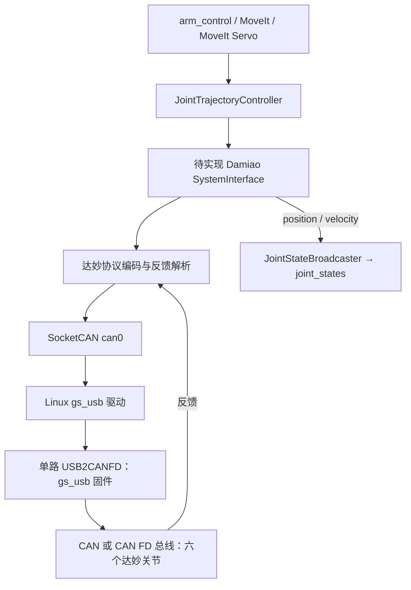

# 达妙电机通信链路与单路 USB2CANFD 刷机说明

核对日期：2026-09-10。硬件条件：x86 Linux，达妙原厂单路 USB2CANFD，目前使用原厂固件；电机型号、固件版本与总线参数尚未提供。本次完成源码、官方资料和主机只读检查，未刷写设备、配置总线或驱动电机。

## 1. 结论与本机状态

建议采用：**USB2CANFD 刷官方 gs_usb 固件 → Linux 内核 gs_usb → SocketCAN → 达妙私有电机协议 → ros2_control 硬件接口**。

本机实查结果：

- 架构为 `x86_64`，内核为 `6.8.0-138-generic`。
- `modinfo gs_usb` 已找到本机内核自带的 `gs_usb.ko`，不需要先安装相邻仓库中的 Orin/RK 驱动。
- 检查时 `ip -details -statistics link show` 没有 CAN 网络接口；`lsusb` 没有出现参考原厂 SDK 使用的 `34b7:6877`，也没有明显的 gs_usb 适配器。这个结果不能证明设备损坏或刷机失败，只说明本次未识别到设备。
- Linux 6.8 的上游 `gs_usb` 驱动包含 CAN FD 支持；最终是否正常工作还取决于设备固件、USB 标识和实际枚举结果。[内核源码](https://github.com/torvalds/linux/blob/v6.8/drivers/net/can/usb/gs_usb.c)

“gs_usb 固件”写入 USB2CANFD 转接器；“gs_usb.ko 驱动”运行在 Linux 内核。安装驱动不会把原厂 USB 协议固件变成 gs_usb 固件。

## 2. 项目中已经有什么

| 位置 | 实际作用与现状 |
| --- | --- |
| `src/aubo_i5_moveit_config/config/aubo_i5.ros2_control.xacro:9` | 使用 `mock_components/GenericSystem`，尚未连接实际电机 |
| `src/aubo_i5_moveit_config/config/ros2_controllers.yaml` | 六关节、position 命令接口、position/velocity 状态接口；更新率 100 Hz；`open_loop_control: true` |
| `src/arm_control/launch/arm_control.launch.py` | 启动 controller_manager、轨迹控制器、状态广播器和 MoveIt；可作为真机集成的上层入口 |
| `docs/motor-control-routine-overview.md` | 达妙参考仓库的概览，属于设计资料，不能视为驱动已经集成 |
| `docs/canopen-stm32-ros2-solution.md` | 自研 STM32 CANopen/CiA 402 从站方案，与现有达妙私有协议路线分开 |
| 相邻 `motor-control-routine/ROS2 例程/src/dmbot_serial` | SocketCAN 协议库和独立 ROS2 电机测试节点；尚非 ros2_control SystemInterface 插件 |
| 相邻 `motor-control-routine/ROS1 例程/u2canfd/src/dmbot_serial` | 原厂固件的 libusb 路线，包含 `libu2canfd.a`；本次检查其目标文件为 x86-64，完整编译与 ABI 兼容性未测试 |
| 相邻 `gs-usb-drivers` | 主要提供 Orin/RK 平台驱动和旧内核适配；不能直接把其中 ARM 的预编译模块装到本机 |

达妙例程实现 MIT、位置速度、速度、位置力矩模式，命令 ID 分别使用电机 CAN ID 加 `0x000/0x100/0x200/0x300`。MIT 将位置、速度、Kp、Kd 和前馈力矩打包为 8 字节；反馈解码得到位置、速度、力矩与状态码。型号对应的编码范围必须与电机内部配置一致，不能把协议编码范围当作机械臂的安全关节限位。

`pos_force` 例程接口虽然被 ROS 节点叫作 effort，但底层函数参数名为 `current`，并乘以 10000 编码；未核对具体电机手册前，不能直接把它解释为 N·m。

## 3. 可行链路比较

| 路线 | 通信路径 | 适用性 |
| --- | --- | --- |
| 原厂固件 + SDK | C++/ROS2 → 达妙协议 → USB SDK/libusb → USB2CANFD → CAN/CAN FD → 电机 | 可行，不必刷机；本地参考为 ROS1 包，移植到底层 C++/ROS2 时需处理 SDK、权限、序列号与 ABI |
| gs_usb + SocketCAN | C++/ROS2 → 达妙协议 → CAN_RAW socket → 内核 gs_usb → USB2CANFD → CAN/CAN FD → 电机 | 推荐；直接复用 ROS2/SocketCAN 参考，便于 candump 诊断及更换适配器 |
| SLCAN 固件 | 应用 → SocketCAN/SLCAN → 串口桥接 → 转接器 → 电机 | 官方另有此路线，但并非 gs_usb；帧格式和厂商扩展需单独核对，本次不作为首选 |
| STM32 中间控制器 | ROS2 → 上下位机协议 → STM32 → 达妙 CAN 协议 → 电机 | 后续若有严格同步或调度要求可评估；当前 100 Hz 机械臂控制不必先增加这一层 |

SocketCAN 是 Linux CAN 接口，CANopen 是另一层应用协议。达妙参考代码没有实现 CiA 402 对象字典、NMT、SDO/PDO 等，不能直接用 ros2_canopen 替代达妙协议驱动。[Linux SocketCAN 文档](https://docs.kernel.org/networking/can.html)

## 4. 单路 USB2CANFD 如何刷成 gs_usb

### 4.1 获取官方文件

- [单路 gs_usb 固件目录](https://github.com/dmBots/usb2canfd/tree/main/firmware/socketcan/gsusb-driverless-firmware)：核对时文件为 `dm_usb2canfd_gsusb_1003.enc`。不要选择 Dual、SLCAN 或“历史固件”目录中的文件。
- [官方通用升级工具](https://github.com/dmBots/dm-tools/tree/master/USB2CANFD%E9%80%9A%E7%94%A8%E5%8D%87%E7%BA%A7%E5%B7%A5%E5%85%B7)：下载并完整解压 `USB2CANFD系列升级工具.zip`。本次检查包内包含 `CANFD_UpdateTool.Desktop.exe` 和配套 DLL，没有 Linux 可执行文件或刷机说明。
- [单路模块使用手册 V1.0](https://github.com/dmBots/usb2canfd/blob/main/达妙科技-USB转CANFD模块使用说明书V1.0.pdf)：第 13 页为转接器升级，第 18 页为电机升级，二者不能混用。
- [单路原厂固件目录](https://github.com/dmBots/usb2canfd/tree/main/firmware/factory-firmware)：保留匹配硬件的原厂固件用于恢复原厂调试工具连接。

### 4.2 刷写流程

目前能核实的官方发布包是 Windows 工具，建议使用 Windows 电脑完成一次刷写，再接回 Linux。本次没有核实可直接在 Linux 刷该 `.enc` 文件的官方工具。

1. 趁原厂固件仍可用，记录电机型号、CAN ID、反馈 MASTER ID、通信模式、波特率和编码范围。多个电机应逐个确认 ID。
2. 断开转接器的 CAN 电机连接，仅通过支持数据传输的 USB 线连接 Windows，关闭其他占用该设备的工具。
3. 启动通用升级工具，刷新并选择目标单路设备，核对设备版本，再通过“固件选择”载入 `dm_usb2canfd_gsusb_1003.enc`，执行“固件升级”，等待明确成功提示。该工具的上述控件名称已通过发布包静态字符串核对，未实际操作设备界面。
4. 如果使用的是当前能够正常连接设备的原厂调试上位机，手册第 13 页给出的入口是 **F9 → 固件选择 → 固件升级**，升级完成后设备自动重启。F9 是该上位机的入口，不是通用升级程序必须使用的快捷键。
5. 完成后重新插拔，接回 Linux 检查枚举。不要将升级后的原厂调试上位机连接失败直接判断为刷坏：官方 SocketCAN 例程明确说明，刷 gs_usb 后不能使用原厂调试上位机；恢复普通固件使用通用升级工具。

现有官方 `.enc` 文件应交给配套升级工具。不能把它当作通用 STM32 `.bin`，套用网上的 `dfu-util` 地址或 ST-Link 擦写步骤。正常升级步骤也没有要求先拆壳短接 BOOT。

### 4.3 回到 Linux 验证

以下是后续操作示例，本次未执行。用实际枚举的接口名替换 `can0`。

```bash
# 加载本机现有驱动并检查 USB、CAN 网卡和内核日志。
sudo modprobe gs_usb
lsusb
lsusb -t
ip -details link show type can
sudo dmesg --ctime | tail -n 60
```

成功标志是设备绑定到 `gs_usb` 并产生 CAN 网络接口，通常为 `can0`；接口名不是固定的。不需要启动 `slcand`。

如果 USB 完全没有枚举，先检查数据线、USB 端口和供电。如果 USB 存在但没有 CAN 网卡，结合 USB 标识、`lsusb -t` 和日志判断是否刷对固件、驱动是否匹配；先不要覆盖或拉黑系统自带驱动。

## 5. CAN 与 CAN FD 参数

转接器支持 CAN FD，不表示电机当前已经配置为 CAN FD。Linux 网卡配置、应用的 `can_mode`、电机型号和固件支持、实际电机总线参数必须一致。官方 ROS2 例程默认 CAN FD、仲裁段 1 Mbit/s、数据段 5 Mbit/s，只能作为已匹配电机的示例。

```bash
# 仅在电机已经确认使用 CAN FD，仲裁段 1M、数据段 5M 时使用。
sudo ip link set can0 down
sudo ip link set can0 type can bitrate 1000000 dbitrate 5000000 fd on
sudo ip link set can0 up
ip -details -statistics link show can0
```

```bash
# 若电机实际配置为经典 CAN 1M，使用此组替代上面的 FD 配置。
sudo ip link set can0 down
sudo ip link set can0 type can bitrate 1000000 fd off
sudo ip link set can0 up
```

应用参数分别设置 `can_mode:=canfd` 或 `can_mode:=can`。同为 8 字节载荷，经典 CAN 帧与 CAN FD 帧仍是不同格式；开启网卡 FD 能力不会自动把应用发送的经典帧转换为 FD 帧。

```bash
# can-utils 提供抓包工具；先观察总线，暂不发送运动命令。
sudo apt install can-utils
candump -tz -e can0
```

没有主动反馈配置或没有请求时，candump 没有输出不一定是通信失败。能看到本机发送帧也不等于电机已应答，应验证来自目标电机的反馈 ID、数据、更新时间和总线错误计数。

CAN_H/CAN_L 接线应与手册一致；USB 为转接器供电，电机使用独立的适配电源。总线两端各保留一个 120 Ω 终端，避免每台电机都并上终端电阻。单路模块手册第 3 页说明其 120 Ω 开关默认开启，因此要先确认现有终端配置。

## 6. Arm-ZayV2 接入方案



建议先从当前 100 Hz 控制率做单轴再多轴联调。粗略估算：六轴每周期各发一条 8 字节命令并回一条 8 字节反馈，经典 CAN 标准帧按含间隔和填充余量约 110～135 bit/帧计算，100 Hz 占 1M 总线约 13%～16%，500 Hz 约 66%～81%，1 kHz 已超过 100%。这只是链路预算，不包含额外查询、重传、USB 排队和 Linux 调度；不能直接把官方测试节点默认的 1000 Hz 用作六轴经典 CAN 的设置。

硬件插件需要完成：

- `on_configure` 校验型号、ID、控制模式和通信参数，建立接收线程。
- `on_activate` 先确认所有轴反馈有效，目标位置从实测位置初始化，再受控使能。
- `read` 返回有时间戳的真实状态；`write` 做有限值、机械限位与变化率校验后发送。
- 统一关节方向、零偏和传动比；先核对电机反馈是否已经是减速器输出轴单位，避免重复折算。
- 设置指令过期、反馈过期、USB 断开和 bus-off 处理；退出策略需考虑承重关节，不能一律突然失能。
- 将 xacro 中的 Mock 插件替换为硬件插件，并重新评估 `open_loop_control: true`，验证实际状态参与轨迹执行和误差监控。

无需先实现 CANopen，也不需要为使用 USB2CANFD 增加 STM32 中间板。

## 7. 参考代码不能直接照搬的点

以下位置相对 `/home/wlzc/qihemu_ws/motor-control-routine/ROS2 例程/src/dmbot_serial/`：

| 源码位置 | 观察到的问题 | 集成要求 |
| --- | --- | --- |
| `src/protocol/damiao.cpp:125` | 打不开网卡时无限重试，构造过程中调用 `enable_all` | 使用有期限的初始化和 ROS2 生命周期管理 |
| `src/test_motor_node.cpp:94`、`:136` | 初始目标默认为零，定时重发最后指令；未见指令过期处理 | 上线先读位置，增加指令 watchdog；不能当作只读连接测试 |
| `src/protocol/socketcan.cpp:194` | `read` 结果存入无符号 `size_t`，`len < 0` 无法检测错误；没有校验 CAN_MTU/CANFD_MTU | 使用 ssize_t，校验帧尺寸、数据长度与错误标志后解析 |
| `src/protocol/damiao.cpp:714` | 反馈路由取 `data[0] & 0x0F`，未按帧头 MASTER ID 完整区分 | 先使用例程兼容的低 ID，再按实际协议修正反馈路由并处理 ID 冲突 |
| `src/protocol/damiao.cpp:397` | MIT 浮点量直接映射到整数，未先检查有限性和范围 | 校验 NaN/Inf、范围和机械限制，避免越界转换 |
| `src/protocol/damiao.cpp:50` 与头文件 getters | 接收线程更新状态，上层直接读；接收回调的锁未覆盖读取方 | 使用线程安全的状态快照 |

此外，注册表同时以 CAN ID 和 MASTER ID 存储同一电机，部分遍历会重复使能/失能；同一总线应统一维护电机列表与反馈索引。上述为本次静态检查发现，不构成完整代码审计。

下一步现场顺序：刷转接器 → 确认 gs_usb/CAN 网卡 → 确认电机 CAN/CAN FD 参数 → 单轴反馈验证 → 有限幅的低速单轴控制 → 实现 SystemInterface → 六轴集成。
