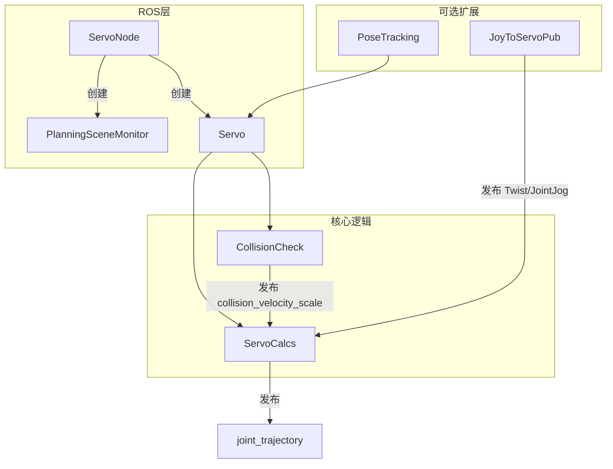

# MoveIt Servo 详解（Humble 源码分析）

本文基于工作区 `moveit2` 文件夹中的 MoveIt2 Humble 源码，对 `moveit_servo` 包进行系统梳理。源码路径：`moveit2/moveit_ros/moveit_servo/`（包版本 **2.5.9**）。

官方教程：[Realtime Arm Servoing Tutorial](https://moveit.picknik.ai/main/doc/examples/realtime_servo/realtime_servo_tutorial.html)

---

## 1. 功能定位

`moveit_servo` 提供**实时、低延迟**的机械臂伺服控制：

| 模式 | 输入 | 输出 |
|------|------|------|
| **笛卡尔空间** | `geometry_msgs/TwistStamped`（线/角速度） | 关节轨迹 |
| **关节空间** | `control_msgs/JointJog`（关节速度） | 关节轨迹 |

典型场景：手柄遥操作、键盘点动、视觉伺服、Pose Tracking（位姿跟踪）。

与 `move_group` 的**一次性规划+执行**不同，Servo 是**高频闭环**：每收到速度指令 → 雅可比/IK → 关节增量 → 限位/碰撞/奇异点处理 → 发布轨迹给控制器。

---

## 2. 包结构与编译产物

```
moveit2/moveit_ros/moveit_servo/
├── include/moveit_servo/     # 头文件
├── src/                      # 实现
├── config/                   # Panda 示例配置
├── launch/                   # 示例 launch
└── test/                     # 单元测试 + 集成测试
```

`CMakeLists.txt` 定义了以下库/节点：

| 目标 | 类型 | 说明 |
|------|------|------|
| `moveit_servo_lib_parameters` | 共享库 | 参数声明/加载/校验 |
| `moveit_servo_lib` | 共享库 | 核心计算 + 碰撞检测 |
| `pose_tracking` | 共享库 | 位姿跟踪（PID → Twist → Servo） |
| `servo_node` | Component | ROS2 组件节点 `ServoNode` |
| `servo_controller_input` | Component | 手柄遥操作示例 `JoyToServoPub` |
| `servo_node_main` | 可执行文件 | 独立启动 Servo |
| `servo_pose_tracking_demo` | 可执行文件 | Pose Tracking C++ 示例 |
| `fake_command_publisher` | 可执行文件 | 测试用假指令发布器 |

此外还依赖 `moveit_core/online_signal_smoothing` 做输出平滑（Butterworth 滤波插件）。

---

## 3. 核心类层次与职责



### 3.1 ServoNode（ROS 入口）

文件：`moveit_ros/moveit_servo/src/servo_node.cpp`

职责：

- 加载 `ServoParameters`
- 初始化 `PlanningSceneMonitor`（关节状态、场景、碰撞环境）
- 创建 `Servo` 实例
- 提供生命周期服务（**注意：构造后不会自动 start，需调用 `~/start_servo`**）

### 3.2 Servo（门面类）

文件：`moveit_ros/moveit_servo/include/moveit_servo/servo.h`

主要接口：

- `start()`：等待关节状态 → 启动计算线程 + 碰撞检测
- `setPaused(bool)`：暂停/恢复
- `getCommandFrameTransform()` / `getEEFrameTransform()`：获取坐标变换

内部组合：

- `ServoCalcs servo_calcs_`
- `CollisionCheck collision_checker_`

`start()` 会等待 `move_group` 的完整关节状态（超时 10s），然后启动 `ServoCalcs` 主循环和（可选）`CollisionCheck` 定时器。

### 3.3 ServoCalcs（核心算法）

文件：`moveit_ros/moveit_servo/include/moveit_servo/servo_calcs.h`

独立**计算线程**（`mainCalcLoop`），按 `publish_period`（默认 ~30Hz）或 `low_latency_mode` 触发。

主循环 `calculateSingleIteration()` 流程：

1. 发布 `status`（`std_msgs/Int8`）
2. `updateJoints()` 从 PSM 同步关节状态
3. 检查指令是否**过期**（`incoming_command_timeout`）
4. **笛卡尔优先于关节**（同时有指令时）
5. 调用 `cartesianServoCalcs` 或 `jointServoCalcs`
6. 无有效指令时 `filteredHalt()` 平滑停车
7. 发布 `JointTrajectory` 或 `Float64MultiArray`

### 3.4 CollisionCheck（独立碰撞线程）

文件：`moveit_ros/moveit_servo/src/collision_check.cpp`

以 `collision_check_rate`（默认 10Hz）运行，与计算线程解耦：

- 检测**自碰撞**与**环境碰撞**（基于距离）
- 计算 `velocity_scale_`（0~1），通过 `~/collision_velocity_scale` 发给 `ServoCalcs`
- 已碰撞 → scale=0；接近碰撞 → 指数衰减减速

### 3.5 PoseTracking（高级封装）

文件：`moveit_ros/moveit_servo/include/moveit_servo/pose_tracking.h`

- 订阅目标位姿 `geometry_msgs/PoseStamped`
- 用 **PID**（`control_toolbox::Pid`）计算位置/姿态误差 → 生成 `TwistStamped`
- 发布到 Servo 的笛卡尔输入话题
- 内部持有 `Servo` 实例并调用 `servo_->start()`

---

## 4. 笛卡尔伺服算法详解

`cartesianServoCalcs()` 是核心，位于 `servo_calcs.cpp`。

### 4.1 指令预处理

1. NaN 检查
2. `enforceControlDimensions()`：按 `control_dimensions_[6]` 屏蔽未控制轴
3. 坐标变换：将 Twist 从 `header.frame_id` 转到 `planning_frame`
   - 支持空 frame / `robot_link_command_frame` / `ee_frame_name` / 任意 link

### 4.2 速度缩放

`command_in_type`：

- `"unitless"`：[-1,1] 映射到物理单位（`linear_scale`/`rotational_scale`/`joint_scale`）× `publish_period`
- `"speed_units"`：直接使用 m/s、rad/s

### 4.3 笛卡尔 → 关节

两种路径：

**A. 逆雅可比（默认 fallback）**

```cpp
jacobian = current_state_->getJacobian(joint_model_group_);
pseudo_inverse = SVD(jacobian);
delta_theta = pseudo_inverse * delta_x;
```

**B. IK 插件**（若 `move_group` 配置了运动学插件且支持该组）

- 将 `delta_x` 转为目标位姿增量
- 调用 `ik_solver_->searchPositionIK()`
- 关节增量 = IK 解 - 当前关节角

### 4.4 奇异点处理

`velocityScalingFactorForSingularity()`（`utilities.cpp`）：

- 用雅可比 SVD 的**条件数**衡量接近奇异程度
- 用 U 矩阵最后一列判断运动方向是否**朝向奇异点**
- 三级策略：
  - 条件数 < `lower_singularity_threshold`：正常
  - 介于 lower 与 hard_stop 之间：减速（`DECELERATE_FOR_APPROACHING_SINGULARITY`）
  - ≥ `hard_stop_singularity_threshold`：急停（`HALT_FOR_SINGULARITY`）
  - **离开奇异点**时阈值放宽（`leaving_singularity_threshold_multiplier`）

### 4.5 冗余自由度（Drift）

`removeDriftDimensions()`：对 `drift_dimensions_[x,y,z,roll,pitch,yaw]` 为 true 的维度，从雅可比和 `delta_x` 中移除对应行，允许该方向“漂移”，有助于绕开奇异点（例如允许腕部自由旋转）。

---

## 5. 内部更新管线 internalServoUpdate

笛卡尔和关节模式共用：

```
delta_theta
  → × collision_velocity_scale（碰撞减速）
  → applyJointUpdate()（位置增量 + Butterworth 平滑 + 速度估算）
  → enforceVelocityLimits()（SRDF 速度限制）
  → enforcePositionLimits()（关节限位，可能 suddenHalt）
  → composeJointTrajMessage()（组装 JointTrajectory）
  → [Gazebo 模式] 插入冗余轨迹点
```

停车策略：

- `filteredHalt()`：平滑减速（用 smoothing plugin）
- `suddenHalt()`：关节限位/碰撞等紧急情况，速度置零

---

## 6. ROS 接口一览

### 6.1 订阅（输入）

| 话题/服务 | 类型 | 默认名 |
|-----------|------|--------|
| 笛卡尔指令 | `geometry_msgs/TwistStamped` | `~/delta_twist_cmds` |
| 关节指令 | `control_msgs/JointJog` | `~/delta_joint_cmds` |
| 碰撞缩放 | `std_msgs/Float64` | `~/collision_velocity_scale`（内部） |
| 关节状态 | 通过 PSM 订阅 | `joint_topic`（默认 `/joint_states`） |

### 6.2 发布（输出）

| 话题 | 类型 | 默认名 |
|------|------|--------|
| 关节命令 | `trajectory_msgs/JointTrajectory` 或 `std_msgs/Float64MultiArray` | `command_out_topic` |
| 状态码 | `std_msgs/Int8` | `~/status` |

### 6.3 服务

| 服务 | 类型 | 说明 |
|------|------|------|
| `~/start_servo` | `std_srvs/Trigger` | 启动伺服循环 |
| `~/stop_servo` | `std_srvs/Trigger` | 暂停（同 pause） |
| `~/pause_servo` | `std_srvs/Trigger` | 暂停，保持 PSM |
| `~/unpause_servo` | `std_srvs/Trigger` | 恢复 |
| `~/reset_servo_status` | `std_srvs/Empty` | 碰撞后重置状态 |
| `~/change_control_dimensions` | `moveit_msgs/ChangeControlDimensions` | 动态开关 6 轴控制 |
| `~/change_drift_dimensions` | `moveit_msgs/ChangeDriftDimensions` | 动态设置漂移轴 |

### 6.4 状态码 StatusCode

定义于 `include/moveit_servo/status_codes.h`：

| 值 | 枚举 | 含义 |
|----|------|------|
| 0 | `NO_WARNING` | 无警告 |
| 1 | `DECELERATE_FOR_APPROACHING_SINGULARITY` | 接近奇异点，减速 |
| 2 | `HALT_FOR_SINGULARITY` | 非常接近奇异点，急停 |
| 3 | `DECELERATE_FOR_COLLISION` | 接近碰撞，减速 |
| 4 | `HALT_FOR_COLLISION` | 检测到碰撞，急停 |
| 5 | `JOINT_BOUND` | 接近关节限位，停车 |
| 6 | `DECELERATE_FOR_LEAVING_SINGULARITY` | 离开奇异点，减速 |

---

## 7. 关键参数（ServoParameters）

参数命名空间默认 `moveit_servo`，在 launch 中通常这样加载：

```python
servo_yaml = load_yaml("moveit_servo", "config/panda_simulated_config.yaml")
servo_params = {"moveit_servo": servo_yaml}
```

参数结构体定义于 `include/moveit_servo/servo_parameters.h`，实现于 `src/servo_parameters.cpp`。

### 7.1 参数分组

| 分组 | 参数 | 含义 |
|------|------|------|
| 输入 | `command_in_type`, `scale.linear/rotational/joint` | 无量纲/物理单位、速度上限 |
| 输出 | `publish_period`, `command_out_type`, `command_out_topic` | 发布频率与格式 |
| 输出 | `publish_joint_positions/velocities/accelerations` | 轨迹点内容 |
| MoveIt | `move_group_name`, `planning_frame`, `ee_frame_name`, `robot_link_command_frame` | 运动学上下文 |
| 安全 | `incoming_command_timeout`, `num_outgoing_halt_msgs_to_publish` | 超时停车、停车消息重复次数 |
| 奇异点 | `lower_singularity_threshold`, `hard_stop_singularity_threshold`, `leaving_singularity_threshold_multiplier` | 奇异点减速/急停 |
| 限位 | `joint_limit_margin` | 关节限位缓冲 [rad] |
| 碰撞 | `check_collisions`, `collision_check_rate`, `self_collision_proximity_threshold`, `scene_collision_proximity_threshold` | 碰撞检测开关与阈值 |
| 平滑 | `smoothing_filter_plugin_name` | 默认 `online_signal_smoothing::ButterworthFilterPlugin` |
| 性能 | `low_latency_mode` | true 时收到指令立即计算，忽略 period |
| 场景 | `is_primary_planning_scene_monitor` | 是否作为主编场景（提供 `/get_planning_scene`） |
| Gazebo | `use_gazebo` | Gazebo 仿真模式（插入冗余轨迹点） |

### 7.2 示例配置

参考 `moveit2/moveit_ros/moveit_servo/config/panda_simulated_config.yaml`。

---

## 8. 依赖关系

```
moveit_servo
├── moveit_core              # RobotState, Jacobian, 碰撞检测
├── moveit_ros_planning      # PlanningSceneMonitor
├── online_signal_smoothing  # ButterworthFilterPlugin（pluginlib）
├── control_msgs, geometry_msgs, trajectory_msgs
├── control_toolbox          # PoseTracking 的 PID
└── tf2_eigen, pluginlib
```

平滑插件接口（`moveit_core/online_signal_smoothing/smoothing_base_class.h`）：

```cpp
class SmoothingBaseClass
{
  virtual bool initialize(...);
  virtual bool doSmoothing(std::vector<double>& position_vector);
  virtual bool reset(const std::vector<double>& joint_positions);
};
```

---

## 9. 启动与集成模式

### 9.1 独立节点（常用）

```bash
ros2 run moveit_servo servo_node_main --ros-args \
  --params-file servo_config.yaml \
  -p robot_description:="..." \
  -p robot_description_semantic:="..."
```

启动后还需调用服务开始伺服：

```bash
ros2 service call /servo_node/start_servo std_srvs/srv/Trigger
```

### 9.2 Component 容器（低延迟）

`launch/servo_example.launch.py` 演示了：

- `servo_node_main` 独立运行
- `JoyToServoPub` + `joy` 在 `component_container_mt` 中（建议开启 `use_intra_process_comms`）

### 9.3 C++ 库集成（不经过 ServoNode）

```cpp
auto params = ServoParameters::makeServoParameters(node);
auto psm = std::make_shared<PlanningSceneMonitor>(...);
auto servo = std::make_unique<Servo>(node, params, psm);
servo->start();
// 自行发布 Twist 到 cartesian_command_in_topic
```

### 9.4 与 ros2_control 对接

输出 `trajectory_msgs/JointTrajectory` 到 `joint_trajectory_controller` 的 `commands` 话题；`header.stamp = 0` 表示“立即执行”（JTC 的 trajectory replacement 语义）。

---

## 10. 测试体系

| 测试 | 内容 |
|------|------|
| `servo_calcs_unit_tests` | 奇异点缩放、限位等单元逻辑 |
| `test_servo_integration` | 端到端：发 Twist → 检查关节轨迹 |
| `test_servo_collision` | 碰撞场景下减速/停车 |
| `test_servo_pose_tracking` | Pose Tracking 闭环 |
| `publish_fake_jog_commands` | 手动/自动化测试辅助 |

---

## 11. API 变更说明

详见 `moveit_ros/moveit_servo/MIGRATION.md`：

- `servo_server.h` / `ServoServer` 已**废弃**，改用 `servo_node.h` / `ServoNode`
- `Servo::getLatestJointState()` 已移除；应通过 PSM 获取：

```cpp
planning_scene_monitor_->getStateMonitor()->getCurrentState()
    ->copyJointGroupPositions(move_group_name, positions);
```

---

## 12. 与本项目（Arm-ZayV2）的关联

本项目的 `servo_keyboard_node` 属于**自定义输入节点**模式：读取键盘 → 发布 `TwistStamped` / `JointJog` 到 Servo 输入话题，与官方 `JoyToServoPub` 角色相同，核心计算仍由 `moveit_servo` 完成。

典型数据流：

```
键盘/手柄节点 → ~/delta_twist_cmds
                    ↓
              ServoNode (moveit_servo)
                    ↓
         joint_trajectory_controller
                    ↓
              真实/仿真机械臂 (arm_driver_node)
```

集成时需对齐：

1. `move_group_name` / `planning_frame` / `ee_frame_name` 与 URDF/SRDF 一致
2. `command_out_topic` 指向你的 `joint_trajectory_controller`
3. `is_primary_planning_scene_monitor`：若已有 `move_group` 管理场景，设为 `false`
4. 调用 `start_servo` 服务后才开始运动
5. 订阅 `~/status` 处理奇异点/碰撞告警

相关文件：

- `src/arm_control/src/servo_keyboard_node.cpp` — 键盘输入节点
- `src/arm_control/config/servo_keyboard.yaml` — Servo 参数配置
- `src/arm_control/launch/servo_keyboard.launch.py` — 启动文件

---

## 13. 架构小结

| 特点 | 说明 |
|------|------|
| **双线程** | 计算线程（ServoCalcs）+ 碰撞线程（CollisionCheck） |
| **双模式** | 笛卡尔（雅可比/IK）+ 关节（直接增量） |
| **多层安全** | 奇异点、关节限位、碰撞、指令超时 |
| **可插拔** | 运动学 IK 插件、输出平滑插件 |
| **ROS2 原生** | Component 节点、动态参数、参数命名空间 |

---

## 14. 关键源文件索引

| 文件 | 说明 |
|------|------|
| `src/servo_node.cpp` | ROS 节点入口、PSM 初始化 |
| `src/servo.cpp` | Servo 门面，启动计算与碰撞 |
| `src/servo_calcs.cpp` | 主计算循环、雅可比/IK、发布轨迹 |
| `src/collision_check.cpp` | 碰撞检测与速度缩放 |
| `src/servo_parameters.cpp` | 参数声明、加载、校验 |
| `src/pose_tracking.cpp` | 位姿跟踪 PID 控制 |
| `src/utilities.cpp` | 奇异点速度缩放 |
| `src/enforce_limits.cpp` | 关节速度/位置限位 |
| `src/teleop_demo/joystick_servo_example.cpp` | 手柄遥操作示例 |
