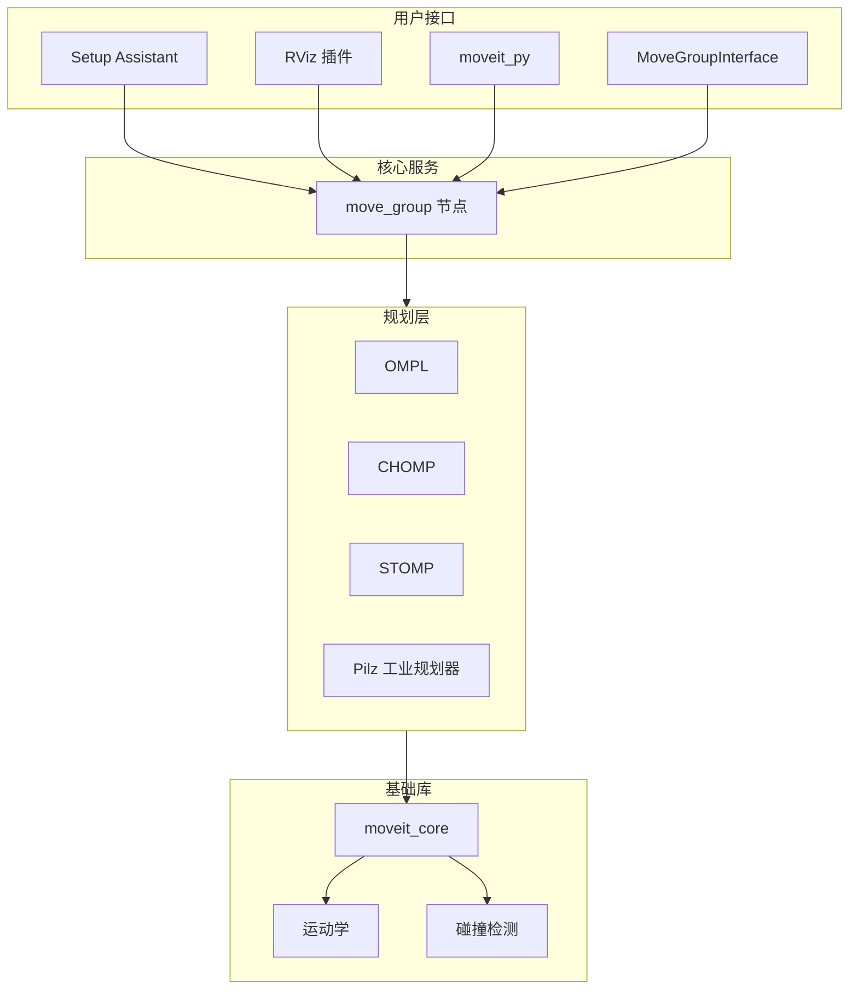

# MoveIt 2 主要功能介绍

> 本文档基于 `/home/wlzc/qihemu_ws/moveit2` 源码仓库整理，供后续项目开发参考复用。
>
> 官方文档：[MoveIt 2 Tutorials](https://moveit.picknik.ai/)

---

## 总体定位

**MoveIt 2** 是 ROS 2 上最主流的机器人**运动规划与操作（Manipulation）**框架，面向机械臂、移动操作平台等场景，提供从建模、规划、碰撞检测到轨迹执行的一整套能力。

MoveIt 2 是一个开源的机器人操作平台，可用于：

- 商业应用开发
- 原型验证
- 运动规划算法评测

它基于 **URDF + SRDF** 描述机器人模型，通过 **`move_group`** 节点对外提供规划、执行、场景管理等核心服务。

---

## 架构概览



### 仓库主要模块

| 目录 | 说明 |
|------|------|
| `moveit_core` | 核心库：运动学模型、碰撞检测、规划插件接口（不依赖 ROS 运行时） |
| `moveit_ros` | ROS 2 集成：规划、可视化、感知、move_group 等 |
| `moveit_planners` | 运动规划器插件：OMPL、CHOMP、STOMP、Pilz 等 |
| `moveit_kinematics` | 正/逆运动学求解器插件 |
| `moveit_plugins` | 控制器对接插件 |
| `moveit_setup_assistant` | 图形化配置工具 |
| `moveit_py` | Python 绑定库 |

---

## 主要功能模块

### 1. 机器人建模与配置（Setup Assistant）

**MoveIt Setup Assistant** 是图形化配置工具，用于：

- 加载 URDF / Xacro 机器人模型
- 定义 **Planning Groups**（规划组，如 arm、gripper）
- 配置 **碰撞矩阵**（哪些连杆之间忽略碰撞）
- 设置 **虚拟关节**、末端执行器、预设姿态
- 配置 ROS 2 控制器与 MoveIt 控制器
- 生成完整的 MoveIt 配置包

**启动命令：**

```bash
ros2 run moveit_setup_assistant moveit_setup_assistant
```

**碰撞矩阵更新：**

```bash
ros2 run moveit_setup_assistant moveit_setup_assistant \
  --urdf <path_to_urdf/xacro> \
  --xacro-args <optional_xacro_args> \
  --srdf <path_to_srdf> \
  --trials 100000
```

---

### 2. 运动规划（Motion Planning）

MoveIt 2 支持多种规划器插件，可按场景选用：

| 规划器 | 特点 |
|--------|------|
| **OMPL** | 默认采样规划器，适合复杂、高维空间 |
| **CHOMP** | 基于优化的轨迹平滑 |
| **STOMP** | 随机轨迹优化 |
| **Pilz** | 工业级直线/圆弧/混合运动，轨迹可预测 |

**规划类型：**

- **关节空间规划**（Joint Space）
- **笛卡尔路径规划**（Cartesian Path，直线插补）
- **约束规划**（位置、姿态、路径约束等）

---

### 3. 运动学求解（Kinematics）

`moveit_kinematics` 提供逆运动学（IK）与正运动学（FK）：

- **KDL** 数值求解器
- **IKFast** 解析求解器（速度快）
- **Cached IK** 缓存 IK 解以加速
- 支持自定义运动学插件

---

### 4. 碰撞检测（Collision Detection）

`moveit_core` 中的碰撞检测模块：

- 基于 **FCL**（Flexible Collision Library）和 **Bullet**
- 支持机器人自碰撞、与环境碰撞
- 支持点云、八叉树（Octomap）等环境表示
- 提供状态有效性检查服务

---

### 5. 规划场景管理（Planning Scene）

维护机器人与环境的统一表示：

- 添加/移除 **Collision Objects**（桌子、障碍物等）
- 集成 **Octomap** 三维占据栅格
- 支持从文件加载/保存场景几何
- 通过 `occupancy_map_monitor` 实时更新环境

---

### 6. 轨迹执行（Trajectory Execution）

通过插件与底层控制器对接：

- **moveit_simple_controller_manager**：对接 FollowJointTrajectory 等 action
- **moveit_ros_control_interface**：对接 ros2_control
- 支持轨迹时间参数化、速度/加速度限制

---

### 7. 实时伺服控制（MoveIt Servo）

`moveit_servo` 提供**低延迟、实时**的末端或关节速度控制：

- 适合遥操作、视觉伺服、人手拖动
- 带碰撞检测与奇异点处理
- 面向实时控制回路设计

详细说明见：[MoveIt Servo 详解](./moveit-servo.md)

参考教程：[Realtime Arm Servoing Tutorial](https://moveit.picknik.ai/main/doc/examples/realtime_servo/realtime_servo_tutorial.html)

---

### 8. 混合规划（Hybrid Planning）

`moveit_hybrid_planning` 结合全局与局部规划：

- **全局规划器**：生成完整路径
- **局部规划器**：执行中避障、轨迹修正
- 支持碰撞时重新规划等策略

**Demo 启动：**

```bash
ros2 launch moveit_hybrid_planning hybrid_planning_demo.launch.py
```

**可用插件示例：**

| 类型 | 插件 | 说明 |
|------|------|------|
| 规划逻辑 | `replan_invalidated_trajectory` | 全局规划一次，局部执行；碰撞时重新全局规划 |
| 规划逻辑 | `single_plan_execution` | 全局规划一次后交由局部规划器执行 |
| 全局规划 | `moveit_planning_pipeline` | 通过 MoveItCpp API 调用 MoveIt 规划管线 |
| 轨迹采样 | `simple_sampler` | 按当前状态采样全局轨迹路点作为局部目标 |
| 局部求解 | `forward_trajectory` | 转发局部轨迹路点，可选碰撞检测 |

---

### 9. 感知集成（Perception）

`moveit_ros_perception` 将传感器数据接入规划：

- 点云转 Octomap
- 深度图处理
- 与规划场景联动，实现动态避障

---

### 10. 可视化与交互（Visualization）

RViz 插件包括：

- **MotionPlanning** 插件：拖拽目标、规划、执行
- **Trajectory** 显示
- **Planning Scene** 编辑
- **Robot Interaction**：交互式标记（Interactive Markers）

---

### 11. Python 接口（moveit_py）

`moveit_py` 提供 Python 绑定：

- 通过 pybind11 封装 C++ 核心
- 支持 Jupyter 交互式开发
- 降低 Python 用户使用门槛

---

### 12. 其他实用功能

| 功能 | 包名 | 说明 |
|------|------|------|
| **Benchmarks** | `moveit_ros_benchmarks` | 规划器性能评测 |
| **Trajectory Cache** | `moveit_ros_trajectory_cache` | 缓存历史轨迹以加速重复规划 |
| **Warehouse** | `moveit_ros_warehouse` | 存储/检索规划场景与轨迹 |
| **Robot Interaction** | `moveit_ros_robot_interaction` | 交互式末端目标设置 |

---

## 核心节点：`move_group`

`move_group` 是 MoveIt 2 的中央节点，通过 ROS 2 服务/动作提供：

| 能力 | 说明 |
|------|------|
| `MoveGroupMoveAction` | 通过 Action 计算运动规划 |
| `MoveGroupPlanService` | 通过 Service 计算运动规划 |
| `MoveGroupExecuteTrajectoryAction` | 执行已计算的轨迹 |
| `MoveGroupExecuteService` | 执行已计算的路径 |
| `MoveGroupCartesianPathService` | 计算带碰撞检测的笛卡尔直线路径 |
| `MoveGroupKinematicsService` | 正/逆运动学计算 |
| `MoveGroupStateValidationService` | 单状态有效性检查 |
| `MoveGroupMultiStateValidationService` | 多状态有效性检查 |
| `MoveGroupGetPlanningSceneService` | 查询规划场景 |
| `ApplyPlanningSceneService` | 阻塞式更新规划场景 |
| `ClearOctomapService` | 清除 Octomap |
| `MoveGroupQueryPlannersService` | 查询可用规划器 |
| `SaveGeometryToFileService` / `LoadGeometryFromFileService` | 场景几何存取 |
| `GetUrdfService` | 获取指定规划组的 URDF 片段 |
| `TfPublisher` | 发布规划场景坐标系到 TF |

---

## 典型使用流程

1. 用 **Setup Assistant** 为机器人生成 MoveIt 配置包
2. 启动 `move_group` 和 RViz
3. 在 RViz 中设置目标位姿或关节目标
4. 调用规划器生成无碰撞轨迹
5. 通过控制器执行轨迹

---

## 与本项目（ZayV2）的关系

工作区中的 `moveit2` 和 `ZayV2_ws` 通常配合使用，MoveIt 2 可为 Zay 机器人提供：

- 机械臂运动规划
- 抓取与放置（Pick & Place）
- 避障导航
- 与 `ros2_control` 的集成
- 实时伺服控制（见 [MoveIt Servo 详解](./moveit-servo.md)）

---

## 参考链接

### 项目文档

- [MoveIt Servo 详解](./moveit-servo.md)

### 外部链接

- [MoveIt 2 官网](https://moveit.ai/)
- [官方教程](https://moveit.picknik.ai/)
- [二进制安装](https://moveit.ai/install-moveit2/binary/)
- [源码编译](https://moveit.ai/install-moveit2/source/)
- [GitHub 仓库](https://github.com/moveit/moveit2)
- [开发路线图](https://moveit.ai/documentation/contributing/roadmap/)
