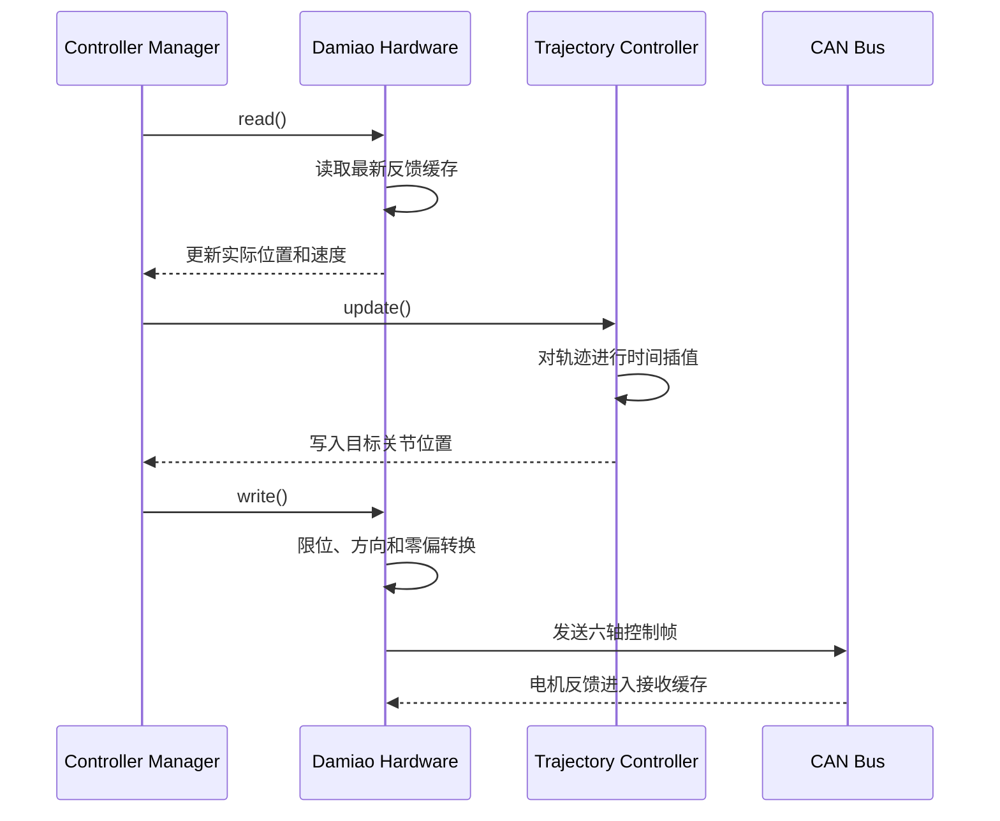

`ros2_control` 是 ROS 2 中连接“上层运动算法”和“实体硬件”的通用控制框架。

放在 ZayV2 中看，它负责把 MoveIt 产生的六轴轨迹交给达妙电机，并把电机反馈的位置、速度重新提供给 MoveIt、TF 和其他 ROS 节点。

```text
MoveIt / MoveIt Servo
          │ 关节轨迹
          ▼
JointTrajectoryController
          │ position 命令接口
          ▼
ros2_control 硬件插件
          │ 达妙 CAN 报文
          ▼
      六个实体电机
          │ 位置/速度/故障反馈
          └──────────────► /joint_states
```

## 1. ros2_control 解决什么问题

如果没有 `ros2_control`，通常需要自己编写一个电机节点，并自行处理：

- 如何接收 MoveIt 的轨迹。
- 如何对轨迹进行时间插值。
- 如何管理多个控制器。
- 如何避免多个控制器同时占用同一关节。
- 如何把真实关节状态发布出去。
- 如何切换控制模式。
- 如何管理硬件的初始化、激活、停止和故障。
- 如何让不同品牌的电机都能使用相同的上层控制器。

`ros2_control` 把这些问题拆成标准层次：

| 层次 | 负责内容 |
|---|---|
| MoveIt | 规划机械臂应该怎样运动 |
| ros2_control 控制器 | 根据时间执行关节轨迹 |
| ros2_control 硬件接口 | 将标准关节量转换成设备命令 |
| 设备协议 | 生成达妙 CAN 报文并解析反馈 |
| 实体硬件 | 电机、编码器、驱动器 |

因此，更换电机或通信方式时，通常主要修改硬件接口，上面的 MoveIt 和轨迹控制器可以继续使用。

## 2. ros2_control 不是电机驱动

这个区别很重要。

`ros2_control` 本身不知道：

- 达妙电机的 CAN ID。
- MIT 模式的数据格式。
- PMAX、VMAX、TMAX。
- 如何打开 `can0`。
- 如何发送使能帧。
- 如何解析电机温度和错误码。

这些内容需要由项目实现的硬件插件完成。

所以它更像一套“插座标准”：

- 控制器把目标写到标准接口。
- 硬件插件从接口中取得目标。
- 硬件插件自己完成设备通信。
- 电机反馈再写回标准状态接口。

## 3. 核心组件

### Controller Manager

`controller_manager` 是整个框架的核心调度器。在 ZayV2 中，它由下面这个进程提供：

```text
controller_manager/ros2_control_node
```

它负责：

- 读取机器人描述中的 `<ros2_control>` 配置。
- 加载硬件插件。
- 加载轨迹控制器和状态广播器。
- 管理硬件与控制器的生命周期。
- 分配关节接口，避免多个控制器冲突。
- 周期性执行控制循环。

当前 ZayV2 在 [arm_control.launch.py](/home/wlzc/qihemu_ws/Arm-ZayV2/src/arm_control/launch/arm_control.launch.py:28) 中启动了这个进程。

### Resource Manager

`ResourceManager` 由 `controller_manager` 内部使用。它负责管理所有硬件资源，例如：

```text
shoulder_joint/position
shoulder_joint/velocity
upperArm_joint/position
...
```

控制器要使用某个命令接口时，需要先申请它。例如：

```text
arm_controller
    申请 shoulder_joint/position
    申请 upperArm_joint/position
    ...
```

如果另一个控制器已经占用了这些命令接口，框架会阻止冲突的控制器同时激活。

状态接口可以被多个只读组件使用；命令接口通常只能由一个活动控制器占用。

### Hardware Component

硬件组件是对实体设备的抽象。它分三类：

| 类型 | 典型用途 |
|---|---|
| `ActuatorInterface` | 单个电机或独立执行器 |
| `SensorInterface` | IMU、力传感器等只读设备 |
| `SystemInterface` | 多关节机器人、共享通信总线的设备 |

ZayV2 的六个电机共享一条 CAN 总线，适合实现一个 `SystemInterface`：

```cpp
class DamiaoSystemHardware
    : public hardware_interface::SystemInterface
{
    // 管理六个关节和一个 CAN 总线
};
```

### Controller

控制器从状态接口读取实际状态，向命令接口写入控制目标。

ZayV2 当前使用：

```text
joint_trajectory_controller/JointTrajectoryController
```

它接收 `FollowJointTrajectory` action 或 `JointTrajectory` 话题，根据轨迹时间进行插值，然后每个控制周期输出六个关节的目标。

如果配置的是 `position` 命令接口，它输出的就是：

```text
shoulder_joint/position = 目标角度
upperArm_joint/position = 目标角度
...
```

### Broadcaster

Broadcaster 是只读控制器。它读取硬件状态并发布成 ROS 消息。

ZayV2 使用：

```text
joint_state_broadcaster/JointStateBroadcaster
```

它将硬件插件提供的关节位置、速度发布到：

```text
/joint_states
```

随后：

- `robot_state_publisher` 用它计算 TF。
- MoveIt 用它获取当前机械臂状态。
- RViz 用它显示真实姿态。
- 轨迹控制器用它检查跟踪误差。

## 4. 命令接口与状态接口

接口是 `ros2_control` 最基本的数据交换方式。

常见接口包括：

| 接口 | 作为命令 | 作为状态 |
|---|---|---|
| `position` | 目标位置 | 实际位置 |
| `velocity` | 目标速度 | 实际速度 |
| `effort` | 目标力矩/力 | 实际力矩/力 |
| `acceleration` | 目标加速度 | 实际加速度 |

对于 ZayV2 第一版，建议使用：

```text
命令接口：
    每个关节一个 position

状态接口：
    每个关节一个 position
    每个关节一个 velocity
```

在程序内部，这些接口通常指向硬件插件保存的数组：

```cpp
std::vector<double> position_commands_;
std::vector<double> position_states_;
std::vector<double> velocity_states_;
```

轨迹控制器修改 `position_commands_`，硬件插件的 `write()` 读取这些值。

CAN 反馈到达后，硬件插件的 `read()` 更新 `position_states_` 和 `velocity_states_`。

接口本身不发送 ROS 消息，也不发送 CAN 帧。它们主要是同一个进程中的内存数据入口。

## 5. 一个控制周期如何运行

当前 ZayV2 配置的控制频率是 100 Hz：

```yaml
controller_manager:
    ros__parameters:
        update_rate: 100
```

对应每 10 ms 运行一个周期：



从框架角度看，循环是：

```text
read → controller update → write
```

### `read()`

它应当：

- 获取每台电机最新的反馈快照。
- 检查反馈是否有效、是否过期。
- 解析错误码和温度。
- 将电机角转换成 ROS 关节角。
- 更新 position/velocity 状态接口。

它不适合做长时间阻塞查询。CAN 接收通常由独立线程完成，`read()` 只读取已经接收到的缓存。

### `update()`

由控制器执行。例如轨迹控制器会：

- 找到当前轨迹时间。
- 在相邻轨迹点之间插值。
- 计算这一时刻的目标位置。
- 检查实际位置与目标位置的偏差。
- 将结果写入 position 命令接口。

这部分不需要达妙硬件插件自己实现。

### `write()`

它应当：

- 读取六轴目标位置。
- 检查 NaN、Inf 和机械限位。
- 检查单周期最大变化量。
- 根据零偏、方向和传动比转换成电机位置。
- 编码达妙控制帧。
- 按总线调度发送六轴命令。
- 处理发送失败和运行许可。

## 6. 轨迹控制器具体做什么

MoveIt 给出的轨迹一般不是每 10 ms 一个点。例如，它可能给出：

```text
t = 0.0 s：关节位置 A
t = 1.2 s：关节位置 B
t = 2.5 s：关节位置 C
```

`JointTrajectoryController` 会根据控制频率，在这些轨迹点之间生成连续目标：

```text
0.00 s → q0
0.01 s → q1
0.02 s → q2
...
2.50 s → q250
```

然后硬件插件每周期将这个目标发送给电机。

所以职责关系是：

```text
MoveIt：决定路径经过哪里
JTC：决定当前时刻应该到哪里
硬件插件：把这个目标可靠地交给电机
电机内部控制环：让电机实际到达目标
```

采用达妙位置速度模式时，电机内部还有自己的位置环、速度环和电流环。此时 PC 端 JTC 主要负责轨迹插值、时间管理和跟踪监督，具体的电机位置闭环由驱动器执行。

## 7. 开环与闭环在这里是什么意思

当前配置包含：

```yaml
open_loop_control: true
```

它表示轨迹控制器在启动新轨迹时，倾向于使用上一次命令作为插值起点，而不是完全依据硬件实测状态。

这不等于电机本身没有闭环。达妙位置模式内部仍然是闭环控制，但 ROS 层的轨迹执行对真实状态利用不足。

真机一般需要：

```yaml
open_loop_control: false
```

并配置逐轴误差限制，例如：

```yaml
constraints:
    goal_time: 1.0
    stopped_velocity_tolerance: 0.05

    shoulder_joint:
        trajectory: 0.15
        goal: 0.05
```

含义是：

- 运行中实际位置偏离轨迹太多时，中止目标。
- 到达时间超过容许范围时，报告失败。
- 终点位置误差超过限制时，不报告成功。

具体数值需要通过低速实机测试确定，不能直接使用示例值。

即使关闭 `open_loop_control`，使用 position 命令接口时，JTC 也不会自动在 PC 端增加一个位置 PID；它仍主要向硬件传递目标位置。真正的位置闭环仍由达妙驱动器完成。

## 8. 生命周期有什么作用

硬件插件具有生命周期：

```text
UNCONFIGURED
      │ on_configure
      ▼
   INACTIVE
      │ on_activate
      ▼
    ACTIVE
      │ on_deactivate
      ▼
   INACTIVE
```

对实体机械臂，可以这样定义：

### `on_init()`

只解析配置，不访问电机：

- 确认有六个关节。
- 检查每个关节的接口声明。
- 解析电机型号、CAN ID、方向和零偏。
- 分配状态及命令数组。

### `on_configure()`

建立通信，但不允许运动：

- 打开 `can0`。
- 启动接收线程。
- 检查电机 ID 是否重复。
- 查询电机模式、PMAX、VMAX、TMAX。
- 检查六轴反馈是否存在。
- 保持电机失能。

### `on_activate()`

准备开始运动：

- 确认六轴反馈都没有过期。
- 确认电机无故障。
- 将初始命令设为实际位置。
- 执行保持当前位置的使能时序。
- 确认电机已经进入使能状态。
- 最后设置 `motion_allowed = true`。

### `on_deactivate()`

停止执行运动：

- 禁止接收新的运动命令。
- 停止当前轨迹。
- 根据承重结构执行保持或减速停止。
- 完成抱闸交接后失能。

### `on_error()`

处理严重故障：

- 锁存故障。
- 阻止继续发送运动命令。
- 记录是哪个轴、什么错误。
- 根据机械结构执行安全停止。
- 要求人工检查或重新走初始化流程。

需要注意：Humble 版本中，硬件处于 `INACTIVE` 时命令接口仍可能存在，因此硬件实现本身必须检查运行许可，不能只依靠生命周期名字判断是否可以发送运动命令。

## 9. URDF/Xacro 在 ros2_control 中的作用

机器人几何模型和 ros2_control 硬件描述通常都放在机器人描述中，但它们负责不同内容。

普通 URDF 描述：

- 连杆和关节关系。
- 关节轴方向。
- 几何尺寸。
- 质量和惯量。
- 机械位置和速度限制。

`<ros2_control>` 描述：

- 使用哪个硬件插件。
- 有哪些硬件关节。
- 每个关节有哪些命令接口。
- 每个关节有哪些状态接口。
- 硬件插件需要哪些参数。

当前 ZayV2 使用的是模拟插件：

```xml
<hardware>
    <plugin>mock_components/GenericSystem</plugin>
</hardware>
```

位置在 [aubo_i5.ros2_control.xacro](/home/wlzc/qihemu_ws/Arm-ZayV2/src/aubo_i5_moveit_config/config/aubo_i5.ros2_control.xacro:7)。

真机版本应改成类似：

```xml
<ros2_control name="DamiaoArm" type="system">
    <hardware>
        <plugin>damiao_hardware/DamiaoSystemHardware</plugin>
        <param name="can_interface">can0</param>
        <param name="control_mode">pos_vel</param>
        <param name="feedback_timeout_ms">50</param>
    </hardware>

    <joint name="shoulder_joint">
        <param name="motor_type">J4340-2EC</param>
        <param name="esc_id">1</param>
        <param name="mst_id">17</param>
        <param name="direction">1</param>
        <param name="zero_offset">0.0</param>
        <param name="external_ratio">1.0</param>

        <command_interface name="position"/>
        <state_interface name="position"/>
        <state_interface name="velocity"/>
    </joint>

    <!-- 其余五个关节 -->
</ros2_control>
```

`ros2_control` 只负责把这些参数交给插件。`motor_type`、`esc_id`、`zero_offset` 都是项目自定义参数，具体含义和校验逻辑需要在插件里实现。

## 10. YAML 控制器配置负责什么

Xacro 描述“硬件提供什么接口”，控制器 YAML 描述“哪个控制器使用这些接口”。

当前 [ros2_controllers.yaml](/home/wlzc/qihemu_ws/Arm-ZayV2/src/aubo_i5_moveit_config/config/ros2_controllers.yaml:1) 声明：

```yaml
arm_controller:
    ros__parameters:
        joints:
            - shoulder_joint
            - upperArm_joint
            - foreArm_joint
            - wrist1_joint
            - wrist2_joint
            - wrist3_joint

        command_interfaces:
            - position

        state_interfaces:
            - position
            - velocity
```

控制器激活时会检查：

- 六个关节是否都存在。
- 硬件是否导出了六个 position 命令接口。
- 硬件是否导出了 position、velocity 状态接口。
- 接口有没有被其他控制器占用。

如果硬件插件少导出一个接口，控制器就无法正常激活。

## 11. 它与 MoveIt、Servo 的关系

MoveIt 与 ros2_control 不是同一套系统。

| 组件 | 关注的问题 |
|---|---|
| MoveIt | 路径规划、逆运动学、碰撞检查 |
| MoveIt Servo | 根据连续输入生成短周期关节命令 |
| ros2_control | 控制器调度、硬件接口、状态反馈 |
| 达妙驱动器 | 电机电流环、速度环、位置环 |

普通 MoveIt 规划通过：

```text
FollowJointTrajectory action
```

把轨迹发给 `JointTrajectoryController`。

MoveIt Servo 通常向控制器的：

```text
/arm_controller/joint_trajectory
```

持续发送短轨迹。

两者最终都使用同一组关节命令接口，因此应当管理控制权，避免规划执行和 Servo 同时下发命令。

## 12. ros2_control 能处理什么故障，不能处理什么故障

它能够帮助处理：

- 硬件插件加载失败。
- 控制器接口不匹配。
- 命令接口资源冲突。
- `read()` 或 `write()` 返回错误。
- 轨迹跟踪误差超限。
- 控制器启动、停止与切换。

但它不能自动解决：

- 实体急停回路。
- 断电后承重关节下坠。
- 电机抱闸控制。
- CAN 总线断线后的机械安全行为。
- 零位标定错误。
- 机械限位安装错误。
- 错误的电机方向或传动比。
- 多圈位置无法恢复。

这些仍然需要硬件设计、达妙插件和整机状态管理共同完成。

## 13. 对 ZayV2 的实际意义

ZayV2 现在已经具备：

- MoveIt 规划。
- `JointTrajectoryController`。
- `JointStateBroadcaster`。
- MoveIt Servo。
- Mock 硬件。
- 上层运动服务。

缺少的是：

```text
mock_components/GenericSystem
                ↓ 替换
damiao_hardware/DamiaoSystemHardware
                ↓
SocketCAN + 达妙协议 + 六个实体电机
```

因此接入实体机械臂时，核心工作不是重写 MoveIt，也不是重写轨迹控制器，而是实现一个可靠的达妙 `SystemInterface`，再完善真实模型、标定、控制器容差和整机停止策略。

官方资料可参考 [ros2_control 硬件组件](https://control.ros.org/humble/doc/ros2_control/hardware_interface/doc/hardware_components_userdoc.html)、[编写硬件插件](https://control.ros.org/humble/doc/ros2_control/hardware_interface/doc/writing_new_hardware_component.html) 和 [Controller Manager](https://control.ros.org/humble/doc/ros2_control/controller_manager/doc/userdoc.html)。