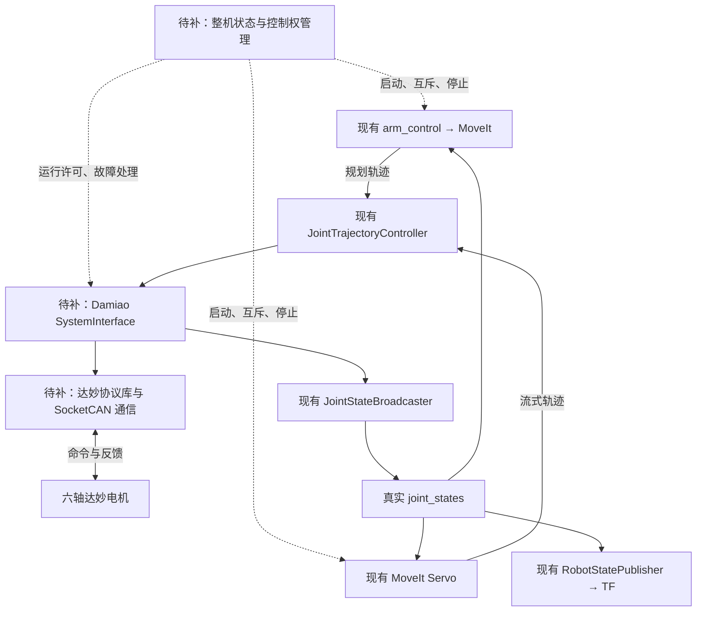

**ZayV2 已有上层运动控制框架，实体机械臂的主要缺口是：真实机械模型、达妙硬件接口、关节标定，以及贯穿启动、运行和故障处理的整机状态管理。** 建议按“单轴闭环 → 多轴闭环 → MoveIt 真机执行 → Servo”的顺序实现。

以下基于当前代码和两份原始说明书的静态核对，尚未进行实机验证。说明书依据：:codex-file-citation{path="/home/wlzc/qihemu_ws/Arm-ZayV2/docs/DM-J4310P-2EC减速电机说明书V1.1  定稿(2).pdf" purpose="source"}、:codex-file-citation{path="/home/wlzc/qihemu_ws/Arm-ZayV2/docs/DM-J4340-2ECV1.1减速电机说明书 V1.2.pdf" purpose="source"}。

**当前框架可以保留哪些部分**

| 现有部分 | 实际作用 | 真机接入判断 |
|---|---|---|
| `arm_driver_node`、`ArmController` | 接收目标位姿、调用 MoveIt 规划和执行 | 可以保留；虽然叫 driver，实际属于上层运动接口 |
| `move_group` | 运动规划、碰撞检测、轨迹执行管理 | 可以复用，需要真实机器人模型 |
| `arm_controller` | `JointTrajectoryController`，执行关节轨迹 | 可以复用，需要调整反馈和误差约束 |
| `joint_state_broadcaster` | 将硬件状态发布为 `/joint_states` | 可以复用，状态来源需要换成电机反馈 |
| `robot_state_publisher` | 根据模型和关节位置计算 TF | 可以复用 |
| MoveIt Servo、键盘节点 | 连续笛卡尔运动输入 | 后期接入，需要控制权和停止管理 |
| `GenericSystem` | 模拟硬件 | **必须增加真实硬件实现** |

硬件入口目前明确使用 [GenericSystem](/home/wlzc/qihemu_ws/Arm-ZayV2/src/zayv2_moveit_config/config/zayv2_description.ros2_control.xacro:9)。相邻达妙仓库提供协议参考，但尚未接入 ZayV2；文档提到的 `can-motor-tool` 在本次检查的项目内和相邻路径中均未找到，不能计作已经交付的能力。

建议形成下面的控制链：

这里最关键的 `SystemInterface` 是由 `controller_manager` 加载的**硬件插件**，不必额外做成一个独立 ROS 节点。可以让一个插件统一管理同一 CAN 总线上的六个关节。[ros2_control 硬件组件说明](https://control.ros.org/humble/doc/ros2_control/hardware_interface/doc/writing_new_hardware_component.html)

**需要补齐的关键环节**

| 环节 | 需要实现的内容 | 对当前项目的影响 |
|---|---|---|
| **真实机械模型与负载核算** | 连杆尺寸、关节轴方向、质量与惯量、碰撞模型、机械限位、TCP；核算各轴持续和峰值力矩 | 当前加载 ZayV2 模型，仍需核对实体参数后才能用于真机 |
| **电气与 CAN 链路** | 电源容量、布线与终端电阻、适配器接入；逐轴确认型号、电压版本、固件、ID、模式、波特率 | 先保证通信可诊断、参数可追溯 |
| **达妙协议库** | 命令编解码、反馈路由、寄存器查询、超时与异常帧处理、线程安全状态缓存 | 官方例程可作为起点，需要工程化 |
| **`DamiaoSystemHardware` 插件** | 生命周期管理，导出命令与状态接口，实现 `read()`、`write()` | 补上轨迹控制器到电机之间的核心接口 |
| **关节映射与标定** | 关节名 ↔ 电机 ID、方向、零偏、额外传动比、位置连续性、标定记录 | 保证 ROS 中的关节角与实体姿态一致 |
| **整机状态和故障管理** | 就绪判断、使能、停止、故障锁存、反馈失效、控制源互斥、恢复流程 | 决定机械臂能否可靠启动和停止 |
| **真机启动与诊断** | 独立真机 launch、配置检查、控制器就绪检查、温度/电压/错误码/反馈年龄监控 | 将调试过程变成可重复的启动流程 |

其中有几个容易影响路线选择的细节。

**首先，机械模型和承载能力需要先确定。** 当前 [ZayV2 URDF](/home/wlzc/qihemu_ws/Arm-ZayV2/src/zayv2_description/urdf/zayv2_description.urdf) 已包含六轴几何与惯量；这些参数仍需与实体机械臂核对；[MoveIt 限位配置](/home/wlzc/qihemu_ws/Arm-ZayV2/src/zayv2_moveit_config/config/joint_limits.yaml:12) 中各轴还关闭了加速度限制。

J4310P 和 J4340 的额定力矩分别为 3.5、12 N·m，峰值分别为 12.5、40 N·m。选型要考虑整条下游连杆、末端负载和加速需求，不能按峰值力矩判断长期承载能力。实体尺寸、质量和电机分配仍需核对，尚不能仅凭模型确认六个关节的电机选型。

承重关节还需要明确失能后的支撑方式。电机过温、通信丢失等保护会退出使能，因此抱闸、配重或其他机械支撑方案应在带载测试前确定。

**其次，关节标定不等于电机出厂校准。**

- 电机出厂编码器校准解决电机内部测量问题；机械臂仍需要安装零位、方向和限位标定。
- 双编码器提供的是**单圈绝对位置**，不能据此假定多圈关节位置掉电后也能唯一恢复。
- `0x50` 与 `0x51` 分别涉及转子折算位置和输出轴编码器位置，需要实测它们与普通反馈 `POS` 的对应关系、零点及跨圈行为。
- 已折算到减速器输出轴的角度，不能再除一次电机内部的 10:1 或 40:1 减速比。
- 启动时目标应从实测位置初始化；软件启动和保存电机零点应是两个独立流程。

**底层控制模式建议先采用位置速度模式完成低速验证。** 这与当前 `position` 命令接口衔接较直接：轨迹控制器给出目标位置，硬件层提供经验证的速度上限。

但达妙位置速度模式中的 `v_des` 表示运动过程的**最大绝对速度**，与轨迹中的带符号目标速度不是同一含义，不能直接照搬。电机内部的位置运动过程也可能影响多轴轨迹同步，需要测量跟踪误差。

后续若需要更好的连续轨迹跟踪、柔顺或重力补偿，再评估 MIT 模式，并增加逐轴 `kp/kd`、速度前馈、力矩限制等。当前 JTC 的 position 接口只是转发位置指令；关闭开环选项也不会自动增加位置 PID。[JTC 接口说明](https://control.ros.org/humble/doc/ros2_controllers/joint_trajectory_controller/doc/userdoc.html)

**通信频率必须按六轴总线计算。** 假设每轴每周期发送一帧八字节命令并返回一帧反馈，按每帧约 110～135 bit 估算：

| 六轴刷新频率 | 经典 CAN 1 Mbps 的估算占用 |
|---|---:|
| 100 Hz | 13%～16% |
| 250 Hz | 33%～41% |
| 500 Hz | 66%～81% |
| 1000 Hz | 132%～162%，超出容量 |

这还没有包含寄存器查询、重传和 USB 排队。建议从当前 **100 Hz** 开始测量周期抖动、反馈延迟和跟踪误差，再决定是否提高频率。说明书的 `TIMEOUT` 以 50 μs 为计数单位，具体设置应匹配实测周期和停止要求。

同时要区分三类超时：电机收不到 CAN 帧、主机收不到电机反馈、上层运动指令已经失效。**底层持续重发旧指令时，电机自身的通信超时并不能发现上层已经失联。** 其中，规划轨迹与 Servo 的指令有效期也需要分别处理。

**现有代码中，需要在真机接入前调整的地方**

1. **轨迹反馈与容差。**  
   [控制器配置](/home/wlzc/qihemu_ws/Arm-ZayV2/src/zayv2_moveit_config/config/ros2_controllers.yaml:27) 未显式配置 `open_loop_control`，没有配置逐关节路径和终点位置容差。真机应使用实测状态，设置跟踪误差阈值和有限的到达时间容差，并验证实际生效。[参数说明](https://control.ros.org/humble/doc/ros2_controllers/joint_trajectory_controller/doc/parameters.html)

2. **状态失效后拒绝运动。**  
   [ArmController](/home/wlzc/qihemu_ws/Arm-ZayV2/src/arm_control/src/arm_controller.cpp:172) 获取当前状态失败时，会用轨迹首点构造状态继续处理。真机需要检查所有关节状态是否完整、新鲜、可信，失败时返回明确错误。

3. **运动请求的成功语义。**  
   当前配置允许笛卡尔路径只完成 90% 就执行，而接口仅返回 `bool success`；需要明确“部分路径执行”是否允许。另有速度、加速度在消息注释中写为物理单位，代码却按缩放系数使用，应该统一。[运动配置](/home/wlzc/qihemu_ws/Arm-ZayV2/src/arm_control/config/arm_control.yaml)、[消息定义](/home/wlzc/qihemu_ws/Arm-ZayV2/src/robot_interfaces/msg/WayPointInfo.msg)

4. **启动顺序与控制权。**  
   当前 launch 使用固定延时启动上层节点，真机需要基于反馈、标定和控制器状态放行。MoveIt 执行与 Servo 都会向同一个控制器发送轨迹，需要互斥管理。

5. **停止功能。**  
   [键盘空格键](/home/wlzc/qihemu_ws/Arm-ZayV2/src/arm_control/src/servo_keyboard_node.cpp:310) 只清除速度输入。还需要规划任务取消、Servo 停止、硬件运行许可和承重关节停止流程；硬件急停链路应独立实现。

**建议的实现顺序与验收条件**

| 顺序 | 实现内容 | 进入下一阶段的条件 |
|---|---|---|
| **① 确定整机参数** | 电机分配、负载核算、限位、供电、急停与失能支撑方案；整理关节参数表 | 每轴方向、范围、承载和停止方式明确 |
| **② 单电机只读通信** | 核实适配器链路，读取 ID、模式、映射范围、位置及故障状态 | 能可靠辨认反馈，断开和超时可检测 |
| **③ 单轴受限运动** | 建立协议库；当前位置初始化、低速运动、限幅、停止与超时处理 | 实测角度方向正确，启动无意外跳变，异常行为符合预期 |
| **④ 单轴 ros2_control 接入** | 实现硬件插件，用单轴测试配置接 JTC 与状态广播器 | 标准轨迹接口能够驱动电机，反馈来自真实测量 |
| **⑤ 六轴通信与标定** | 统一参数配置、总线调度、逐轴零位标定、整机故障联动 | 六轴无串轴、反馈持续有效，控制周期有余量 |
| **⑥ 真机模型与 MoveIt 执行** | 完成真实 URDF/SRDF、碰撞模型、限位、TCP 和执行容差 | 先通过小幅关节轨迹，再验证点到点和笛卡尔路径 |
| **⑦ Servo 与连续运行** | 加入控制权切换、指令超时、在线状态监控；逐步增加速度和负载 | 失联、取消、故障恢复和持续运行均通过验证 |

真实机械模型可在第②～⑤阶段同步制作，但必须在第⑥阶段前核对完成。采用现有达妙电机协议时，首版可以直接走 **SocketCAN → 达妙协议 → ros2_control**；STM32 中间控制器和 CANopen 不属于这条路线的前置依赖。

建议把第一个软件里程碑定义为：**一台电机通过标准轨迹接口执行受限运动，发布真实关节状态，并通过断连、超时和重启验证。**

- :codex-followup[整理关节参数表]{prompt="根据当前分析，为 ZayV2 整理六轴关节参数表模板，列出电机、传动、零位、限位和负载核算需要填写的数据。"}
- :codex-followup[设计硬件接口]{prompt="结合现有 ZayV2 框架，设计 Damiao SystemInterface 的包结构、参数、生命周期和通信接口，先输出详细设计。"}
- :codex-followup[制定单轴验收流程]{prompt="基于达妙说明书，为 ZayV2 制定从只读通信到 ros2_control 单轴轨迹执行的调试与验收流程。"}